Pour une des rares fois nous avons pu relaxer lors de notre visite au Québec. Il faut dire que James et moi avons de plus en plus d'expériance dans l'organisation de nos vacances.  

  
Les 3 premières journées de nos vacances, nous avons été chez mes parents. Le temps nous a fillé entre les doigts: magasinage, visite de grand-maman Beaupré, jeux, café-céramique, film, nouvelle recette,...  
  
[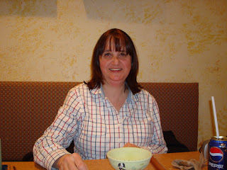](http://1.bp.blogspot.com/_ToTXtyv4mUo/SWNoQeYCnyI/AAAAAAAAANs/Ho4pz6-ep1E/s1600-h/DSC02858.JPG)[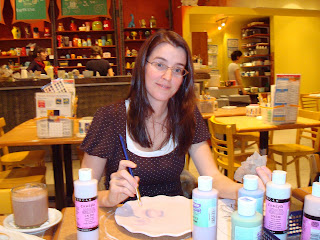](http://2.bp.blogspot.com/_ToTXtyv4mUo/SWNoQOsUa4I/AAAAAAAAANk/A8RxrpMPvWI/s1600-h/DSC02853.JPG)  
Ici une activité mère-fille au café-céramique. J'ai toujours voulu que Jean-Michel vienne, mais c'est supposément "... une activité de fille!'  
  
Pour le 24 décembre, Mélanie et Joe nous ont reçu chez eux. Cette année chaque famille avait un petit quelque chose à présenter.  
Les Amyot nous on fait un théâtre de marionette. L'apparition de Marie sur scène, n'a pas passé inaperçu. Elle était ÉNORME, mais ÉNORME dans sa robe rouge et elle avait de toutes petites jambes. Alexandra pouvait bien être fière de sa marionette. Elle était très belle.  
Les filles Fontaine étaient revêtues de robe de nuit fait par Mélanie spécialement pour cette présentation. Elles nous ont chanté de beaux cantiques de Noël.  
Audrey nous a fait une interprétation mémorable de "Minuit Chrétien".  
Puis maman nous a chanté "Souvenirs d'un vieillard" de Patrick Norman.Une belle chanson qu'on a tous trouvé bien triste.  

  

[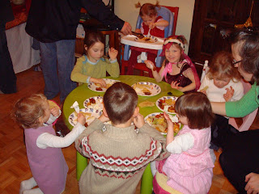](http://2.bp.blogspot.com/_ToTXtyv4mUo/SWNpXgUSyLI/AAAAAAAAAN0/lt89FBWWRLE/s1600-h/DSC02868.JPG)La tablée des enfants.  

  
[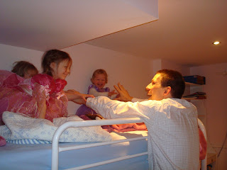](http://4.bp.blogspot.com/_ToTXtyv4mUo/SWNpX9yjATI/AAAAAAAAAN8/jXMVzjZoIzI/s1600-h/DSC02881.JPG)  

François la terreur!!!  

  
[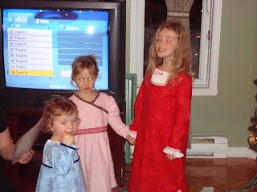](http://1.bp.blogspot.com/_ToTXtyv4mUo/SWNpYVbqjHI/AAAAAAAAAOE/BwEH4LaQQUE/s1600-h/DSC02885.JPG)  

Florance, Élisée et Gaëlle nous charment.  

  
[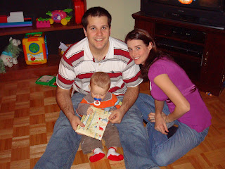](http://4.bp.blogspot.com/_ToTXtyv4mUo/SWNpYweD67I/AAAAAAAAAOM/GNIula6SNYM/s1600-h/DSC02888.JPG)  

Ézékiel ouvre un cadeau à minuit.  

  

Le 25 décembre, on a continué de fêter chez Manon et Jean pour le brunch. On avait tellement hâte de voir la famille qu'on est arrivé plus d'une heure à l'avance. Entre deux bouchées nous avons parlé aux parents de Jean-Michel par internet. On était bien heureux de les voir pour Noël.  
En soirée nous sommes monté au Lac Brome et nous avons mangé la traditionnelle raclette.  

  
[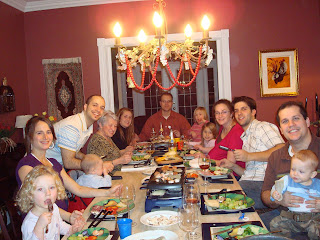](http://3.bp.blogspot.com/_ToTXtyv4mUo/SWNqPSX0VzI/AAAAAAAAAOU/j2yViHso0aM/s1600-h/DSC02897.JPG)  
Ézékiel a été gâté par tout le monde. Il a reçu un gros camion, des autos de toutes grandeurs et des balons.  
  
[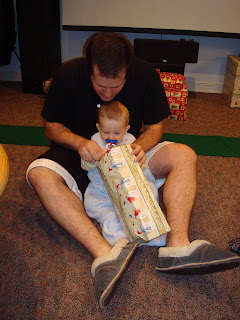](http://1.bp.blogspot.com/_ToTXtyv4mUo/SWNqPgCVusI/AAAAAAAAAOc/BT4vXhDM66Q/s1600-h/DSC02901.JPG)  
Au petit matin Ézékiel a joué avec son cousin pous-pous.  
  
[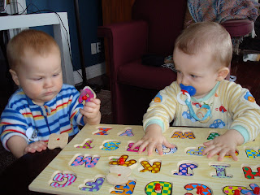](http://4.bp.blogspot.com/_ToTXtyv4mUo/SWNqPxFTJRI/AAAAAAAAAOk/kUAu5IcfFL8/s1600-h/DSC02919.JPG)  
  
Après 10 mois d'attente, Zeke rencontre pour la première fois sa grand-mie.  
  
[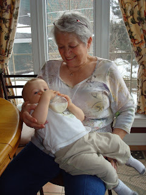](http://1.bp.blogspot.com/_ToTXtyv4mUo/SWNqQmnRrTI/AAAAAAAAAOs/1v0yvHm8q1I/s1600-h/DSC02927.JPG)Le dimanche qui a suivi nous avons été visiter Zoé, la poupounnette de Julie-Claire et Philippe. Un beau gros bébé de presque 10 Lbs. Marie avait apporté avec elle le cadeau de Danielle et Michel. Sur cette photo Doudou ouvre la carte de ses parents.  
  
[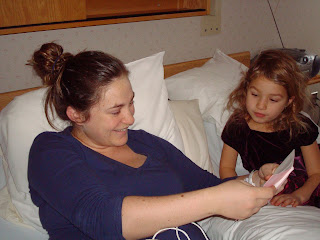](http://3.bp.blogspot.com/_ToTXtyv4mUo/SWNzDu_n29I/AAAAAAAAAO0/s99wjifAkjc/s1600-h/DSC02933.JPG)  
  
Quand Ézékiel m'a vu avec Zoé dans les bras il s'est mi a pleurer. C'était comme si je venais de le trahir... Il va faloir t'abituer mon p'tit homme, parcequ'un jour ça va être pour vrai!  
  
[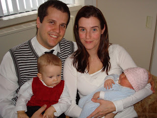](http://2.bp.blogspot.com/_ToTXtyv4mUo/SWNzDwQl4RI/AAAAAAAAAO8/15RyLL7YlQ4/s1600-h/DSC02937.JPG)  

Sur cette photo Ézékiel a du bon temps avec tante Claire.  

  
[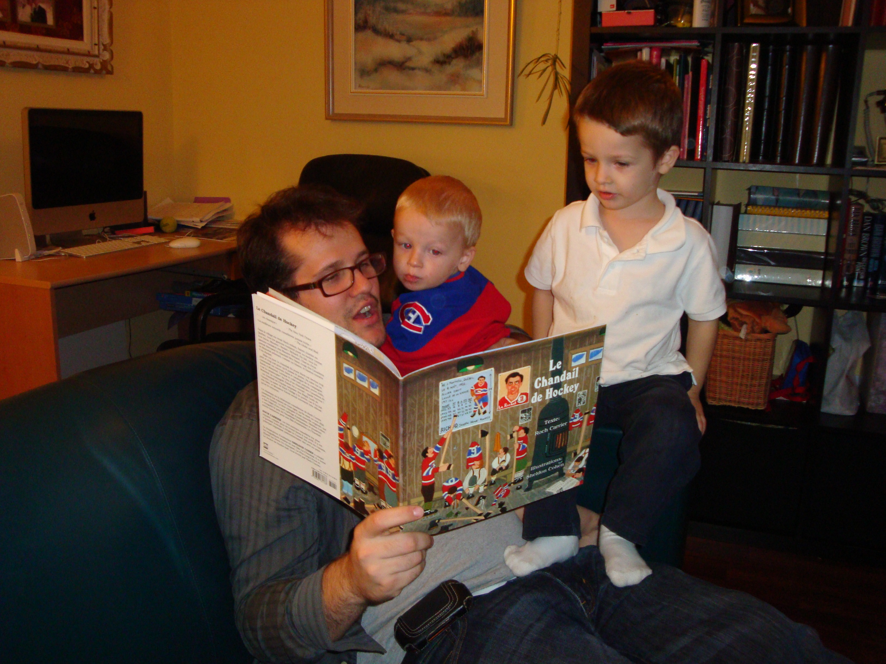](http://4.bp.blogspot.com/_ToTXtyv4mUo/SWNzEABK_SI/AAAAAAAAAPE/Nu_HcPDP050/s1600-h/DSC02952.JPG)  
  

Pendant notre séjour, il fallait bien s'arrêter au moin une fois chez St-Hub.  

  
[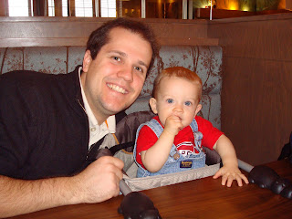](http://4.bp.blogspot.com/_ToTXtyv4mUo/SWNzFNIeJ5I/AAAAAAAAAPM/bR5tg46fotA/s1600-h/DSC02958.JPG)  

J'en rêve depuis si longtemps!!!  

  
[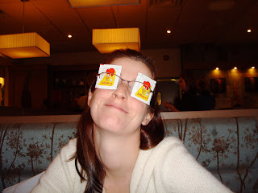](http://4.bp.blogspot.com/_ToTXtyv4mUo/SWNzFuxsGvI/AAAAAAAAAPU/qe--3TmKX1I/s1600-h/DSC02961.JPG)  
  

Comme toujours notre caméra est morte, donc pas de souvenir.  
Pour le jour de l'an on a été fêter chez Dou et Phil.  
  
En tout cas, le 1er Janvier c'était la fête de ma maman. Donc, on était tous réuni chez eux pour fêter. Ça s'est très bien passé.  
  
Jean-Michel et moi, n'avons pas arrêté de faire des activités jusqu'à notre départ: cinéma, patin, jouer à des jeux chez les Amyot, puis repas thaï chez les Fontaine. Malheureusement Jean-Michel est tombé malade la soirée avant notre départ. Tout de suite après la bénédiction de Zoé, nous sommes rentré au bercail.  
  
Et nous voici revenu chez nous et bien heureux d'avoir vu le sourire de tout ceux que nous aimons. Nous vous souhaitons une heureuse et belle année 2009 à tous!
