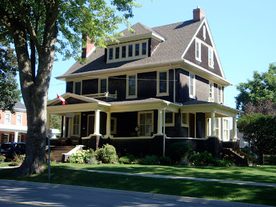
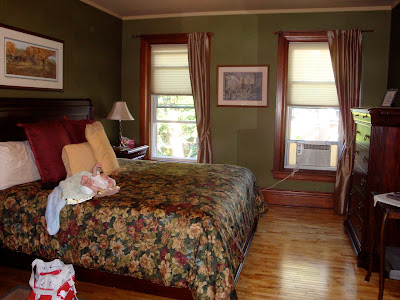
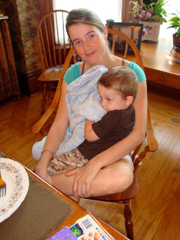
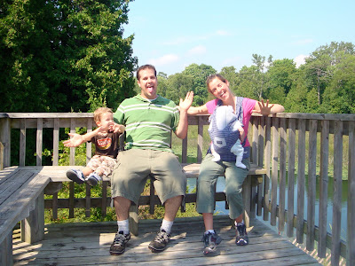
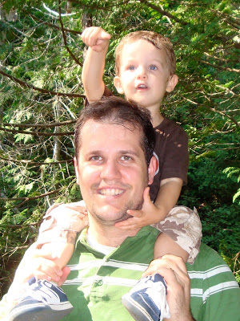
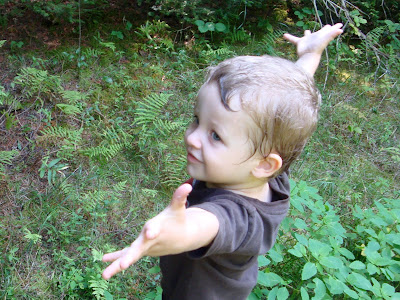
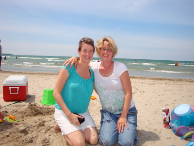
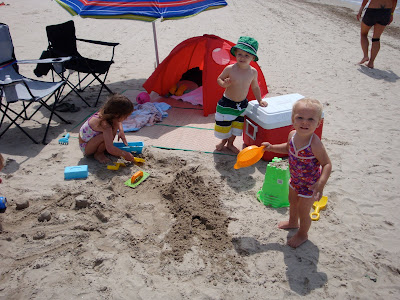
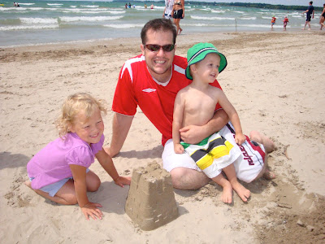
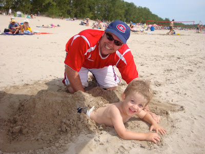

Il y a au moins trois mois, ma soeur Martine et moi avons planifié que nos deux familles passent du temps ensemble durant les vacances d'été. Les Amyot avaient déjà loué un terrain de camping à mi chemin entre Montréal et Toronto. Avec notre p'tit bout de choux Caleb, je nous voyait très mal aller camper. Donc nous avons louer un B&B tout près d'eux à Picton.

  

Brown's Manor B&B

  

Caleb a été le premier à profiter du lit King.

Il faut mentionner qu'avec sa grosseur cette largeur de lit s'impose.

  

Au petit déjeuné Ézékiel est déjà légume...  

Il avait fait le party avec son cousin et ses cousines la veille.

  

Bien entendu nous avons prit un peu de temps pour visiter la petite communauté au décor champêtre. Mais nous avons surtout passé nos vacances au parc régional de Sandbanks, puisqu'il est réputé pour présenter une des plus belles plages au pays.

La première journée nous avons fait un belle excursion de 2km dans la forêt du parc. Ça nous a prit plus de 40 minutes à la vitesse d'Ézékiel.

  

La chaleur nous à rendu mongol!

  

  

Quelqu'un peut me dire qu'est-ce que  
le père et le fils ont en commun sur ces deux photos???

  

  

  

  

  

  

  

  

Puis on a roulé dans le sable blanc et gouté aux  
belles vagues de la plage de Sandbanks.  
Ici avec ma soeurette.

  

Le repaire des garnements.

  

Incroyable, ce château de sable est resté debout plus de 10 secondes!!!

  

Des visages qui veulent tout dire.  

  

Nos vacances ne se sont pas arrêté là. À notre retour de Picton une autre aventure nous attendait à la maison... mais se sera pour le prochain post.
