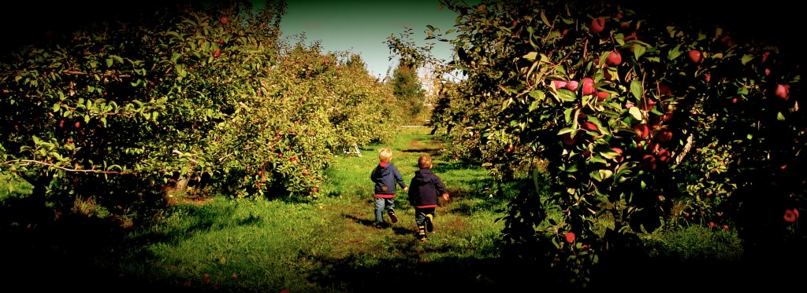
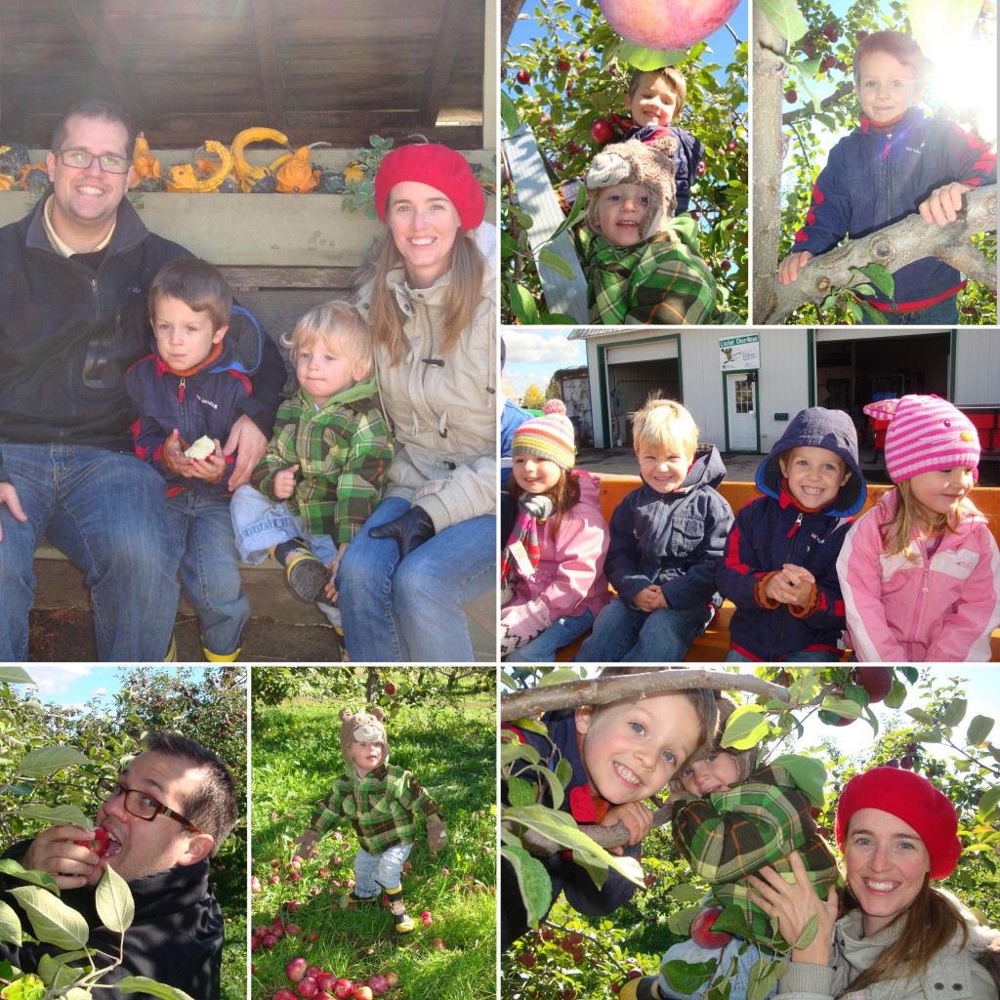
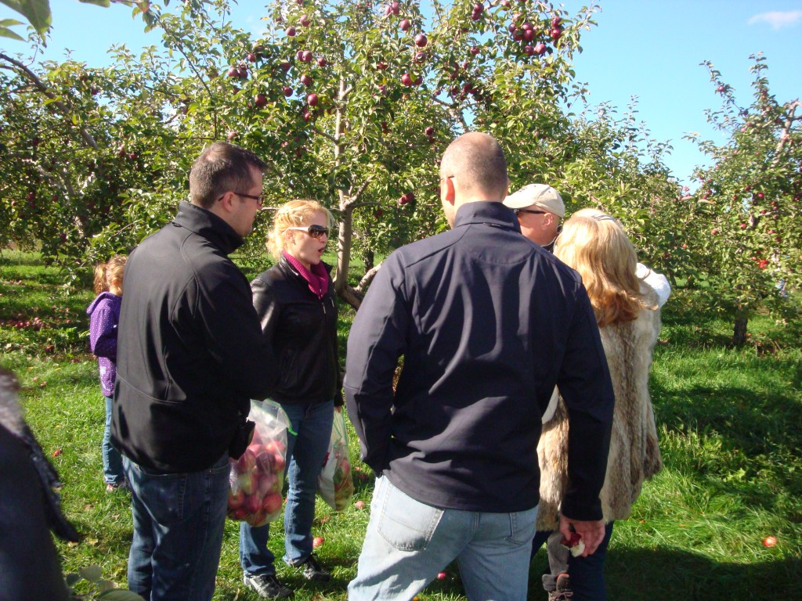

À la dernière minute, Jean-Michel m'a apprit qu'on allait passer la longue fin de semaine de l'action de grâce au Québec. Quelle bonne nouvelle! Aussitôt, je me suis mise au nettoyage et au paquetage. Puis, direction Montréal.

On a eu l'occasion de voir les membres de nos deux familles et de passer du bon temps. Voici quelques photos prisent lors de la traditionnelle cueillette de pomme.

Fait amusant, les hommes ont fait une compétition juteuse. J'explique. Chaque gars doit se procurer une petite pomme qu'il peut mettre d'un seul coup dans sa bouche. Le but, manger toute sa pomme et être le premier à la finir. C'était trop mourant. Il y en a du jus dans des petites pommes et ça giclait de partout au point de s'arroser les uns les autres. À un moment donné Phil a roté, ce qui à fait rire tous les hommes. Résultat, des futs de jus de pommes qui éclaboussaient de partout. En tout cas, on à bien rigolé! C'est quand même dommage que je n'ai aucun souvenir de cette compétition mémorable.Après la cueillette, j'avais un beau gros sac de pommes à ramener en Ontario. Puis j'ai vu «Le meilleur» outil pour les pommes. Et grâce à mes belles-soeurs, j'ai pu acheter un «pommemagique» qui pèle, tranche et évide en deux secondes. C'est le meilleur 15$ que j'ai dépensé dernièrement.

En tout cas, les annonces de dernière minutes comme celle-là, je les aimes!
