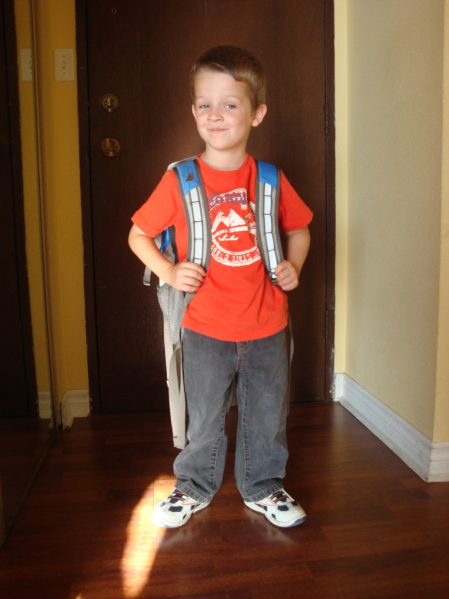
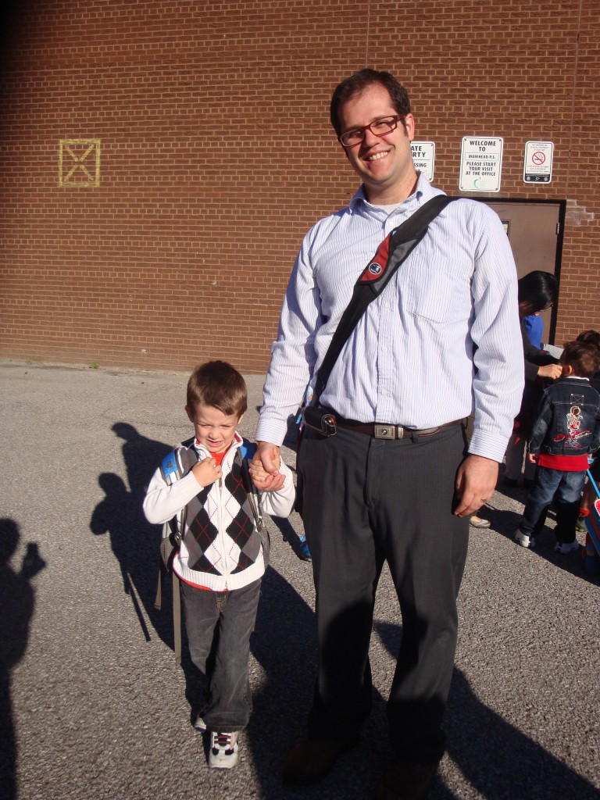
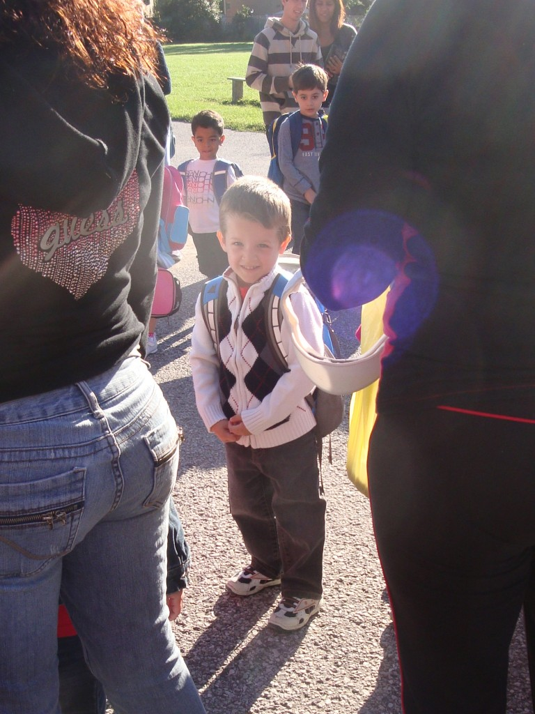

En Ontario, le système éducatif est différent du Québec. Entre autre, la pré-maternel fait partie de l'école primaire. Donc tout le monde envoie leur enfants à partir de trois ans, si ceux-ci ont 4 ans avant le premier Janvier.

J'avoue que je trouve ça jeune, mais en même temps je sais qu'Ézékiel est près pour l'école. Ça fait deux jours qu'il y va et on voit que notre p'tit homme est heureux d'y aller.

Il faut que je m'ajuste à cette nouvelle routine. J'ai l'impression de trouver ça plus dure qu'Ézékiel. Que voulez-vous, je suis peut-être une mère poule après tout?

Ézékiel impatient d'aller à l'école.

Mes deux étudiants.

 En ligne, juste avant d'entrer dans l'école. Comme il est brave](http://famillecarter.com/blog/wp-content/uploads/2012/09/DSC04887.jpg)
