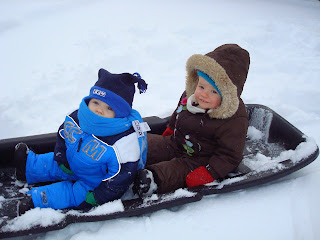
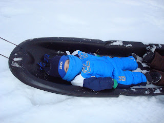
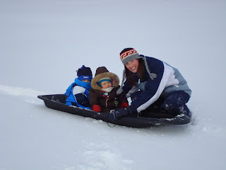

  

Après le temps des fêtes Ézékiel était très heureux de retrouver sa bonne amie Margo.  
Ils ont la chance de se renconter plusieurs fois par semaine.  
  
Mardi: Rencontre au centre pour enfants.  
Vendredi: Piscine ou sortie extérieur avec les mamans.  
Soirées de FDS: Les parents se rencontre pour le plaisir.  
  
Ça c'est sans compter toutes les fois qu'ils se croisent aux activités de l'église.  
  
Voici quelques photos prisent il y a deux semaines. La température était douce et la neige folle.  
  
  
  

Ici Ézékiel est sur le point de s'endormir.  
J'ai du le tourner de l'autre côté puisqu'il  
se laissait tomber sur Margo.  

  
  
  

Après avoir fait deux descentes très excitantes,  
nous sommes rentré puisque les petits choux  
étaient déjà tout gelés.  

  

