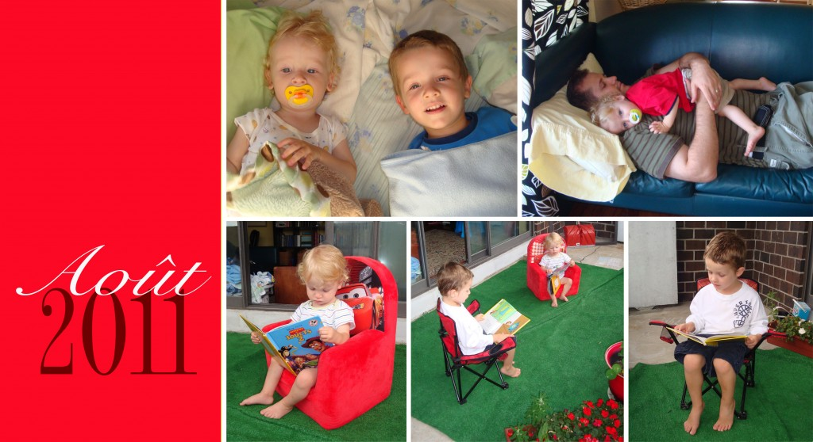

Ce mois ci, j'ai choisi cinq photos de moments attendrissants. Encore là il y en avait encore beaucoup d'autres, mais voici mes coups de coeur.

Photo 1: Un réveille très agréable dans notre lit.

Photo 2: Caleb est lui-même allé coller son papa. Jean-Michel m'a souvent souligné que notre bébé ne voulait jamais rester dans ses bras. Et bien cette journée, Caleb a fait passer son papa pour un menteur puisqu'il a demandé ses bras à au moins deux reprise.

Photo 3 à 5: Au début d'une soirée nous avons eu une panne de courant. Je suis donc sortie lire sur la galerie pour avoir un peu de lumière. Ézékiel m'a imité. J'imagine qu'il a aimé son expérience puisque quelques jours plus tard il m'a demandé la permission d'y retourner. Cette fois-ci Caleb à fait comme lui et ils sont resté un bon 20 minutes silencieux. J'étais en admiration avec mes petits lecteurs d'amours.
