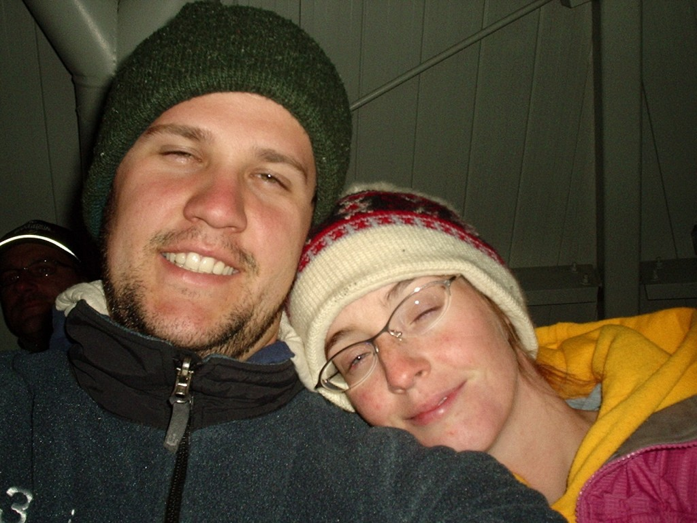
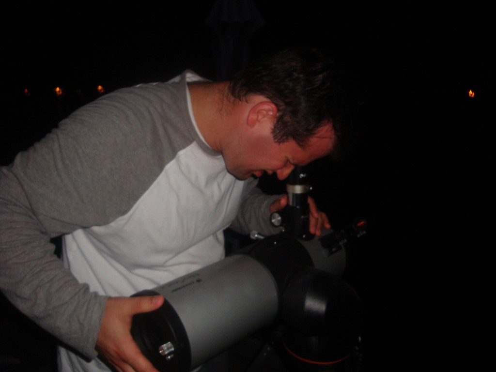
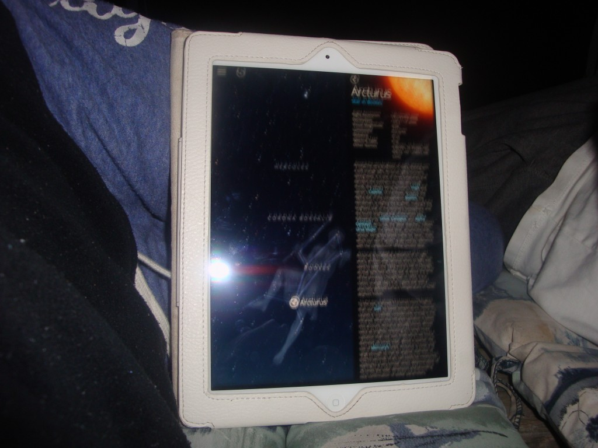
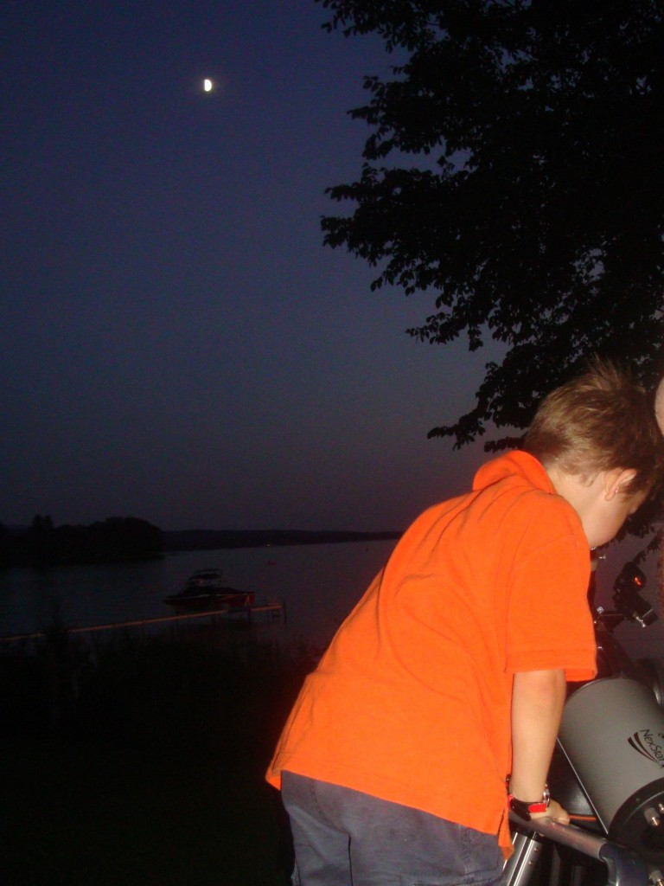
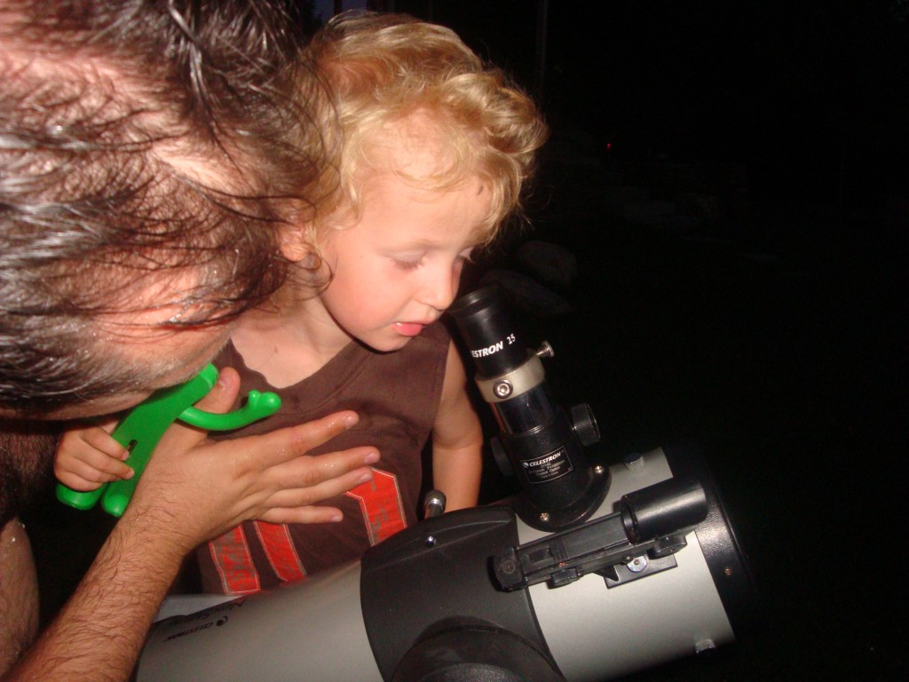

Il y a huit ans Jean-Michel et moi avons été voir les larmes de Saint Laurent, un autre nom pour les perséides. On a eu froid, on a mal mangé, on a mal dormi,... MAIS ÇA EN A VALLU LA PEINE! Nous avons adoré regarder le pluie d'étoile filantes toute la nuit au Mont-Mégantic. Nous en gardons de très bons souvenirs.

\[caption id="attachment\_1195" align="aligncenter" width="584"\] Au Mont-Mégantic à 23:35, encore très loin du dodo.\[/caption\]

D'après un article que j'ai lu, une des dix choses que l'on doit absolument faire durant l'été c'est de regarder le ciel étoilé. Alors mes chers amis préparez-vous, car nous sommes dans la meilleure période de l'année pour observer une belle pluie de météores. Les perséides vont jusqu'au 25 Août, mais les meilleures nuits sont situées entre le 11 et 13 Août.

\[caption id="attachment\_1199" align="aligncenter" width="584"\] Mon homme qui place le téléscope.\[/caption\]

On à pas besoin d'aller jusqu'au Mont-Mégantic ou d'avoir un télescope. Jean-Michel et moi avons avons beaucoup apprécié de juste s'étendre  sur le quai du Lac, alors que le ciel était dégagé. Et puis on a essayer de trouver les constellations.

Pour ceux qui on un ipad ou un iphone, je suggère fortement l'application Sky Guide. On pointe dans une direction et le programme nous montre quelles constellations on devrait voir et nous donne si désirer plus les détails sur toutes les étoiles visibles.

\[caption id="attachment\_1196" align="aligncenter" width="584"\] Avec Sky Guide... c'est super!\[/caption\]

Il est vrai que pour bien voir les étoiles il faut attendre assez tard pour que la lune se couche. Une fois, on a quand même réveillé Ézékiel pour qu'il vienne voir ce beau spectacle nocturne. Résultat, notre petit homme a vraiment aimé son expérience. Puis une autre fois, avant d'aller au lit on a montré les cratères de la lune aux enfants. Par de petites choses aussi simples, les enfants deviennent curieux et se posent de bonnes questions.. Aussi lorsque nous sommes en couple, cet atmosphère nous fait parler de choses vraiment profondes. J'aime avoir un physicien comme mari. Il est tellement bon pour m'expliquer des choses.

\[caption id="attachment\_1197" align="aligncenter" width="584"\] Activité familiale, avant le dodo ou à minuit.\[/caption\]

\[caption id="attachment\_1198" align="aligncenter" width="584"\] Ça ne se comprend pas du premier coup.\[/caption\]

N'oubliez pas de faire un voeux si vous voyez une étoiles filante!
