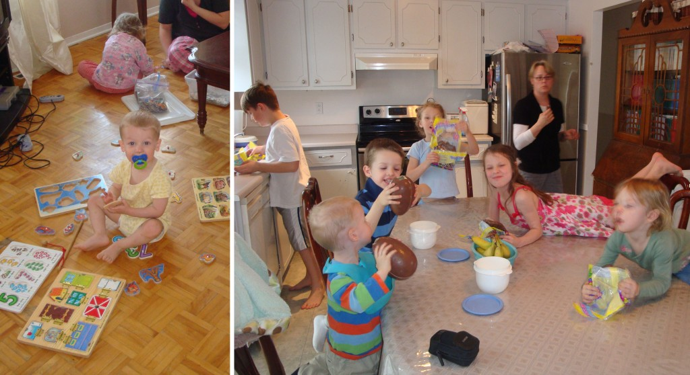
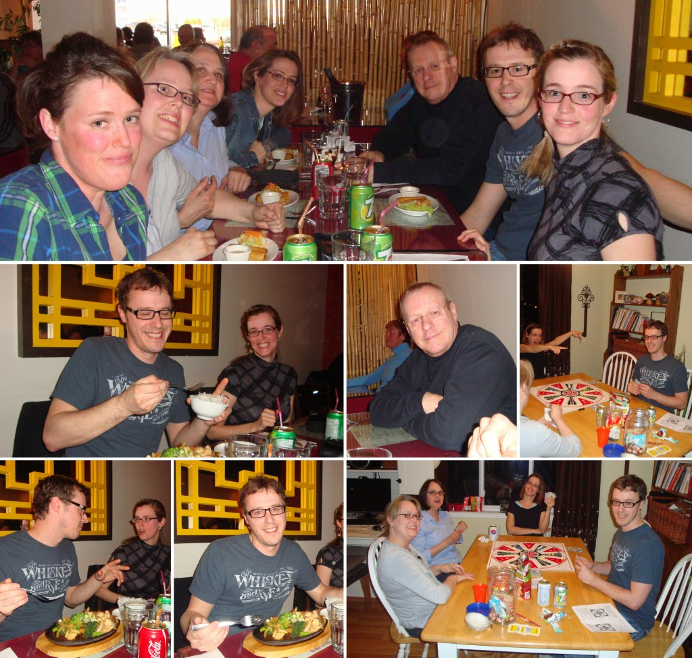
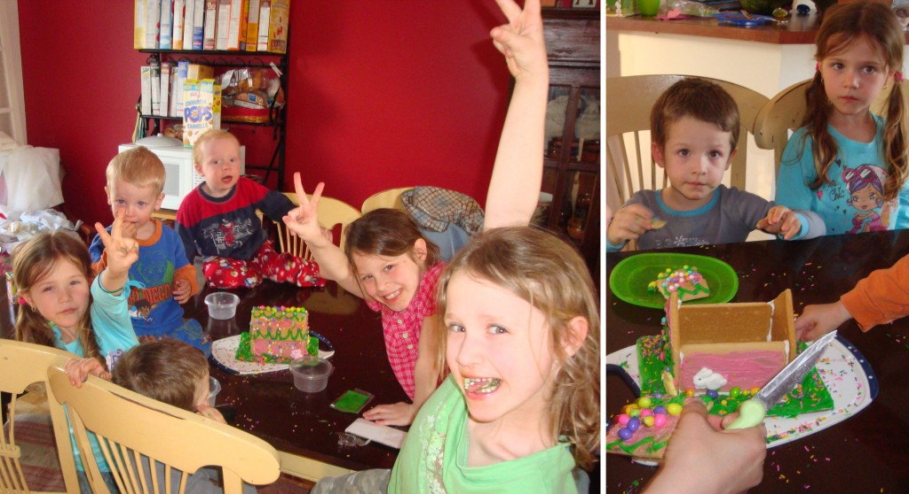
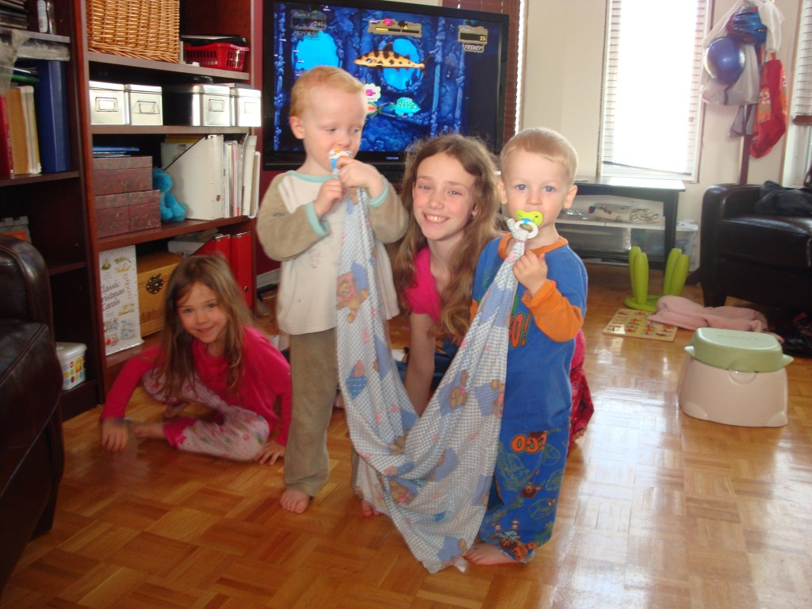
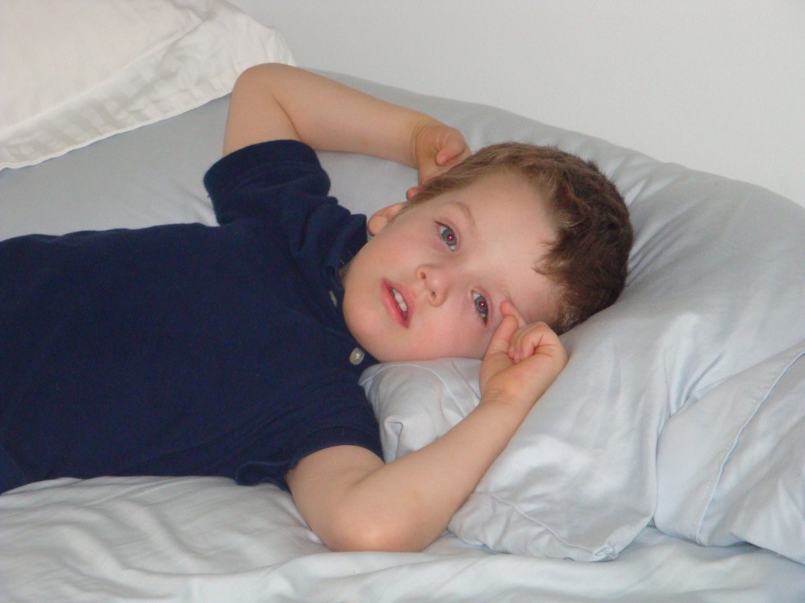
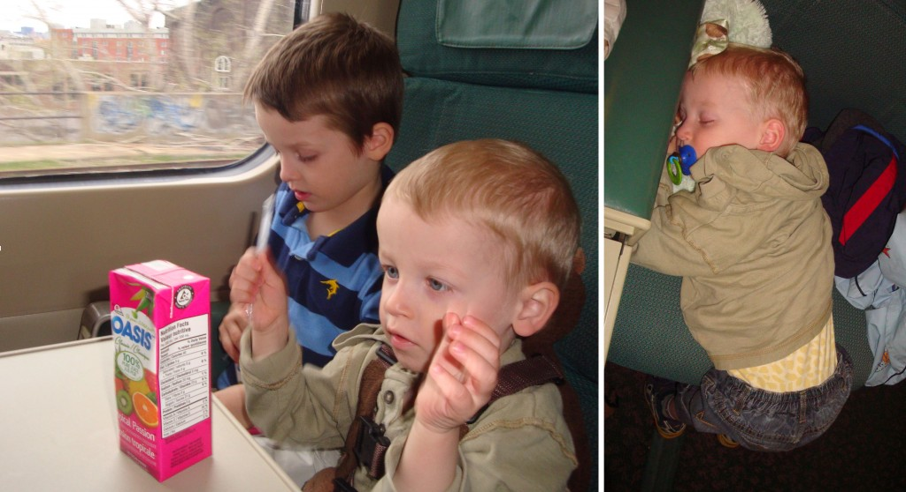

J'avais prévu rester une semaine de plus au Québec après Pâques et revenir avec les enfants en train. Mais à la place de réserver mes billets de train la semaine suivant la Pâques (Christian), je l'ai réservé le dimanche suivant la Pâques (Orthodox). Donc mon séjour au Québec venait de se rallonger d'une semaine.

Durant ces deux semaines là, j'en ai profité pour faire mon plein de «sociale». J'ai visité mes trois soeurs et vu le restant de ma famille.

**_Chez les Amyot_**

Mes enfants ont adoré vivre dans une maison où il y a toujours de l'action. Très souvent observateur, Caleb restait à la table à regarder les plus grands enfants bavarder de leur intérêts et de leur journée.

Ézékiel, lui a découvert une nouvelle amitié avez ti-cha. Tous les deux ont fait des casse-têtes côte à côte à tous les jours. Il a aussi porté beaucoup d'attention à son grand cousin qui aime les Légo et les jeux vidéos. Et il a aussi dépensé tout son énergie avec ses autres cousines, à sauter et courir partout.

Pendant cette semaine là, nous avons aussi été voir la famille Vallée. Une fois de plus mes enfants on  construit des liens solides avec les enfants de ma soeur. À notre départ, les jumeaux étaient particulièrement tristes que l'on ne pouvait pas rester plus longtemps chez eux.

 On en a aussi profité pour faire des retrouvailles de famille au restaurent. Maman, papa et Nat sont venus nous retrouver (les filles). Puis après avoir bien rempli nos ventre nous avons poursuivi la soirée avec des jeux. On a vraiment ri et eu du plaisir de se retrouver ensemble sans avoir besoin de s'occuper sans arrêt d'un enfant.

**_Chez les Fontaine_**

J'ai l'impression que chez les Fontaine, ça l'a été la fête constante pour les enfants. À l'horaire: deux soirées avec un feu de camp, sleep-over de grand-maman et d'Angie, maison de Pâques à décorer, balade autour du quartier en vélo et autres.

On à prit une journée pour travailler dans la cour et j'ai particulièrement aimé désherber le jardin qui en avait drôlement besoin. Après j'étais fière de mon p'tit bout de terre, près à être planté. Ça m'a tellement donné la piqûre qu'une semaine après mon retour à Toronto, je me suis occupée de notre jardin.

Ici on à les deux frères de suces.

**_Le retour_**

Deux jours avant notre retour nous sommes tombés malades. Zeke le premier, Caleb et moi en dernier. Donc nous n'avons pas été en super forme pour terminer notre temps au Québec.

En route, dans le train, le deux tiers du voyage s'est très bien passé. J'avais des collations pour les enfants à profusion et plusieurs petites activités. Par contre au dernier tiers, Caleb m'a vomi dessus et c'est là que les choses se sont un peu compliquées. Une chance il nous restait plus trop long avant d'arriver à la maison.

Lorsque nous sommes finalement débarqué du train, nous avons été gentiment guidé par des employés de Via Rail jusqu'à l'ascensseur. Et c'est là qu'avec soulagement et bonheur, j'ai vu mon homme nous accueillir. Les enfants étaient plus qu'heureux de voir leur papa d'amour. On était finalement la famille toute réunie, au soulagement de tous.

