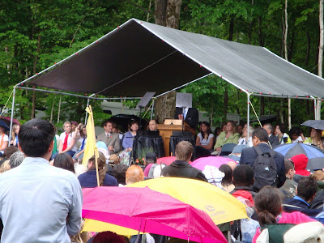
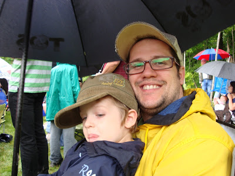
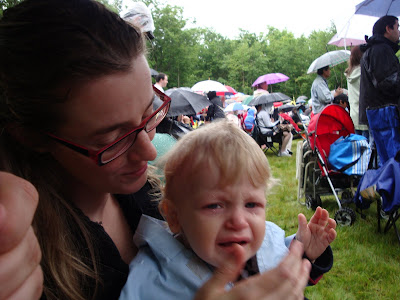
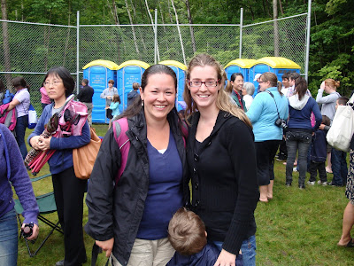
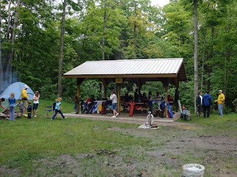

Hier nous avons été à la dédicace du nouveau terrain de camping pour le camp des Jeunes-filles: Thomas S. Monson Camp. Comme le prophète était déjà à Toronto pour une présentation du choeur du Tabernacle, celui-ci devait venir faire personnellement la dédicace.

Tout énervé, le matin même de bonne heure nous sommes partis toute la petite famille. Malgré notre intention d'arriver à l'avance pour avoir de bonnes places, on s'est quand même retrouvé au fond du terrain. J'ignore combien on était, il y en avait du monde!  

Voici une photo de la réunion. Une chance qu'il y a un bon Zoom sur la caméra. Ça prouve en quelque sorte qu'on à pas vu grand chose de la réunion. On peut voir le prophète à gauche de l'orateur. Le tout à durée une heure et demi. Ça n'a pas été facile avec les enfants et la pluie, mais nous étions très heureux d'entendre le prophète.  

  

Jean-Michel et Zeke qui se cachent de la pluie.

  

Maman qui essaye de consoler son p'tit Caleb.  

Celui-ci à été de cette humeur durant 95% de notre sortie.

Pas facile, pas facile.

  

Après la réunion nous avons eu l'agréable surprise de rencontrer des amis. Plusieurs personnes de la rive-sud de Montréal étaient venues, ainsi qu'une bonne partie des membres de Gatineau. Toute une surprise d'avoir vu la belle Cat.

  

Puis lorsque tout le monde s'est dispersé nous avons été faire un tour pour voir les nouvelles installations du camp. Encore mieux, nos amis les Létourneau avaient réservé un terrain sur le camping et nous avons pu y passer un peu de temps. Il y avait 7 sites pour chaque vertus des J-F, jusqu'à 4-5 tentes chaque.

Le site Good Works #7

  

Jean-Michel qui parle avec Marc avant de repartir.

  

Maintenant on prévois bientôt y aller en famille. Super!
