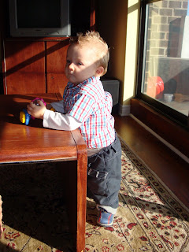
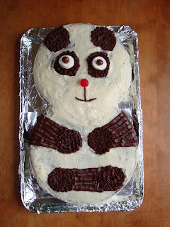
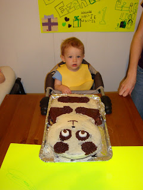
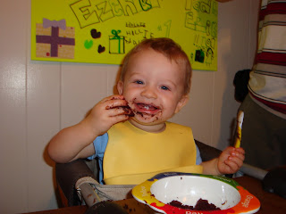
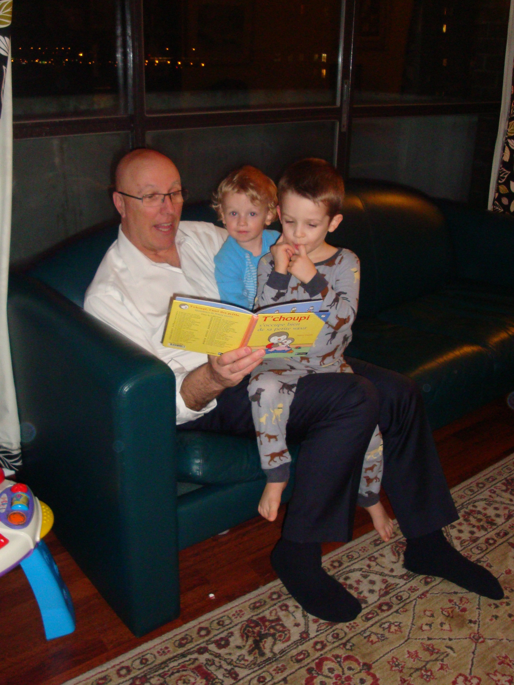

Le 8 mars, une journée avant le temps, nous avons fêté l'anniversaire d'Ézékiel. Notre grand bonhomme a eu un an. C'est incroyable comme le temps passe vite.  
  
  
La semaine passée, alors que je servais le repas pour une conférence de zone, j'ai revu deux missionnaires qui ont servi dans notre paroise en 07-08. Ils m'ont dit: Wow, sister Carter you don't have your belly anymore. I wish I could see your baby!  
Même si j'avais l'impression d'avoir vu ses personnes il n'y a pas si longtemps, j'ai réalisé qu'ils ne m'ont pas vu depuis que j'ai accouché.  
  
Tout ça pour dire que ça va vite. Ézékiel a eu droit à un beau gâteau au chocolat comme premier dessert. Pour ma première tentative de décoration de gâteau, je trouve qu'il est pas si mal.  
  
  
  
Lorsqu'on a chanté "Bonne fête", notre petit mec semblait perdu. Qu'est-ce qui pouvait bien se passer? Mais, ça n'a pas prit de temps pour que monsieur découvert le bon goût du chocolat.  
  

Ici Zeke est encore dans les vapes. "Something is going on!!!"  

  
  

J'avais une question moi?  

La recette parfaite pour réussir une fête... une sècheuse.  

  

  
  
Puis finalement Ézékiel à reçu un cadeau le jour de son anniversaire. On espère que ça va le motiver à marcher. En tout cas, il semblait très heureux de son présent.  
  
  

"J'ai un an!"  

