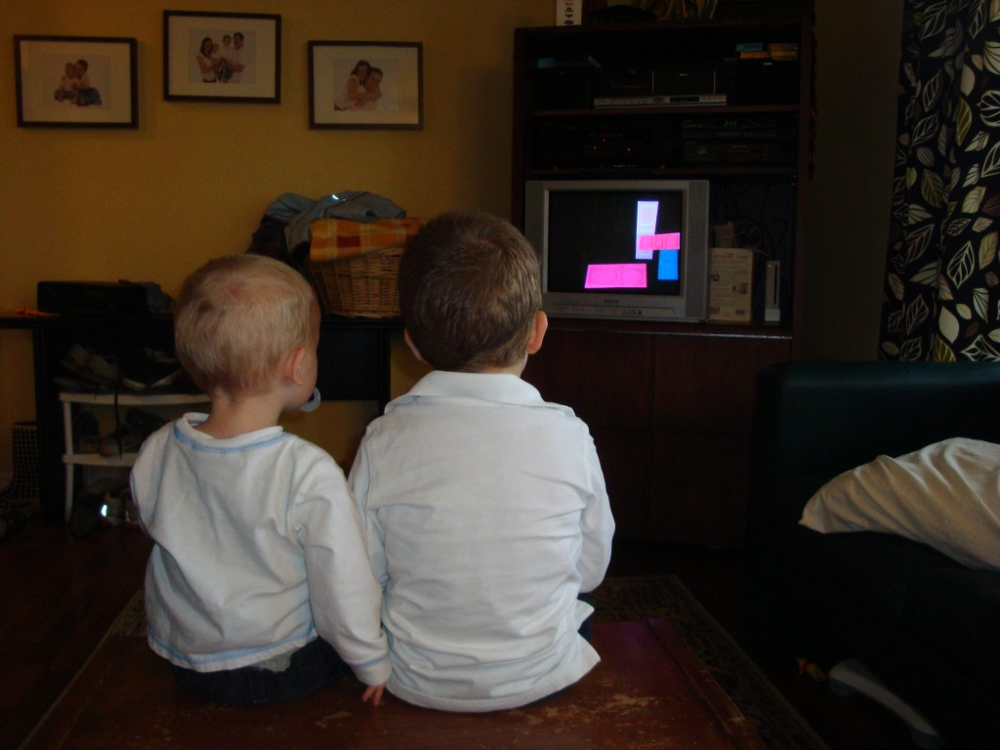
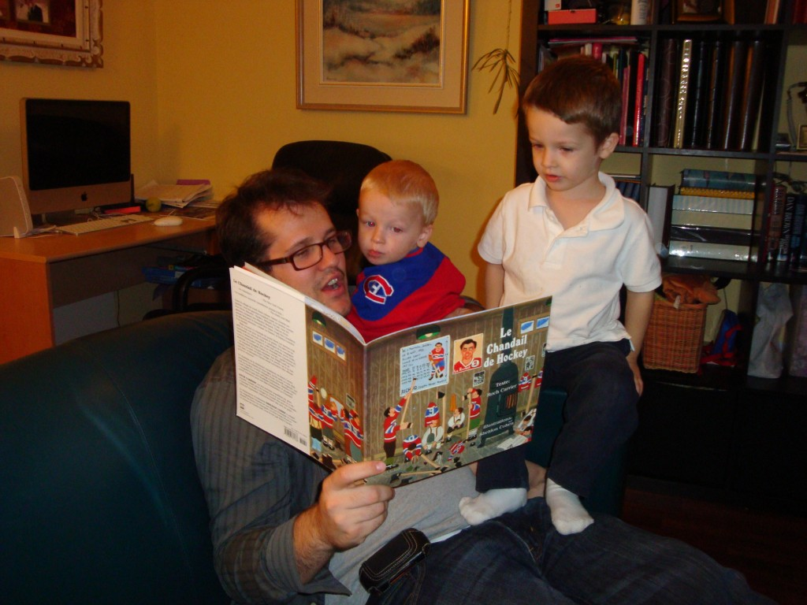
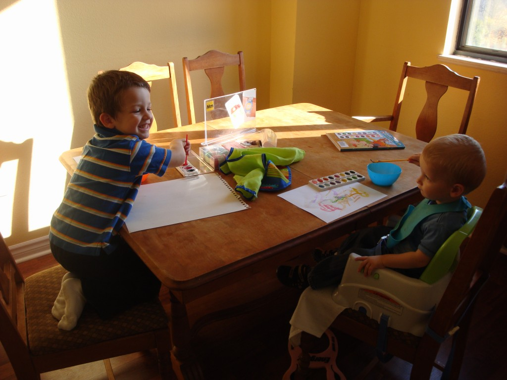
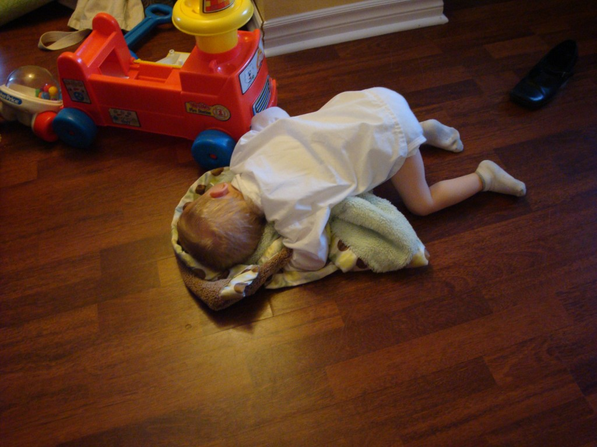
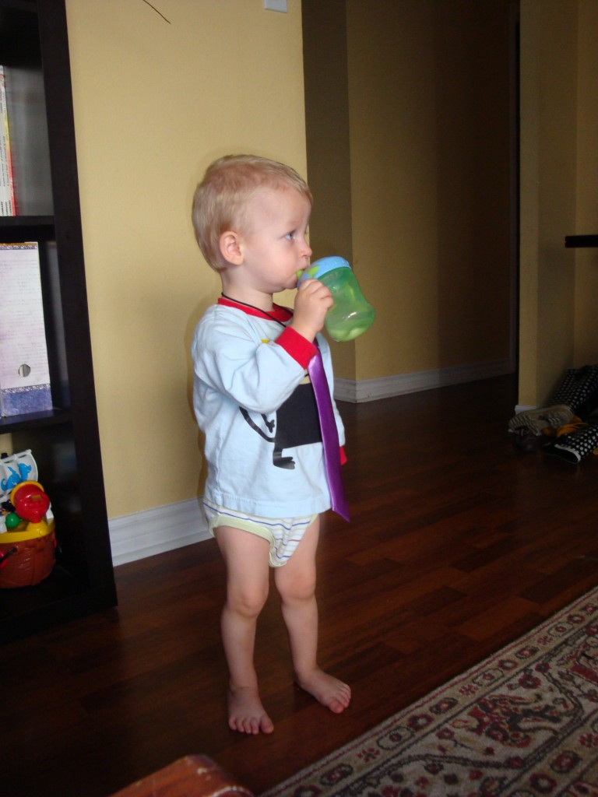

On est dans notre dernière année à Toronto et ça parait. Mon homme réalise que la fin de ses études arrive de plus en plus vite. Et pour être sûr de bien graduer, le voici qui travaille comme un fou, sans relâche.

C'est pourquoi toute la famille fait des gros sacrifices. Malheureusement depuis déjà quelques semaines il n'y a plus de grosses sorties familiales durant la fin de semaine. Résultat, je me retrouve presque constamment seule avec les enfants.

On essaye de se tenir occupé: épicerie, cours de sport, cours de mouvements, groupe de maman francophone, ...

J'ai quand même prit quelques photos, depuis le début du mois, qui méritent d'être soulignées.

Nous avons constaté une plus grande complicité entre les deux frères. Caleb est plus grand et suit mieux Ézékiel.

Le samedi soir quand il y a une partie de Hockey on a une petite tradition. Papa fait la lecture du livre « Le chandail de Hockey », par Roch Carrier. C'est un classique à avoir à la maison. Même maman et papa le trouve super bon.

Aussi, Ézékiel fait preuve de plus de créativité. C'est incroyable son attention dure plus de deux minutes. Maintenant il peut resté assit à la table 15 à 30 minutes pour découper, coller, … Tandis que Caleb est très doué. Ça paraît qu'il à un don.

Le dimanche c'est une journée de repos. Caleb nous en fait une bonne démonstration. Ici il s'est endormit sur le plancher du salon et à fait une bonne sieste d'au moins 30 minutes. On vous suggère d'aller dans votre lit.

Puis, encore dans les spécialités de Caleb, monsieur aime bien paraître. S'il y a une cravate qui traine, devinez qui réclame qu'on lui mette à son cou? La cravate fait l'homme, même si on est en chache-couche.

