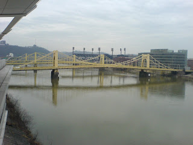
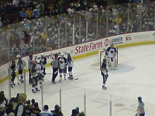
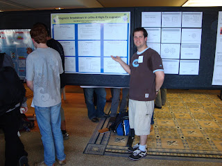
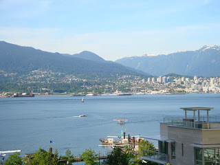
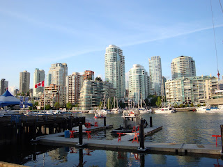

Ça fait très longtemps que je n'ai pas fait de post sur ce Blog. Marjorie est tellement bonne à le garder à jour que je ressent rarement le besoin de le faire. Par contre, depuis le début de cette année, il y a eut plusieurs bonnes choses qui se sont passées dans ma vie "professionelle" qui sont dignes de mention.

  

Premièrement, en Mars, j'ai eut la chance de participer au 2009 annual APS (American Physical Society) March meeting à Pittsburgh où j'ai pu faire une présentation sur mon projet de recherche que j'ai commencé l'été dernier dans le cadre de mes études. Ce fut la première fois de ma vie où je donnais une telle présentation, et ça a très bien été. Je suis vraiment content de l'expérience et disons que ça a cassé la glasse pour les années à venir.

  

À partir du Convention center ... on voit les nombreux ponts jaunes

avec le stade des Pirates en arrière plan!

  

Pendant que j'étais à Pittsburgh, Guillaume Lambert (un ami de McGill qui est maintenant à Princeton et qui était à la même conférence que moi) et moi sommes allés voir un match des Penguins contre les Thrashers. C'était vraiment un bon match. Si je souviens bien, Pittsburgh avait gagné 6-2 avec 5 points par Malkin. Quel joueur! Voici une photo que j'avais prise avec mon cell (vu que je n'avais pas la caméra ... dommage, la qualité de la photo n'est pas très bonne).

  

Pendant le match, une fin d'escarmouche!

  

Après Pittsburgh, je me suis concentré un peu sur le dernier cours de ma vie et pour bien terminer j'ai obtenu un A dans ce cour. Ça fait du bien de dire maitenant que plus jamais je n'aurai à prendre un cours ou à étudier pour un examen final!

  

Ensuite, en Mai, j'ai eu la chance d'aller à Vancouver pour un Summer school suivit d'une autre conférence (parti 6 jours en tout) où des experts dans le domaine que j'étudie nous on donné des cours (pendant le summer school) et ont donné des présentation sur leur recherche actuelle. J'ai aussi pu présenté un Poster sur ma recherche devant ces experts et ce fut une très bonne expérience. Très formateur et dans un setting qui n'était pas trop stressant.

  

Me voici devant mon poster (quand même un peu stressé).

  

Vancouver est vraiment une belle ville. Surtout le campus de UBC sur le bord de la mer, juste à côté des montagnes. C'était magnifique! Voici quelques photos

  

La vue que j'avais à partir de l'Hôtel où je présentait mon poster.

  

Ici c'est la vue à partir du restaurant où nous sommes allées le mardi soir.

Pour plus de photos ... je vais en mettre su Facebook!

  

  

Pour terminer, la semaine qui a suivit la conférence à Vancouver, j'ai du passer mon "Ph.D. qualifying exam" qui constitue à écrire un Research proposal qu'on doit envoyer à tous les membre de notre comité, et ensuite à faire une présentation de 20 minutes sur notre recherche et plan de recherche, suivit d'une période de questions d'environ 40 mins. Ensuite, le comité délibère pendant un quinzaine de minutes, te réinvite dans la salle et t'annonce ton résultat. Il y a 3 possibillités: 1) Tu es confirmés dans le programme. 2) Tu dois repasser l'examen 3 mois plus tard et répondre a certaines exigences avant d'être confirmé. 3) Tu es expulsé du programme. Évidemment, c'était très stressant. Mais la présentation a super bien été et j'ai réussi à répondre a la majorité des questions qui m'ont été posées. Malgré tout, le quinze minutes de délibération était quand même srtessant mais lorsque la porte s'est ouvert, la personne qui s'occupait du bon déroulement de l'examen (le convener) m'a serré la main et m'a dit: "Congratulation, that was a very well done presentation", et m'a ensuite donné le papier qui me confirme dans le programme. OUF!!!

  

Voila ... c'était des nouvelles de moi!

  

JM
