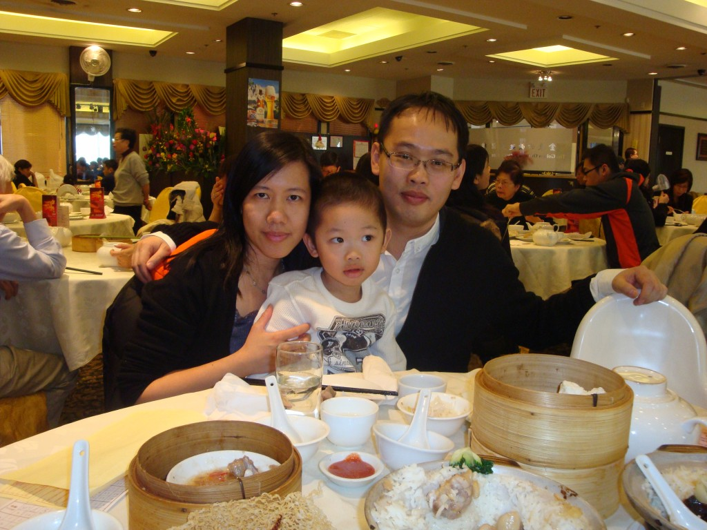
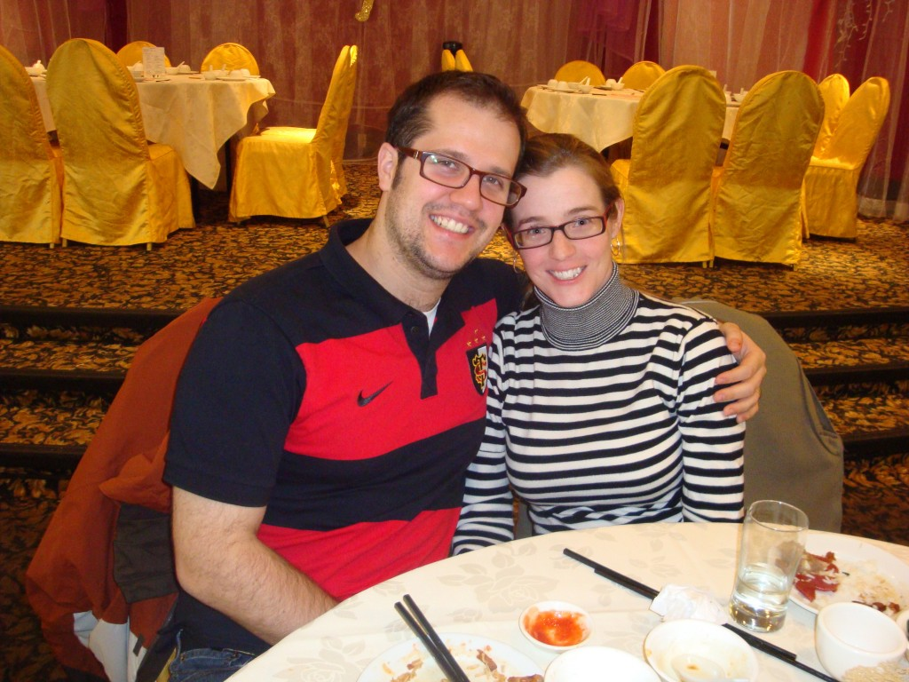
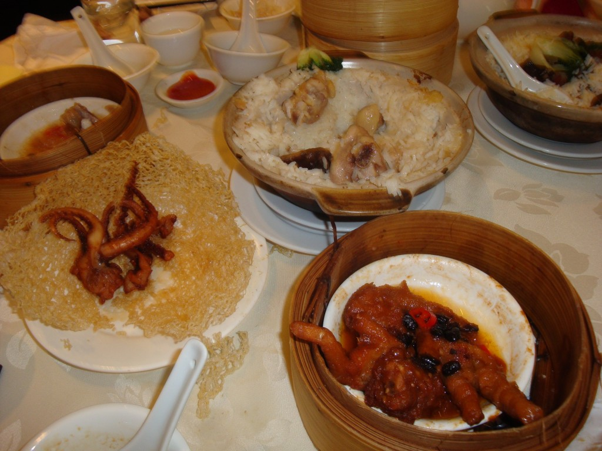

Avant les fêtes nous avons eu une belle sortie entre amis. Il semblerait que _la place_ pour manger de la nourriture authentique chinoise à Toronto, c'est dans le quartier Markham. Nos amis qui s'y connaissent assez bien dans le domaine, nous on amené manger dans leur restaurant préféré.

C'était la première fois que j'assistais à un repas Dimsum (des mets en petites bouchées).Nous avons beaucoup apprécié. Spécialement Jean-Michel qui a mangé de la pieuvre et des pieds de poulets. Merci à nos amis pour le bon temps passé ensemble!
