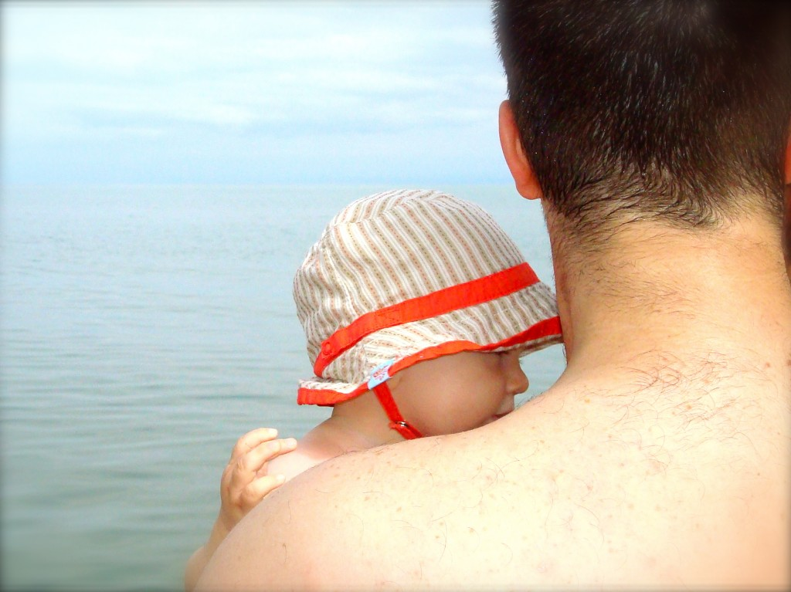
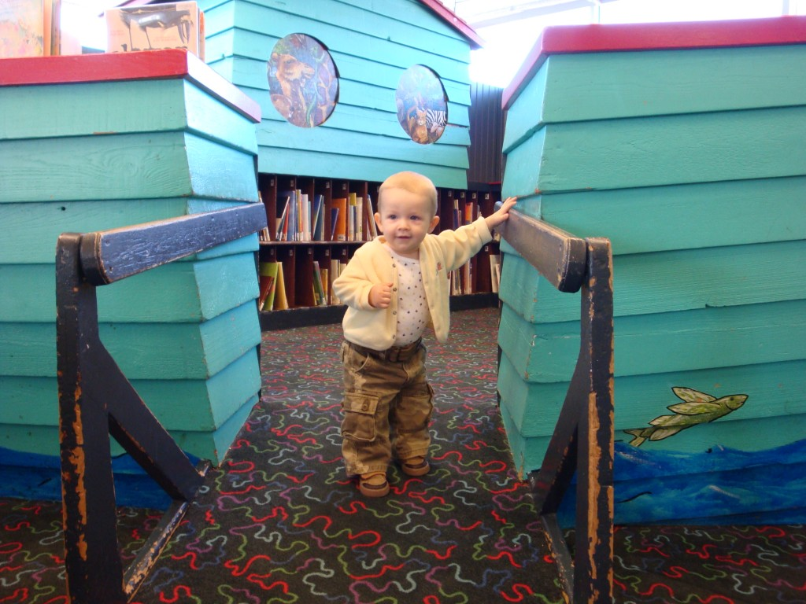
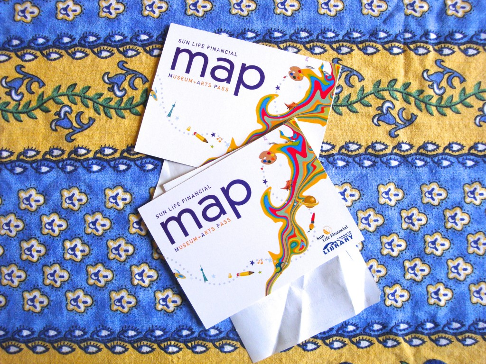

Dix choses, et non personnes, qui vont me manquer de North York.

1) **Les plages en été**. Durant nos six ans ici nous avons été à au moins six différentes plages. La plus proche d'ici étant seulement à 20 minutes en voiture, ce qui m'a permis d'y aller à plusieurs reprise.

2) **La bibliothèque de Toronto.** Une bonne grande variété de livres et un très, très bon système de réservation par internet.

3) **Museum+arts pass.**À tous les samedis matins on avait la possibilité d'avoir des billets pour rentrer gratuitement sur plusieurs sites de Toronto. Au total nous avons utilisé une vingtaine de billets entre autre pour le plus grand musée de Toronto ROM, le centre des scineces, le Zoo de Toronto, Casa Loma, Black Creek Pioneer Village et plusieurs autres.

4) **Welcome Policy.** Ce programme permet au famille à plus petit revenu d'inscrire gratuitement chaque membre de la famille dans des classes des centres communautaires. Ézékiel est celui qui en a le plus profité avec un cours de danse et deux fois le cours creative play time.

5) **Le système de santé.** J'aime qu'il m'a été facile de trouver un docteur de famille et un pédiatre pour mes enfants. Aussi presque dans toutes les cliniques que j'ai été, je n'ai jamais attendu plus d'une demi-heure. Et en plus tous ces emplacements étaient très proche de chez moi.

6) **Les rues.** Le système de rue est fait pour que lorsque les autobus s'arrête pour prendre des passagers, il ne bloque pas la voie de droite. Même chose pour les voitures qui tournent à gauche. Il y a une voie central pour éviter de bloquer les voitures qui continuent tout droit.

7) **Les trottoirs.** Les trottoirs sont à au moins un mètre de la rue, ce qui est plus sécuritaire et qui diminue le risque de se faire mouiller par les voitures passent dans les flaques d'eau. Sans oublier que personnellement je trouve ça plus esthétique.

8) **Une plus grande tolérance face aux autres ethnies.** C'est pas compliqué, tout le monde vient d'une autre province ou d'un autre pays. Quand je vais à l'épicerie je suis une des rares à la peau blanche ce qui m'apporte mon unicité.

9) **L'architecture.** J'aime me promener en voiture dans les vieux quartiers. Je suis toujours en amour avec les vieilles maisons. Et je ne peux pas m'empêcher de dire à Jean-Michel... "Celle-là a un petit cachet."

10) **Le soleil.** Le soleil se couche un peu plus tard et se lève un peu plus tard. Ça peut paraître anodin, mais en hiver ça fait une grosse différence. On est qu'à six heures de Montréal et pourtant on constate la différence quand on va visiter la famille.

Malgré toutes ces choses qui vont me manquer, il n'y a rien, mais absolument rien qui peu me convaincre de rester ici. Il n'y a rien qui peu compenser pour vivre près de notre famille au Québec.
