J'ai beau penser que dernièrement on est dans une petite routine familiale bien normale, mais quand je regarde mes photos je me rend compte que ces petits moments avec eux me font chaud au coeur. Donc, bienvenu dans la galerie de photos «La petite vie entre quatre murs».

Photo1, 2 et 3: Ézékiel nous épate avec son amour pour les casse-têtes. Ce n'est pas tout! Que ce soit en pâte à modelée ou écrire les titres des films qu'il aime, Ézékiel aime écrire.

[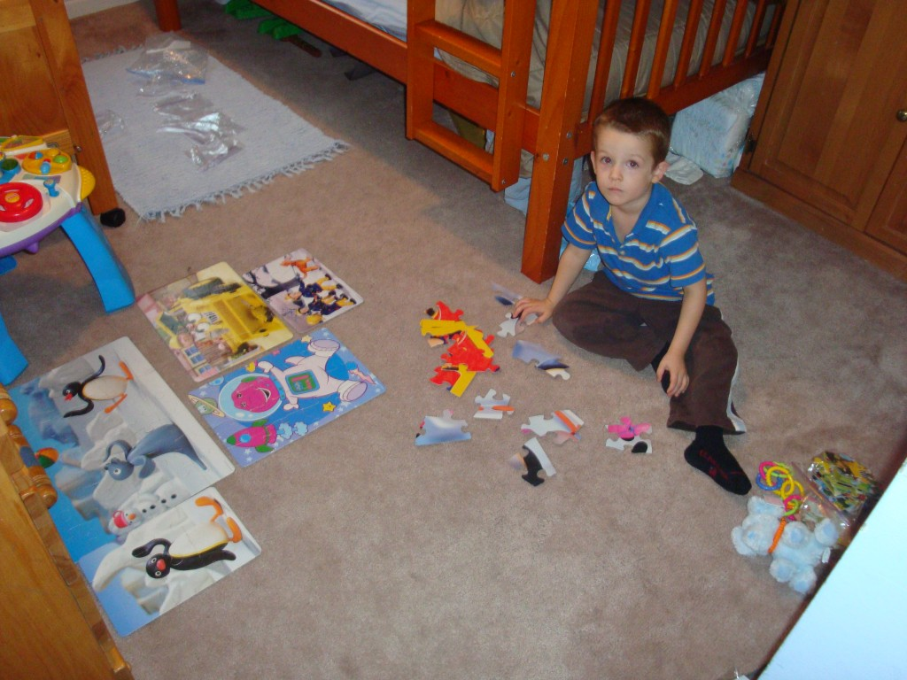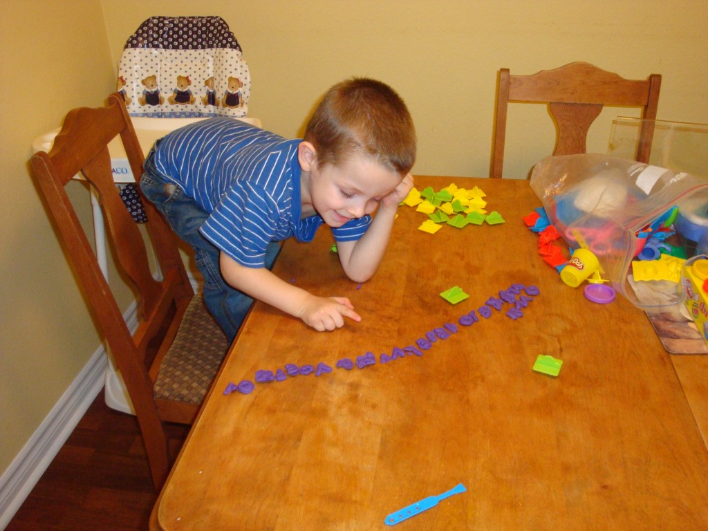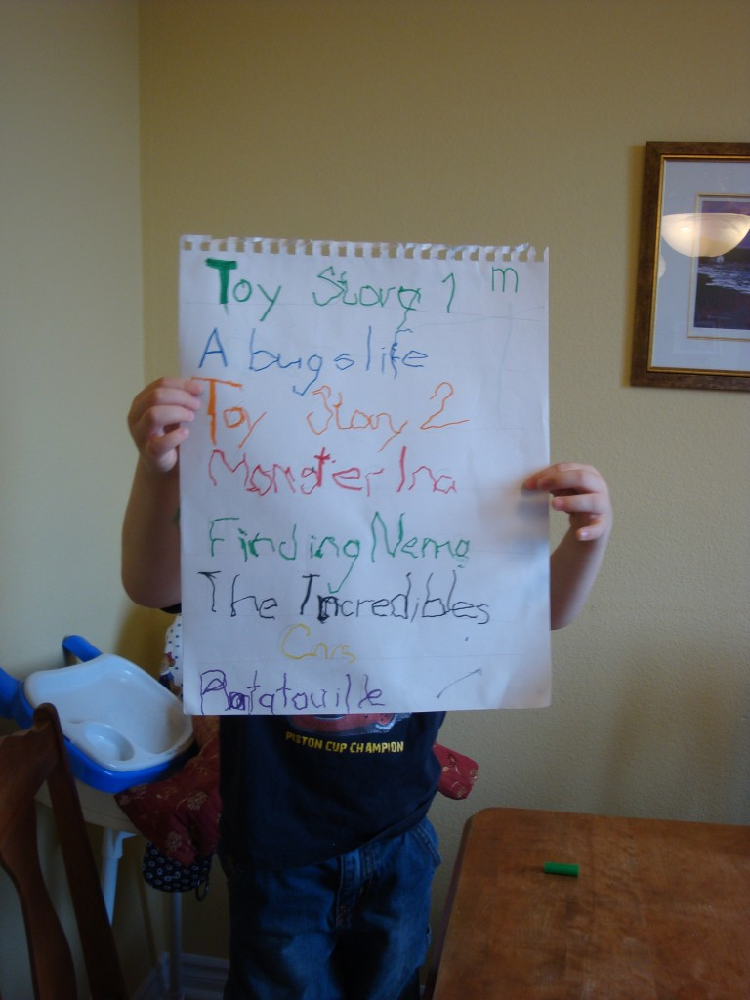](http://famillecarter.com/blog/wp-content/uploads/2011/12/DSC03027.jpg)Photo 4 et 5: Une fois de temps en temps on a droit à une bonne partie de hockey entre les deux petits mousses. Ici Caleb la menace et plus bas Ézékiel la terreur.

[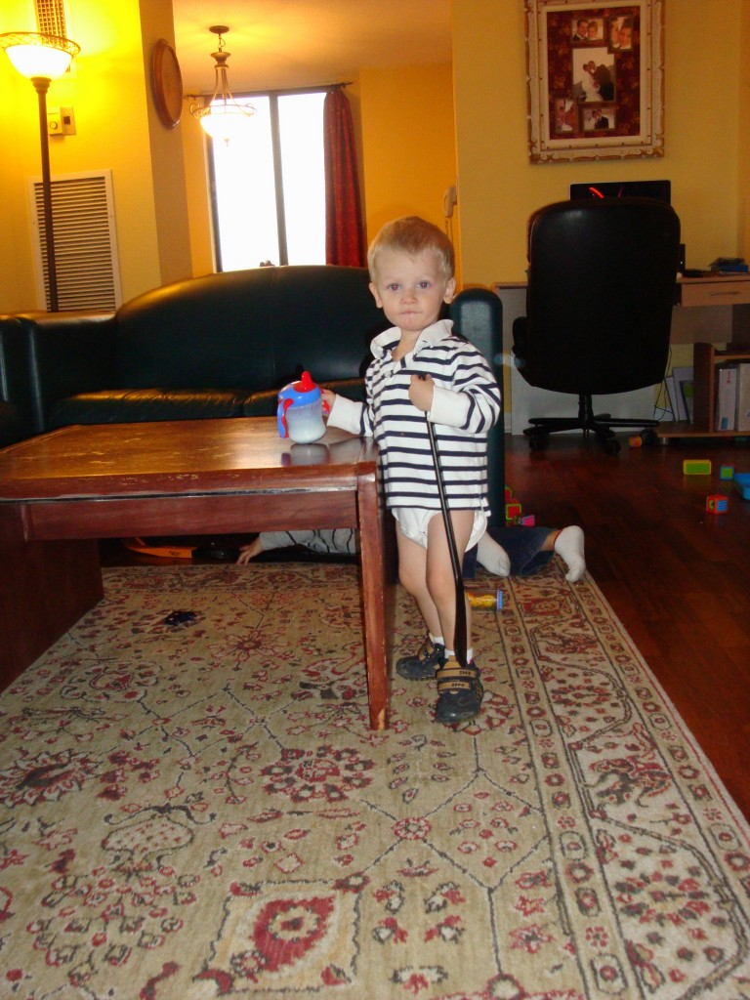](http://famillecarter.com/blog/wp-content/uploads/2011/12/DSC03034.jpg)[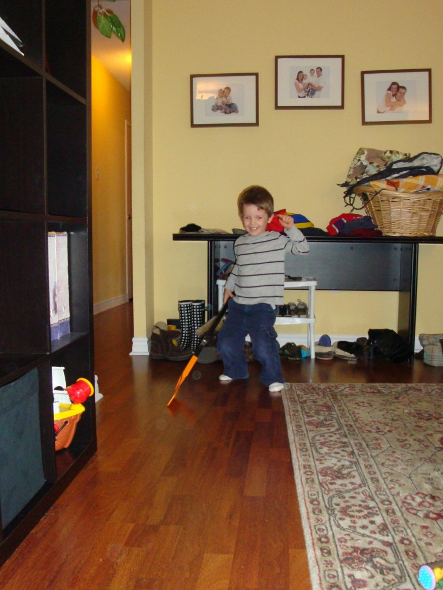](http://famillecarter.com/blog/wp-content/uploads/2011/12/DSC03036.jpg)Photo 6: Tout a commencé quand j'ai entendu l'eau couler dans la salle de bain. J'étais surprise car la lumière était fermée. Ai-je oublié de refermer le robinet? En ouvrant la lumière, j'ai vu le petit visage de Caleb sursauter. Je l'avais prit en flagrant délit de se servir à boire. À surveiller.

[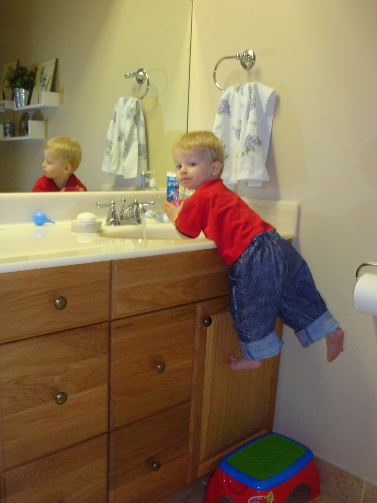](http://famillecarter.com/blog/wp-content/uploads/2011/12/DSC03075.jpg)Photo 7: Vraiment Caleb? Un Woody, des lunettes de piscine et un wrench?

[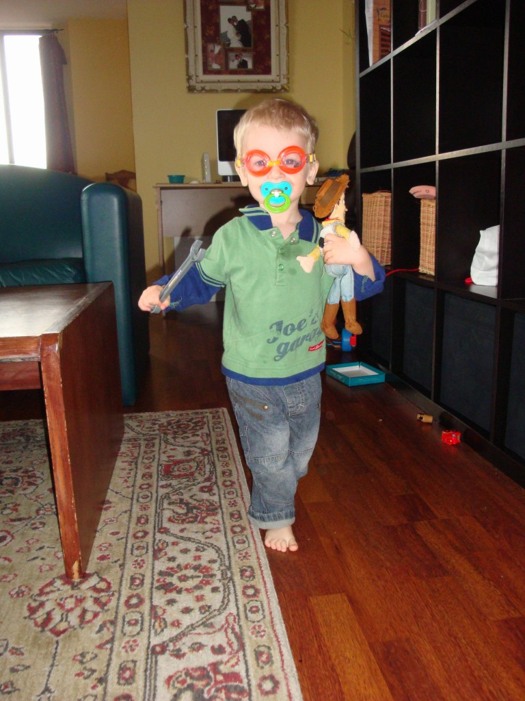](http://famillecarter.com/blog/wp-content/uploads/2011/12/DSC03053.jpg)Photo 8: Au retour de la fête de Noël de la paroisse. Les deux p'tits singes se sont endormis dans la voiture. Résultat nous les avons trimbalé jusque dans le salon et les avons déposé sur le sol quelques minutes. À notre grande surprise les deux garçons avaient la même position. Trop mignon!

[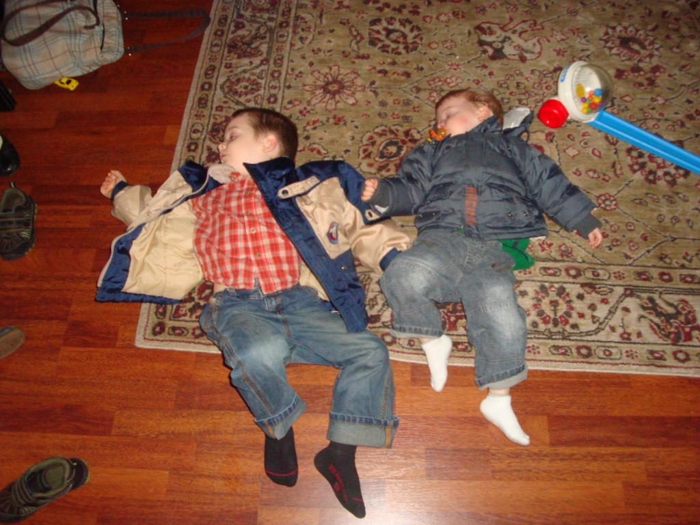](http://famillecarter.com/blog/wp-content/uploads/2011/12/DSC03083.jpg)Photo 9: Nous avons officiellement terminé les cours d'Ézékiel. «Creative Motion» qu'il détestait et «Sport Ball» qu'il aimait un peu plus. Voici le scénario traditionnel du retour à la maison: deux endormis.

[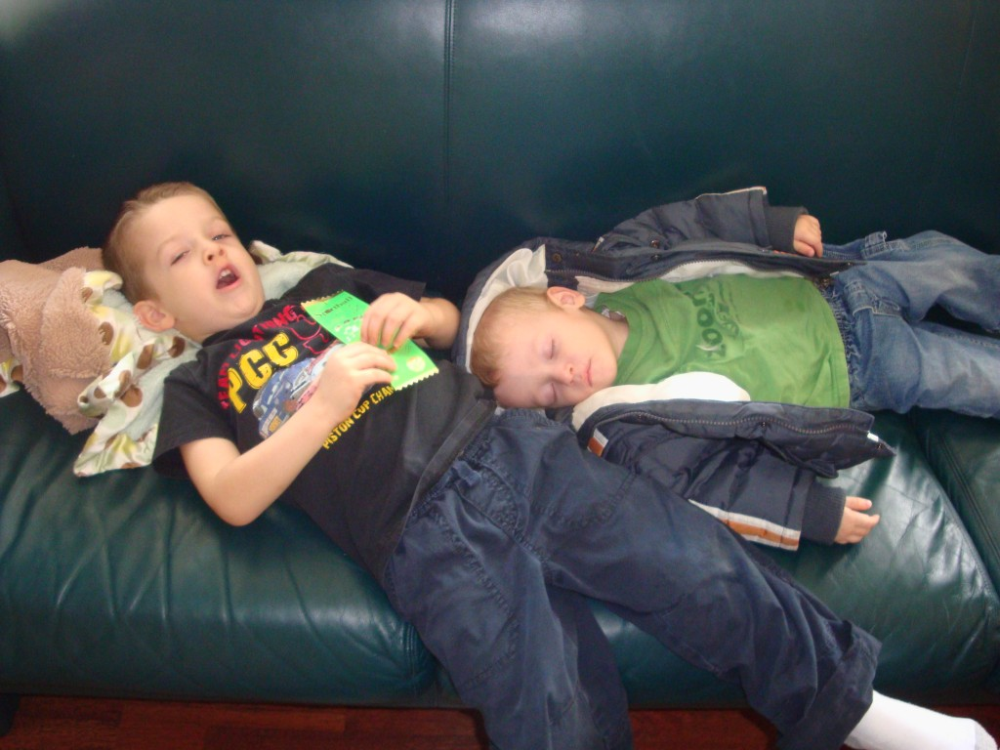](http://famillecarter.com/blog/wp-content/uploads/2011/12/DSC03095.jpg)Photo 10: Faire une maison en pain d'épices pour Ézékiel représente le film "The Grinch". Trouvez le lien, autre que Noël.

[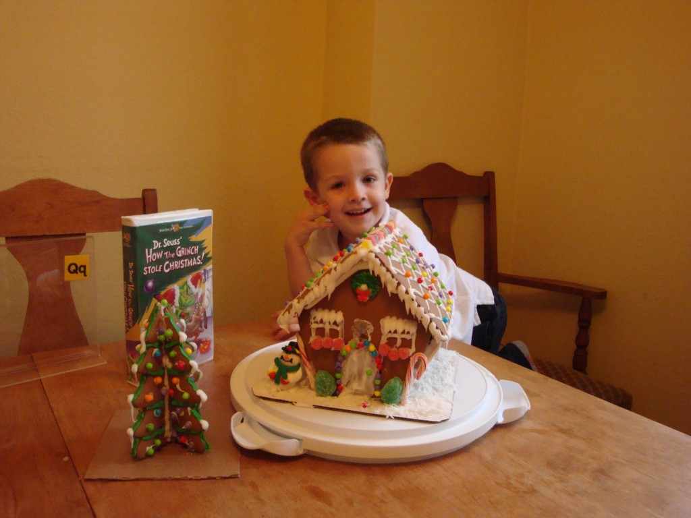](http://famillecarter.com/blog/wp-content/uploads/2011/12/DSC03071.jpg)Et pour terminer, d'Ézékiel qui se pratique à découper. Un passe temps qui a duré plus longtemps que je ne l'avais espéré. Bravo!

[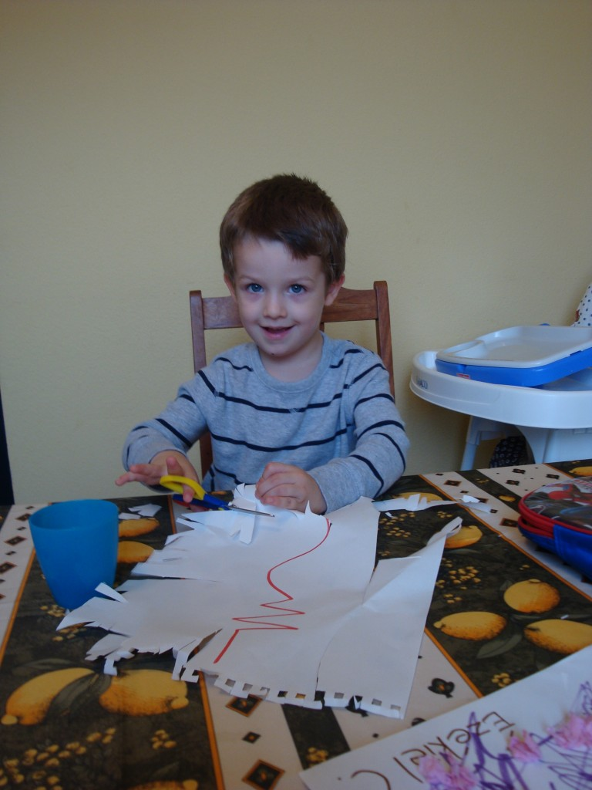](http://famillecarter.com/blog/wp-content/uploads/2011/12/DSC03025.jpg)
