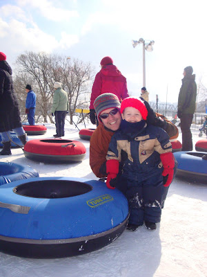
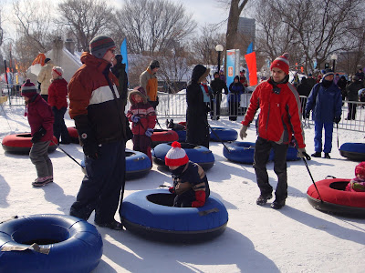
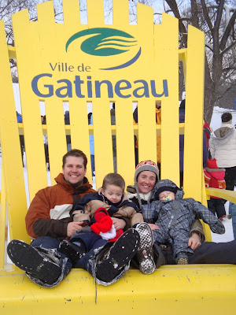
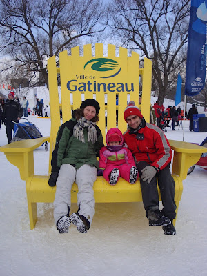

Ézékiel en action.

  

Les mois de février et de mars me semblent toujours plus long que les autres. On ne peut s'empêcher de rêver au printemps. C'est pourquoi cette année j'essaye vraiment de nous tenir occupé.

Comme on avait rien de prévu pour la fin de semaine passée on a décidé d'aller voir nos amis à Gatineau. C'est vrai que c'est à quelques heures de chez nous, mais après avoir voyagé si souvent à Montréal, ça ne nous dérange plus vraiment.

La famille Létourneau a été super gentil de nous recevoir chez eux. Les deux soirs qu'on a été chez eux on a parlé jusqu'à très très tard. J'ai trouvé ça tellement agréable de blablater avec eux spécialement que ça faisait plusieurs années qu'on s'était vu.

Notre visite tombait bien puisque durant cette fin de semaine là c'était le Bal des neiges. La température était idéal pour une occasion comme celle-ci. La famille Plouffe est venue avec nous visiter le site et juste avant de partir on y à vu la famille Groux... C'est fou parce que même si je ne connaissait rien de la ville de Gatineau je m'y sentait comme chez nous. Pas difficile quand on voit ses amis à tous les coins de rue.

  

Ces photos ont été prise au Bal des neiges.

Jean-Michel et Ézékiel qui se préparent à glisser.

  

Les deux hommes qui accompagnent joyeusement leur petits amours

Zeke et Émeline.

  

  
  

Notre belle famille.

  

  

La famille Plouffe avec qui on a eu le plaisir de passer  

une bonne partie de la journée.

  

  

En plus en soirée les Létourneau on organisé une soirée de couple pour souligner la Saint-Valentin. Il y avait les Plouffe, les Winlow, la famille d'Esther Caron, et un nouveau couple qui vient d'arriver du Brésil. Plan pour la soirée: fondue au Chocolat, jeu et session de bavardage.

Nous sommes revenu dimanche après les réunions. Nous étions mort de fatigue, mais nous étions franchement heureux d'avoir été faire un p'tit tour chez nos amis!
