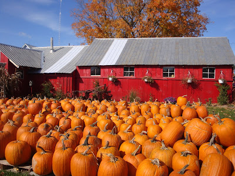
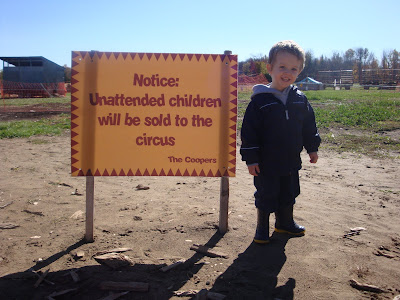
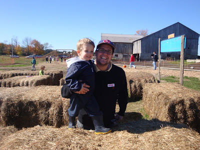
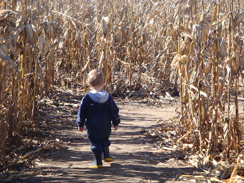
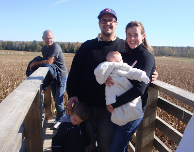

Il n'y a aucun doute, l'automne est définitivement ma saison préférée. C'est tellement plaisent d'aller prendre l'air frais et d'admirer les arbres éclatants de belles couleurs vives. Samedi c'est ce que nous avons fait. Nous avons passé une belle journée à la ferme Cooper's.

  

Ferme Cooper's

  

  

Un p'tit mot de bienvenue à notre arrivé.

  

  

Nous y avons fait une ballade en tracteur, nous avons trouvé La parfaite citrouille de l'année et le meilleur nous nous sommes perdu à plusieurs reprise dans leur labyrinthe de champ de blé d'inde.

À la recherche de La citrouille.

  

  

Dans le labyrinthe pour enfants.  

Ézékiel ne voulait plus partir de là.

  

  

Dans le grand labyrinthe de 10 acres.  

  

  

Jean-Michel à fièrement affiché ses colleurs en portant sa casquette des Canadiens. Il faut mentionner que le labyrinthe avait la forme du logo de l'équipe des Maple Leafs et qu'à travers le parcours de celui-ci était affiché l'histoire de l'équipe d'Hockey. Un gros merci à mon homme qui a accepté de venir sur ce site malgré le fait d'être entouré de partisans des Maple Leafs.  

  

  

  

Maintenant il ne me reste plus qu'à décorer nos citrouilles pour l'Halloween.  

