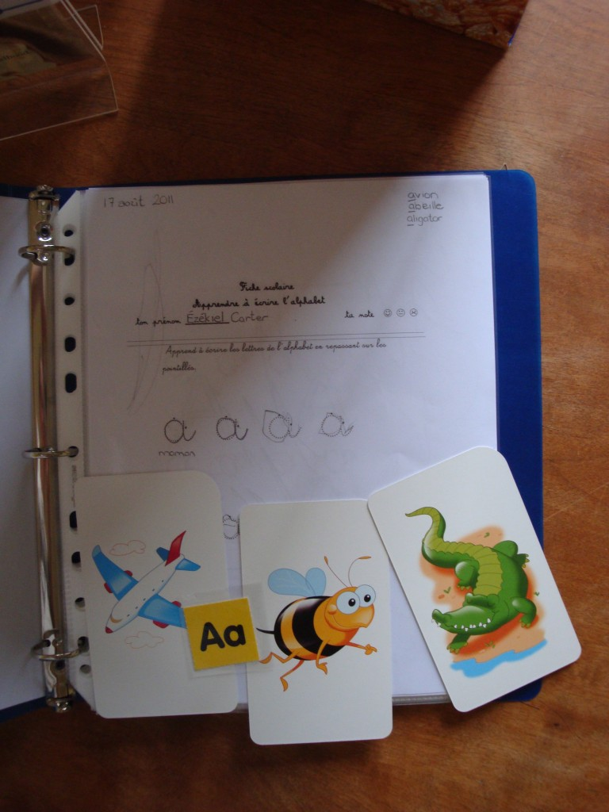
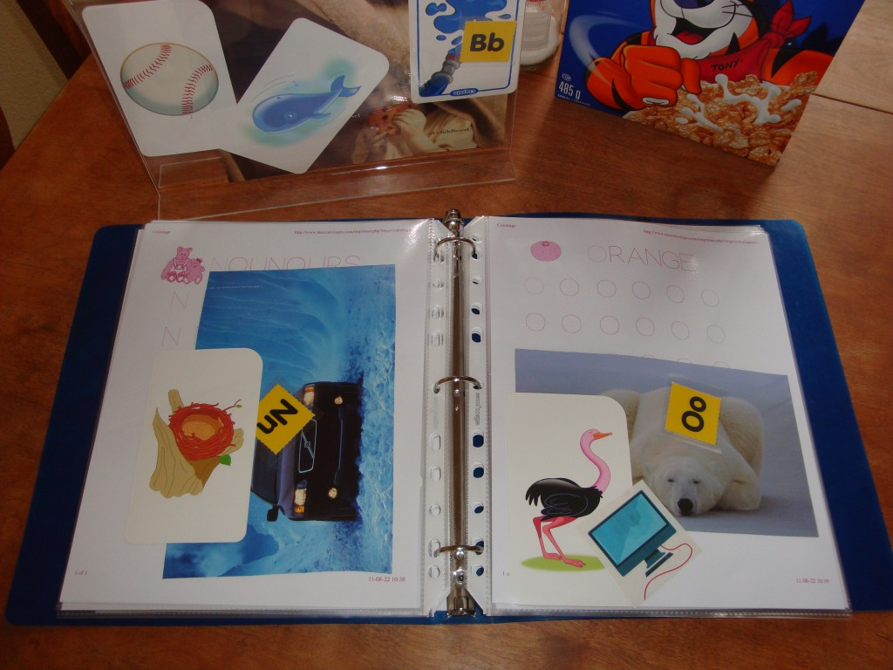
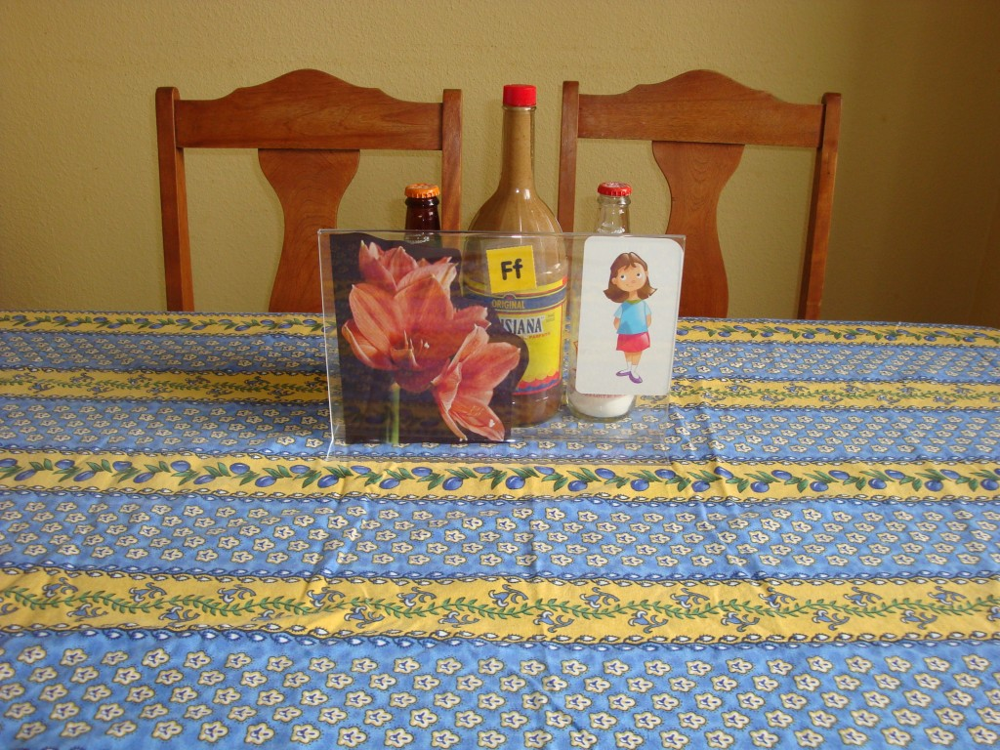

Depuis qu'Ézékiel est tout petit, j'utilise l'heure du diner pour lui enseigner des choses. Depuis quelque temps j'ai commencer à lui faire pratiquer une lettre de l'alphabet par semaine. J'ai déjà tout préparé dans un cartable et le lundi je ne fais que changer les images dans le cadre. Il s'agit d'une technique parmi tant d'autre, mais ce qui compte c'est qu'il apprend quelque chose.

 Première semaine, la lettre A et la feuille de pratique qu'Ézékiel rempli dans attend son repas.

Le cartable déjà préparé. Cette semaine, la lettre F.

Aussi, à notre grande surprise et pour la première fois Ézékiel nous à prouvé qu'il écoutait ce que l'on lui a enseigné. Samedi au zoo, il s'est lui même mit devant la pancarte et voici ce qu'il à fait.

\[video src="Zoo" width=600 height=400\]

 Bravo mon p'tit singe!
