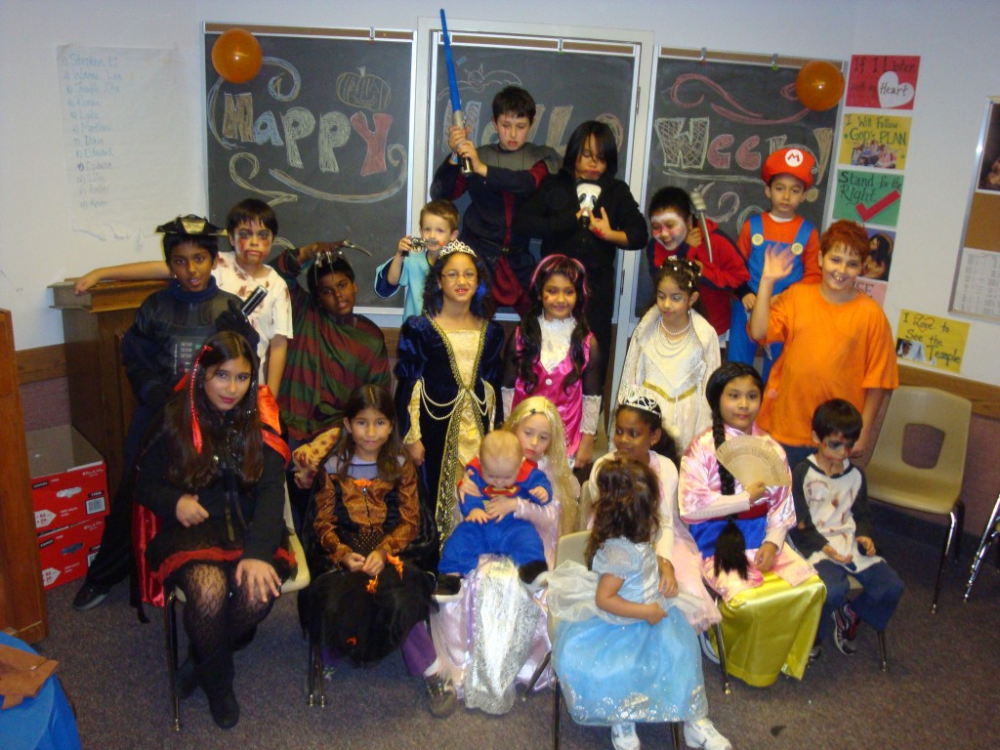
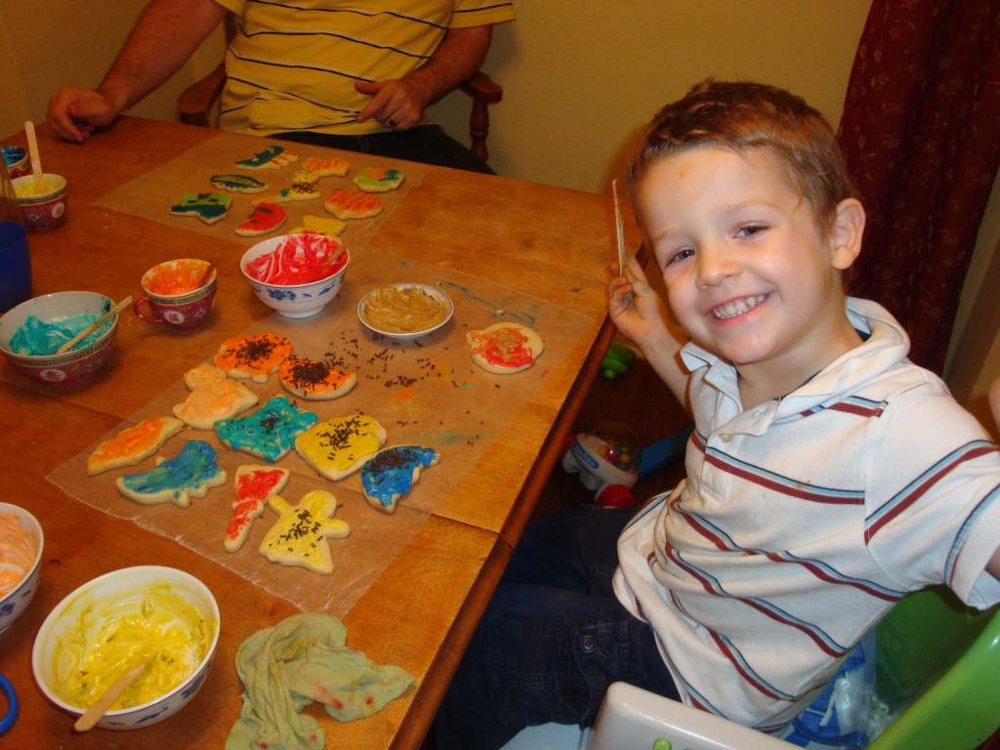
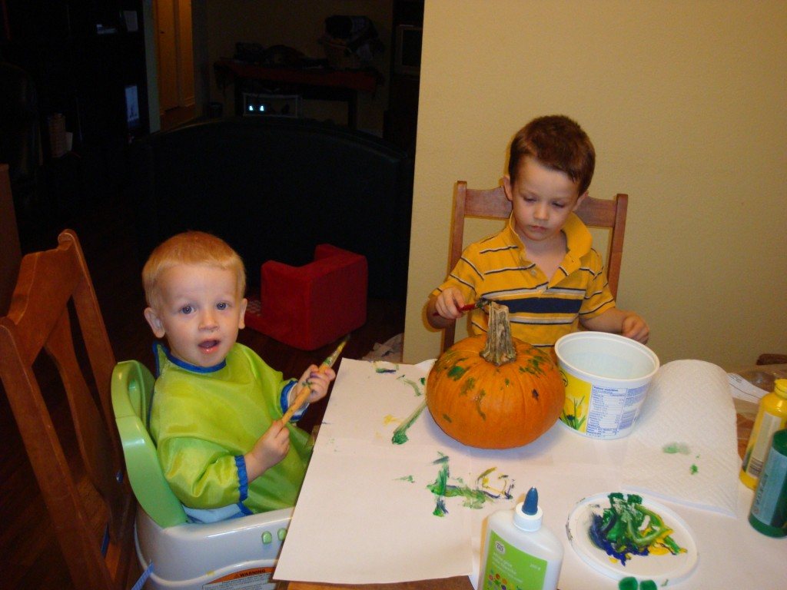
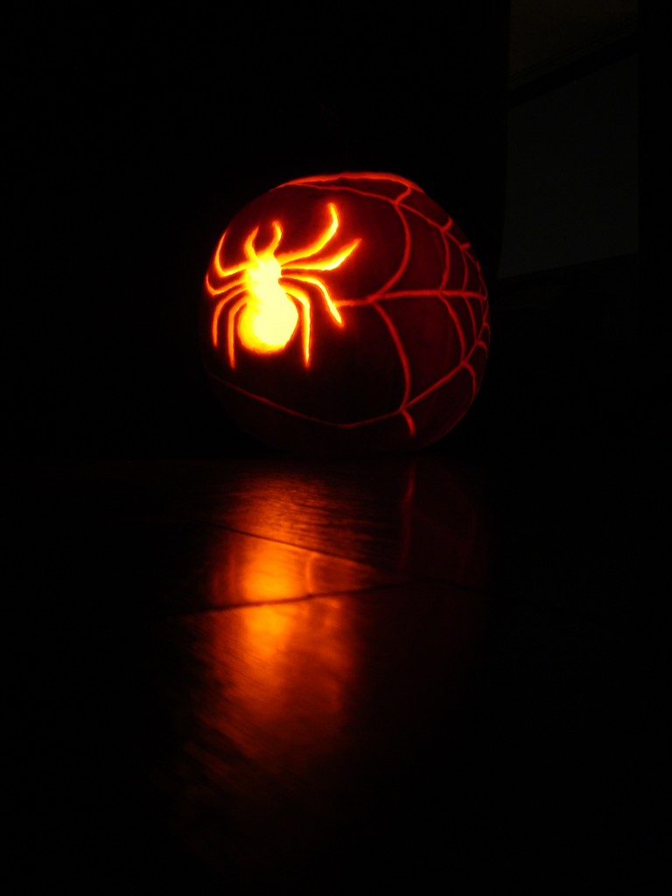
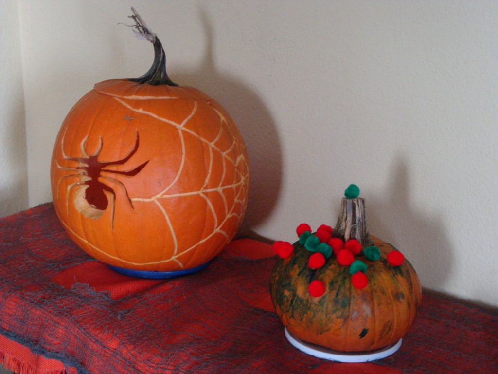
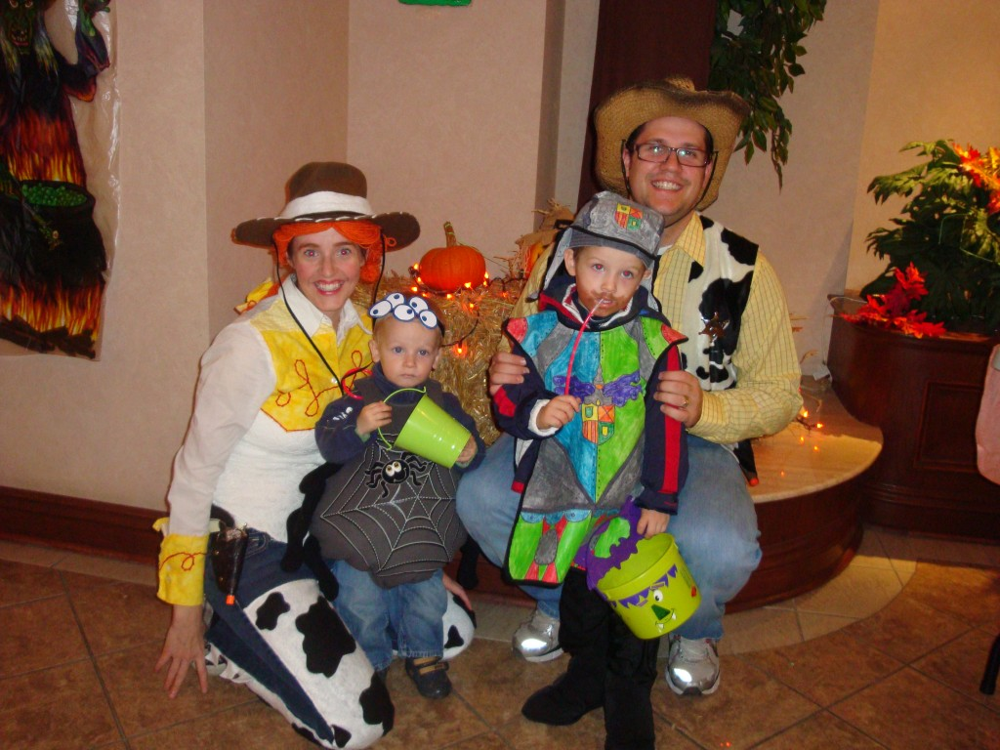
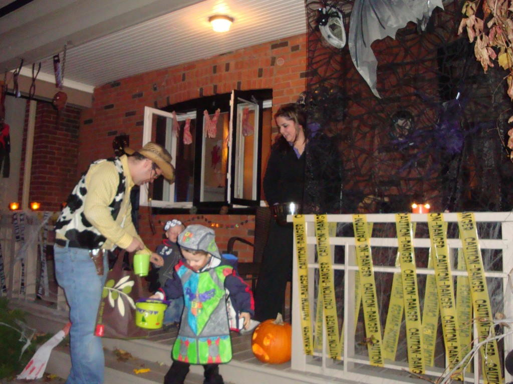
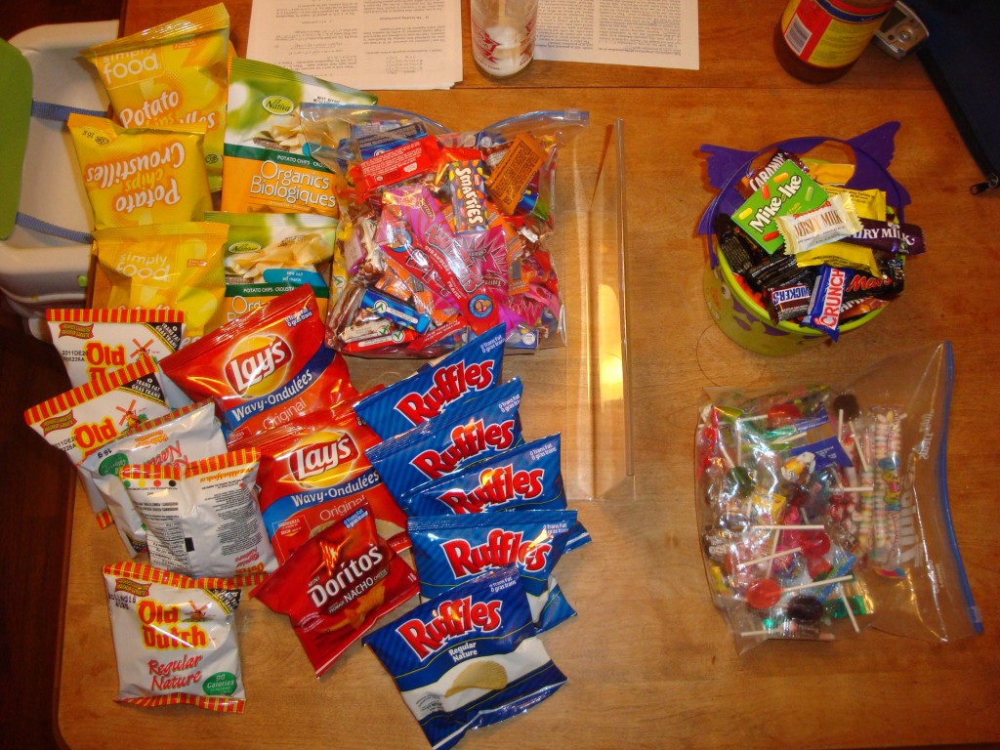

Cette année on a fêté l'Halloween comme jamais. Voici quelques événements où l'on a souligné cette fête.

**_Vendredi soir:_** Soirée d'Halloween de la paroisse. On ne vois pas bien, mais Ézékiel était déguisé en beau poisson bleu. Costume généreusement prêté d'Audrey. Malheureusement le tissu de celui-ci était beaucoup trop mince pour le porter lors de la vraie soirée d'Halloween.

**_Samedi soir:_** On a décoré des biscuits. C'était la première fois qu'Ézékiel à aussi bien participé. Il a crémé dix différents biscuits qu'il a donné aux amis de la garderie.

**_Dimanche soir:_** C'était le temps de faire nos citrouilles. Caleb et Ézékiel ont peinturé la leur. Tandis que papa et maman en on sculpté une autre.

Voici le résultat.

**_Lundi soir:_** C'est le temps de passer l'Halloween! Caleb était en araignée. Tout le monde a trippé sur ses cinq yeux. Ézékiel, lui a remit son costume de chevalier de l'année passée puisque l'on avait pas eu la chance de la passer. Maman et papa étaient en Woody et Jessie.

Cette années nous avons choisi d'aller sur la rue où notre évêque et le prof de Jean-Michel habitent. Ce fur le jackpot! Maisons super bien décorées, bonbons à profusions, enfants plein la rue, visite d'amis en chemin. Tout était parfait.

Revenu à la maison, on a mit nos deux petits monstres au lit et maman à fait le tri de la récolte. Ce qu'Ézékiel peut manger (gauche) et ce qu'il ne peut pas (droite). « Son allergie ». On a calculé que si on enlève les chips, Ézékiel se retrouve à devoir nous donner la moitié de ses bonbons. Une chance pour lui, il n'a pas vu tout ce que j'ai du cacher. Il aurait été triste.

L'Halloween est maintenant terminé et j'ai déjà hâte à Noël. Youpi!
