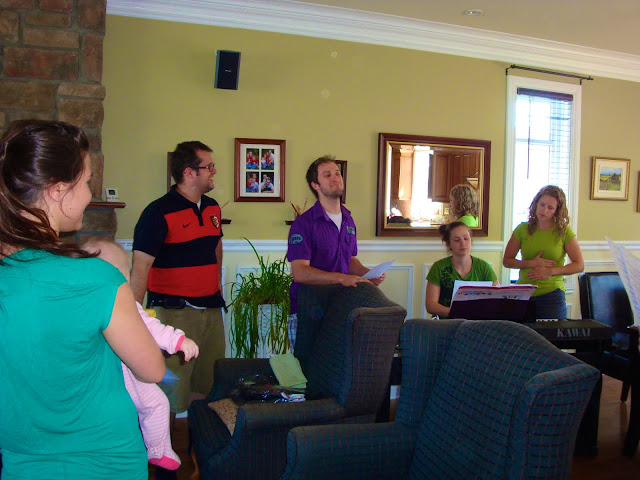
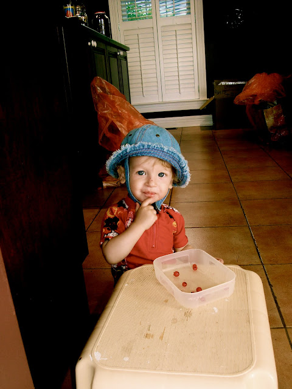
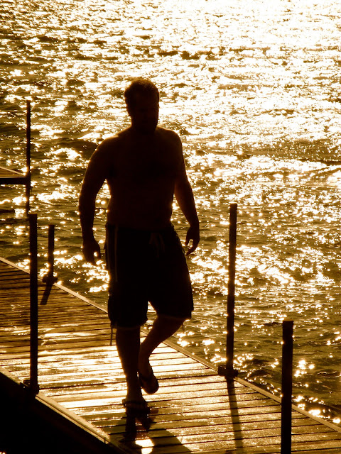
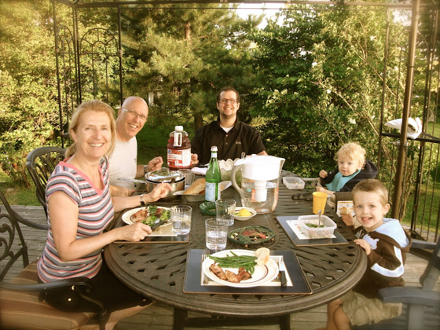

Puisque nous avons déjà prit nos vacances pour aller en France au mois d'Avril, il nous reste malheureusement très peu de temps à passer avec notre grande famille. Voici quelques phrases et photos pour nous remémorer le bon temps passé au Québec en fin de semaine.

Premièrement, j'ai eu le plaisir de passer du temps avec mes parents. Puisque vendredi était une belle journée d'été, nous l'avons honoré en sortant au parc et en allant savourer une bonne crème glacé italienne sur la tétasse d'un petit café au coin. Ainsi nous avons pu profiter une fois de plus du quartier.

Un moment que j'ai particulièrement apprécié, fût les quelques minutes que nous avons eux pour parler de littérature dans la chambre de ma maman. Bref, le lendemain matin nous sommes repartis et comme toujours nous nous sommes dit: Ça l'a passé trop rapidement!

Du côté Carter il y avait de la joie dans l'air. C'était la première fois en quatre ans que toute la famille allait se réunir. Les parents à Jean-Michel allaient parler de leur mission de trois ans en France, le dimanche suivant à la paroisse de Longueuil. Pour l'occasion nous avons pratiqué un chant pour présenter durant la réunion.

Nous voici lors de la pratique chez Marie.

 

Puis nous avons poursuit notre itinéraire au Lac, la maison de mamie et papi. Ceux-ci avaient encore quelques boites à défaire et du rangement à faire. Un retour de mission n'est pas si facile que ça. Avec enthousiasme Jean-Michel voulu s'occuper du jardin qui avait besoin d'entretien et j'ai de mon côté travaillé dans la rhubarbe qui en avait aussi besoin. Ézékiel, lui à eu beaucoup de plaisir à cueillir des groseilles, tandis que Caleb à eu du plaisir à les manger. Monsieur s'en mettait plein la bouche.

 

J'aime beaucoup cette photo de mon homme

qui revient d'un saucette dans le lac après avoir travaillé dans le jardin.

Et puis autour de la table pour un bon repas d'été.

Dimanche aussi à été rempli d'émotion. Nous avons vu et parlé avec beaucoup d'amis. Avec des fins de semaine comme ça, qui à besoin de vacance?
