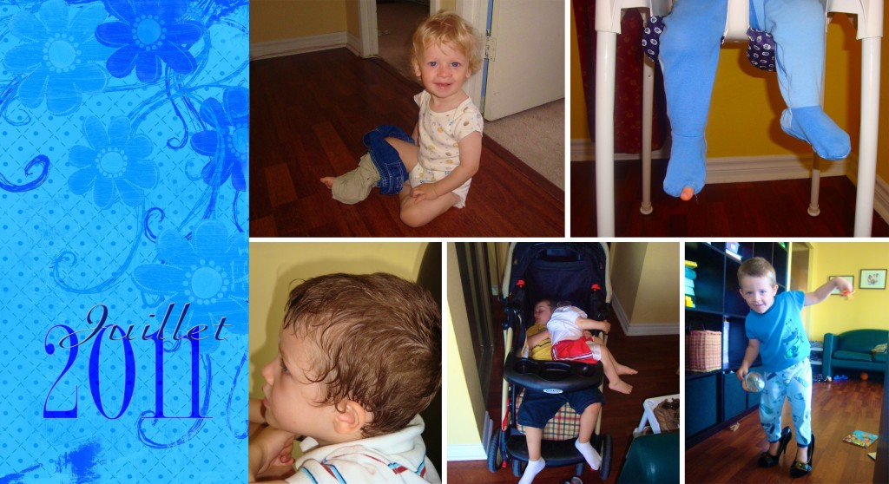

Pour le mois de juillet j'ai choisi cinq photo de moments qui m'ont fait rire ou sourire. J'en avait bien plus que cinq, mais je dois bien me restreindre.

Photo 1: Caleb a démontré son endurance et sa patience en essayant d'enfiler deux paires de shorts dans sa jambe droite. Malheureusement même après 15 minutes, il n'avait toujours pas réussi à en porter une paire comme il le se doit. Meilleur chance la prochaine fois!

Photo 2: Même si je suis triste de constater que les pyjamas de Caleb sont bien usés, ça me fait toujours sourire quand mon p'tit homme exhibe sa grosse orteil comme ici. Trop mignon.

Photo 3: Ça ne prend pas grand chose pour que la tête d'Ézékiel soit toute mouillée de sueur. Vous devriez voir son oreiller toute mouillée après la sieste. Même que la plupart du temps je dois changer sa taie d'oreiller. Je le fais avec un petit sourire en coin car on reconnaît bien qu'il est le fils de son papa.

Photo 4: J'ai déjà montré un photo comme celle-ci au mois de Janvier. Ça ne change pas et ça me fait toujours rire. Quand mes deux amours s'endorment dans l'auto il n'y a qu'une seule façon de les transporter à la maison. L'un sur l'autre.

Photo 5: Ézékiel a voulu essayer de porter les soulier à maman. Ceux-ci n'arrêtaient pas de tomber de ses pieds quand il commençait à marcher. Alors Ézékiel s'est mit à les gronder: Arrête soulier. Arrête! J'étais crampée.
