Arrivé à Toulouse nous étions tous énervé de commencer la troisième partie de notre voyage et la plus longue. Jean-Michel attendait avec impatience de voir ses parents qu'il n'avait pas vu depuis trois ans. La rencontre fut joyeuse et sentimentale.

Première fois avec sa mamie et son papi.  

[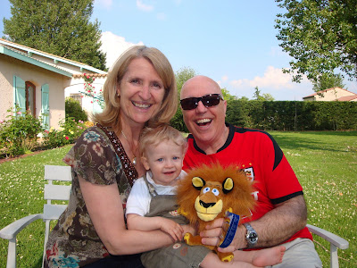](http://4.bp.blogspot.com/-fEjCDJ0DeE0/TcqU_OALq9I/AAAAAAAABKQ/MnQbHaLAKd4/s1600/Toulouse002.jpg)

  

Le lendemain nous avons visité Carcassonne une belle cité médiévale. Jean-Michel et moi avons prit une petite heure pour découvrir le château de la cité. Celui-ci était rempli d'informations historiques intéressantes.  

  
  
Carcassonne  
  
[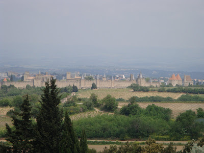](http://3.bp.blogspot.com/-R4LSmws72FI/TcqU_hlwFlI/AAAAAAAABKY/kPsxgvYDz94/s1600/Toulouse008.jpg)  
Dans le château de Carcassonne avec une gargouille.  
  
[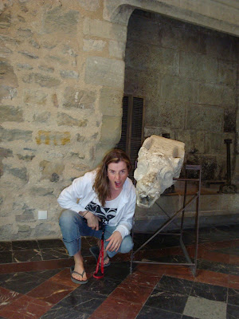](http://1.bp.blogspot.com/-smqqBkjoOX4/TcqU_ubOtwI/AAAAAAAABKg/SNv33O2pENE/s1600/Toulouse034.jpg)  
Jean-Michel qui se faufile entre les murs.  
  
[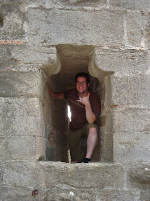](http://4.bp.blogspot.com/-BLpFtbhGLYo/TcrUb8fYhkI/AAAAAAAABKo/VI43otBTN3k/s1600/Toulouse052.jpg)  
  

Lundi, avec les beaux-parents et quelques membres de la famille Caner nous avons été sur Cordes-sur-Ciel. Une autre petite cité-médiéval, mais celle-ci perchée en hauteur. J'ai vraiment eu un coup de coeur pour ce beau village. C'était tellement beau que j'aurais voulu embrasser mon homme sous tous les cadres de portes et les petites galeries.  
  

Cordes-sur-Ciel  

  
[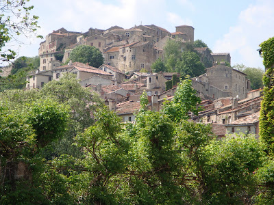](http://1.bp.blogspot.com/-8G7kvrmV1kw/TcrVNY_7d-I/AAAAAAAABKw/5gfSuzAnx78/s1600/Toulouse064.jpg)  

Un bisou! Un bisou!...  
  

[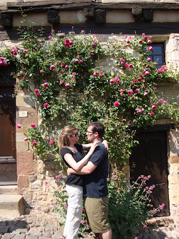](http://2.bp.blogspot.com/-R_bjBjxNXfg/TcrWEuWjEZI/AAAAAAAABK4/VBnymIEwhms/s1600/Toulouse088.jpg)  

Notre beau groupe devant un beau panorama.  

  
[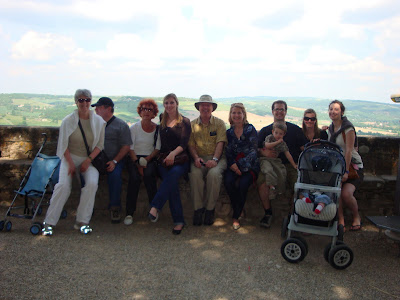](http://1.bp.blogspot.com/-sMO9qv-_LR4/TcrWaj0WVaI/AAAAAAAABLA/zqXEJFfTBSs/s1600/Toulouse123.jpg)  

Ézékiel nous suivait super bien grâce à la tactique de Marion et Carole. Toutes deux se cachaient et Zeke les cherchait. Il est tombé amoureux de celles-ci tellement elles étaient gentille avec lui.  

  
[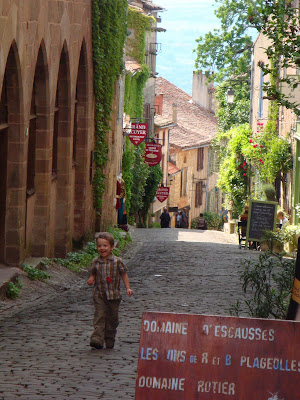](http://3.bp.blogspot.com/-fTWBGvrksrs/TcrWnXQZ9MI/AAAAAAAABLI/-EGvJKPszVs/s1600/Toulouse133.jpg)  

  

Ézékiel à tout aussi apprécié notre journée à la Dune du Pyla. Un site naturel tout à fait exceptionnel.

Nous avons commencé par monter cette montagne de sable. D'un côté de celle-ci nous avions une mer verte et de l'autre une mer bleu. C'était de toute beauté. Notre plus grand plaisir, débouler volontairement la dune de sable. Un moment grandiose!

  

La montée  

  
[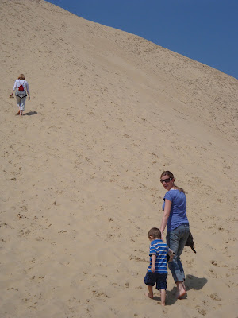](http://1.bp.blogspot.com/-fn9mANrMnbQ/TcrXBFcY26I/AAAAAAAABLQ/lCRofi1mGxo/s1600/Toulouse198.jpg)  

Le contraste  

[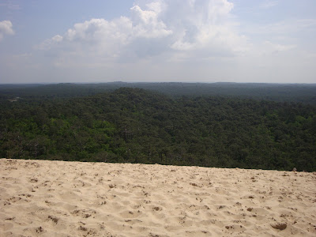](http://4.bp.blogspot.com/-yFPviPbgGbo/TcrsEfhy8cI/AAAAAAAABMo/BHkn5PtEApQ/s1600/Toulouse211.jpg)  

Le soleil fait sourire!  
  

[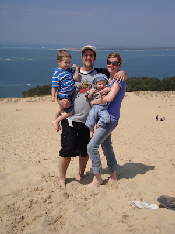](http://3.bp.blogspot.com/-TPObROfUfYA/TcrX5jjgrfI/AAAAAAAABLg/AnI81PFmMok/s1600/Toulouse220.jpg)  
  

Après la descente, notre plaisir dans le sable ne fut pas terminé. Nous sommes alleé à la plage non loin du site touristique. Jean-Michel le grand courageux s'est baigné dans l'océan Atlantique. Pour le mois de mai c'est tout un exploit. Tandis que Caleb s'est aussi saucé... le pauvre à été submergé par une grosse vague à un moment inattendu.

  
  
[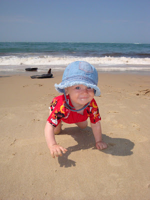](http://3.bp.blogspot.com/-kWbZYgrdqlQ/TcrYd0tz6eI/AAAAAAAABLo/20ITKzxTCaw/s1600/Toulouse226.jpg)  
  

Prise deux... la famille devant l'océan Atlantique.  
  
[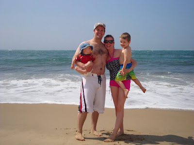](http://4.bp.blogspot.com/-c3hahLznPSw/TcrnPK7vKkI/AAAAAAAABLw/_I4rDivsg08/s1600/Toulouse235.jpg)  
  

Maintenant parlons un peu de Nîmes. Durant notre séjour en France nous avons visité beaucoup de sites médiévaux. Il était temps de faire changement avec un peu d'histoire Romaine. Nous avons commencé par faire la visite des arènes de Nîmes. Ce fût tout un défit avec un petit garçon qui voulait sauter dans tous les sens. Mais Jean-Michel à su bien le protéger de lui-même. Bref notre visites des arènes fut TRÈS instructives sur l'époque des Gladiateurs.

  
Devant les arènes de Nïmes  
  
[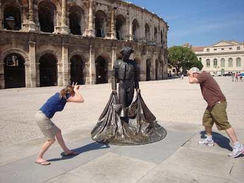](http://4.bp.blogspot.com/-odDBwQX-WY8/TcrpJXB-NYI/AAAAAAAABMI/lM7h9x_xIvQ/s1600/Toulouse293.jpg)  
  
À l'intérieur  
  
[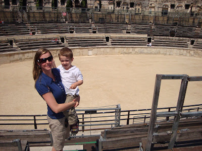](http://2.bp.blogspot.com/-cj0QZWxoZtk/TcroysoHbKI/AAAAAAAABMA/4giMH3TGlqY/s1600/Toulouse268.jpg)  
Le plus beau et courageux des Gladiateurs.  
  
[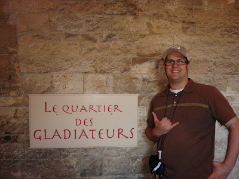](http://4.bp.blogspot.com/-Ktb9lYYokkY/TcrxMszJ7qI/AAAAAAAABNA/8lGugUpQnbM/s1600/Toulouse270.jpg)  

  

Ouf! y'en a des choses à dire. C'est pas fini. La même journée on a poursuit notre circuit vers le pont du Gard qui se situ non loin de Nîmes. Cette structure fut construite par les romains pour faire un aqueduc et un pond routier.

Je me sens tellement privilégiée d'avoir vu toutes ces structures en vraies. J'avais déjà eu un cours des grands courants artistiques et mes leçons sur l'art romain me sont revenues à la mémoire. J'ai aussi apprécié voir ce que j'ai apprit dans mes cours de découverte en Tourisme.

  
  
[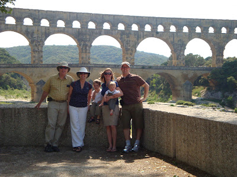](http://2.bp.blogspot.com/-beh1zNYxnFI/Tcrp6O51EkI/AAAAAAAABMY/qTP1wWLz038/s1600/Toulouse305.jpg)  

  

Non loin d'où nous étions il y avait une belle plage le long de la Méditerrané. La température, comme tout le reste de notre voyage, fût juste parfaite pour profiter de la plage. D'après mes beaux parents nous avons été grandement bénis car ils n'ont jamais vu un aussi beau printemps depuis qu'ils vivent en France. Je suis fière de vous annoncer que je me suis trempée dans la méditerranée... spécialement que je suis frileuse.

  
  
[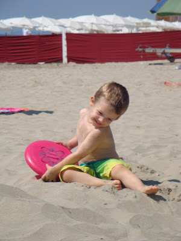](http://4.bp.blogspot.com/-IVXCs3fWk9g/TcrqQj7dZuI/AAAAAAAABMg/7hKbC5LmlSQ/s1600/Toulouse350.jpg)  
[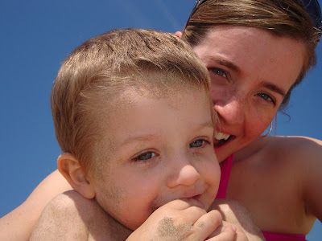](http://3.bp.blogspot.com/-dbq-_zMClXY/TcruQP8-VWI/AAAAAAAABMw/QCWsHd2ynlw/s1600/Toulouse353.jpg)   

  

Vendredi, dernière journée en France, Jean-Michel à été avec son père découvrir la ville rose: Toulouse. Puisque je ne me sentais pas très bien je suis restée à la maison avec les autres pour récupérer le plus possible avec la grosse journée en avion. Ici une photo que Jean-Michel à prise dans le Capitole, bâtiment qu'il a beaucoup aimé visiter.  

  

  
[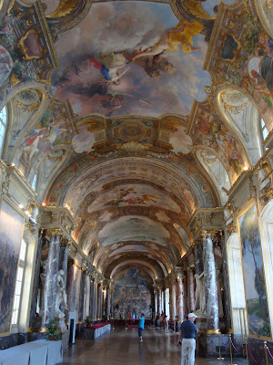](http://4.bp.blogspot.com/-gp4_H3jbnjc/Tcsi20zrbMI/AAAAAAAABNI/G-SCZZ-G4ok/s1600/DSC01200.jpg)  
Pendant ce temps Caleb se fait sécher les petites fesses à l'air libre.  
C'est pas drôle faire ses dents!  

  

[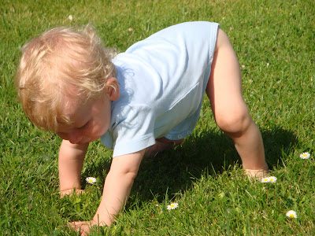](http://1.bp.blogspot.com/-c-ZMsawNx8U/TcrvzQAHlRI/AAAAAAAABM4/iTRcWaehD5g/s1600/Toulouse382.jpg)  
  

Comme Danielle à dit dernièrement, on dirait que ce n'était qu'un rêve tellement ça à passé vite. Merci à tous pour votre chaleureux accueil et amour. On vous aimes!
