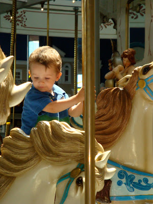
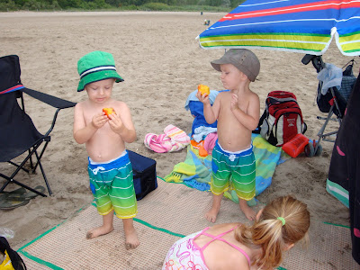
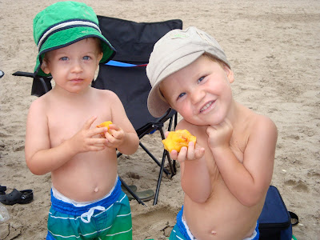
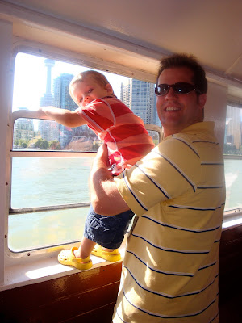
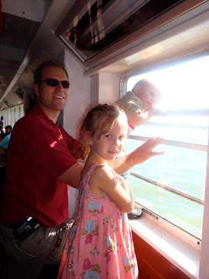
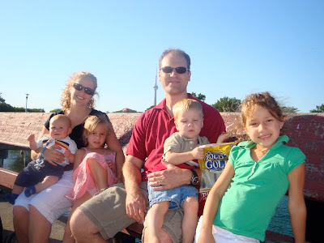
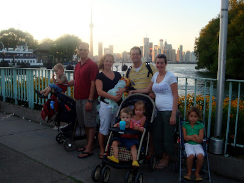

Deux heures après notre retour de Picton nous avons reçu de la grande visite, la famille Salm. Vous pouvez vous imaginer qu'avec six enfants et quatre adultes dans notre petit appartement, ça résonnait pas mal fort. Mais quand même, on a fait de belles sorties à tous les jours.

Comme vendredi la température n'était pas très belle, nous avons été au Fantasy fair. Un parc d'amusement intérieur. Malheureusement nous avions oublié notre caméra. Cette photo à été prise lors de l'anniversaire d'un ami à Zeke. Celui-ci est dans son manège préféré: «Poppins» comme le carrousel de Mary Poppins.  

  

  

Le samedi, malgré le ciel gris, nous avons enfilé nos maillots de bain à 9h et fait preuve de très grande foi en allant à la plage de Brimley. Dès notre arrivée le ciel s'est découvert et nous avons eu du beau temps jusqu'à 2h de l'après-midi.

Y a-t'il du sable sur vos pêches les gars? Oh que oui!

  

Trop beaux les cousins.

  

Dimanche après les réunions on a fait une belle balade dans le parc de «Toronto Islands». Pour y accéder nous avons prit un traversier. Zeke et Pouss-pouss étaient très casse-cou. Une chance les papas ne lâchaient pas prise.

  

La famille Salm

  

Notre beau groupe devant Toronto.

  

J'imagine que cette grosse semaine d'activités m'a brulé parce que le lendemain je me suis réveillée malade. Ce fût une fin de vacance plutôt plate pour tout le monde. Mais au moins on en garde de bons souvenirs. Merci d'être venu nous voir!
