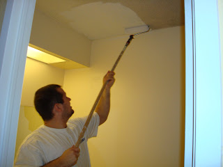
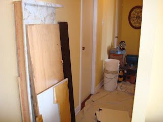
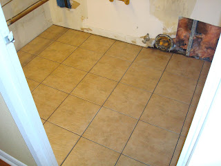
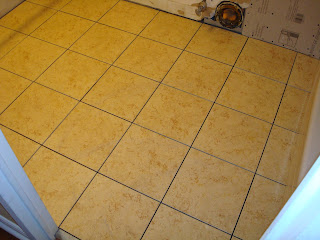
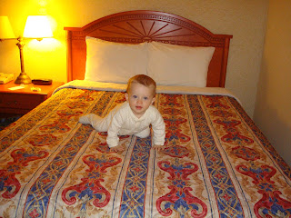
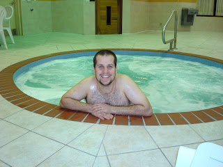
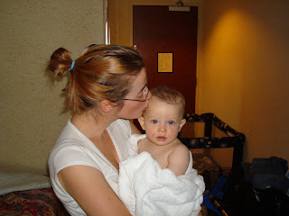
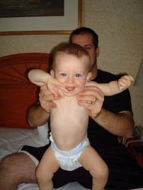

Si vous faites des rénovations, il faut vous attendre à vivre la loi de Murphy. C'est ce que Jean-Michel et moi avons apprit ces 4 dernier mois lors de la planification et lors des rénovations de notre salle de bain. En résumé:  
  

Retard continuel de nos commandes,  

Pas de toilette pour 5 jours,  
Pas de douche pour 7 jours,  
Pas de vanité et d'évier pour 3 SEMAINES,  
et ...  

  
Dans toutes nos malchances les travailleurs ont mis les mauvaises tuiles dans la salle de bain de la moitier du prix de celles que nous avons payé. Résultat on à dû tout recommancer.  
  
Voici Jean-Michel qui peint le plafond avant que les travailleurs arrivent. On peut voir la différence de couleur.  
  
  
Le fouillis dans lequel on a vécu pendant 5 jours.  
  
Les deux sortes de tuiles. Ça ne parrait peut-être pas, mais il y a une méchante différence. Les tuiles de droites sont beaucoup plus claires.  
  
  
  
  
  
  
  
  
  
Dans tous nos malheurs on a été relaxer à l'hôtel. On avait besoin de déconnecter du condo. Et de plus on était tellement soulagé d'avoir accès à une salle de bain lorsqu'on en avait besoin. Ici Ézékiel se fond dans son nouveau décort.  
  
  
Avant de partir Jean-Michel m'a rappelé de prendre mon maillot de bain. J'étais toute énervée au point d'en prendre deux. Suprise, surprise, lorqu'est venu le temps d'aller à la piscine j'ai réalisé que j'avais apporté 2 hauts et aucun bas. Avec jalousie, Ézékiel et moi avons regardé Jean-Michel se faire brasser dans le jacuzzi.  
  
  
Le lendemain on a tous eu le plaisir de prendre une bonne douche avant de revenir chez nous. Ézékiel était tout heureux d'avoir prit son bain.  

  
  
Depuis ça va mieux, au moins on a une toilette. Maintenant la vie va reprendre le court normal des choses.  
À suivre...  
  
  

