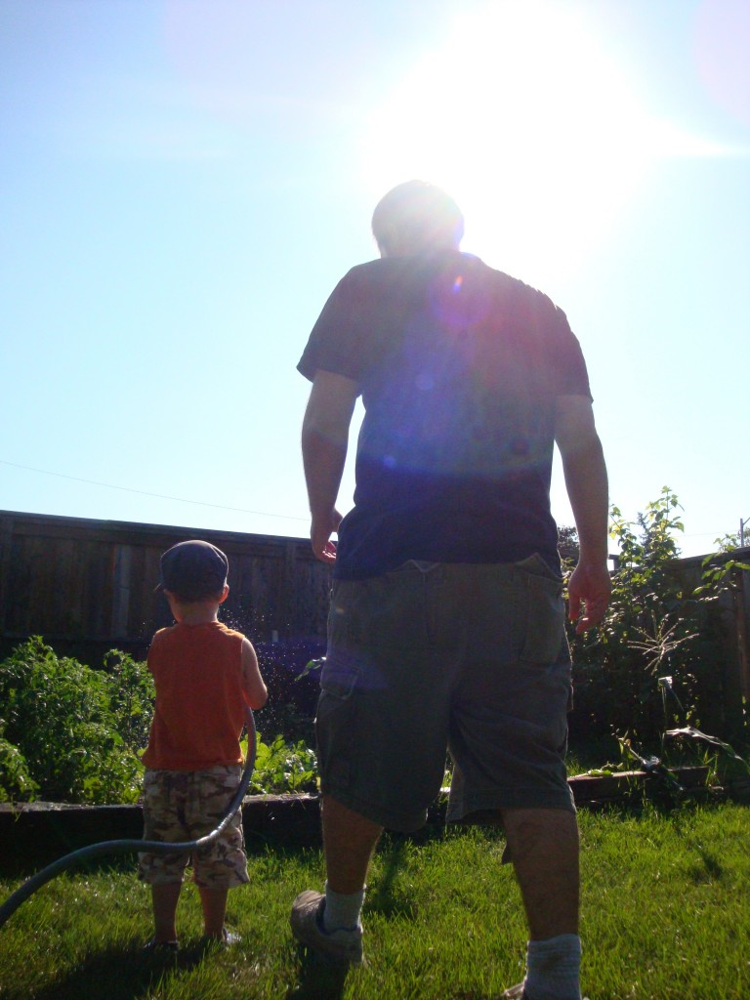
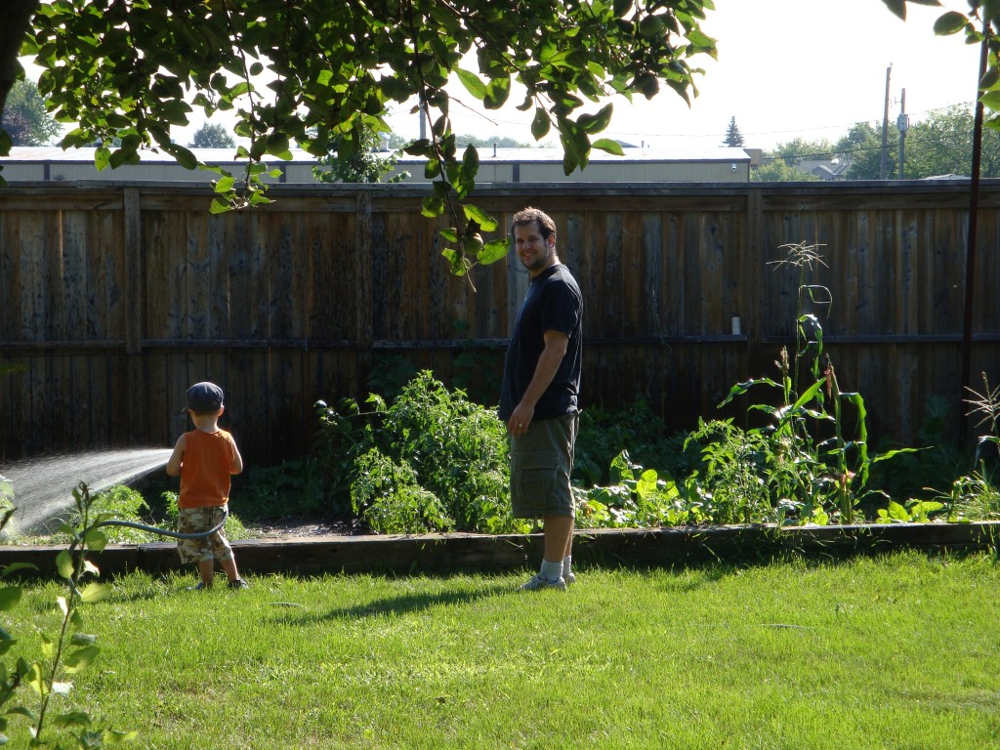
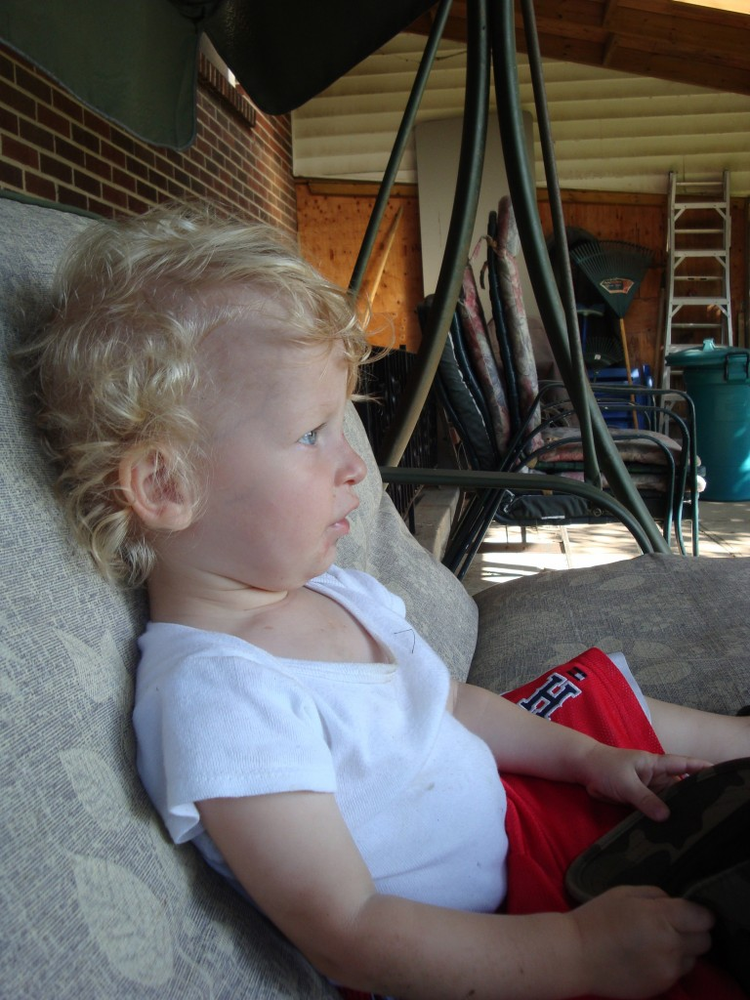
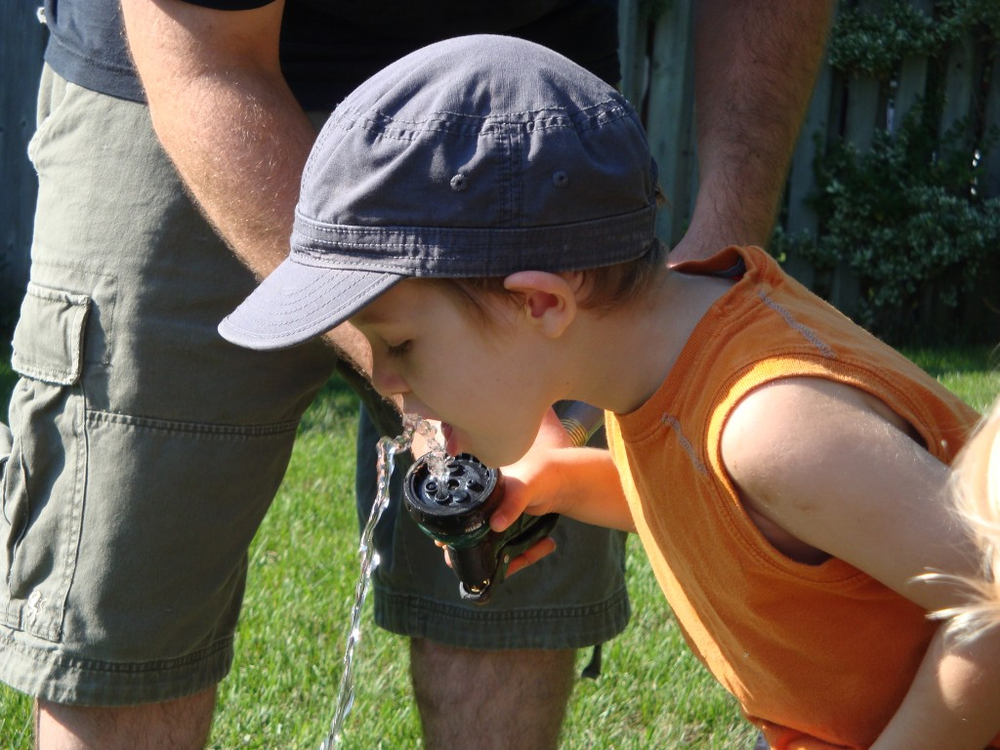
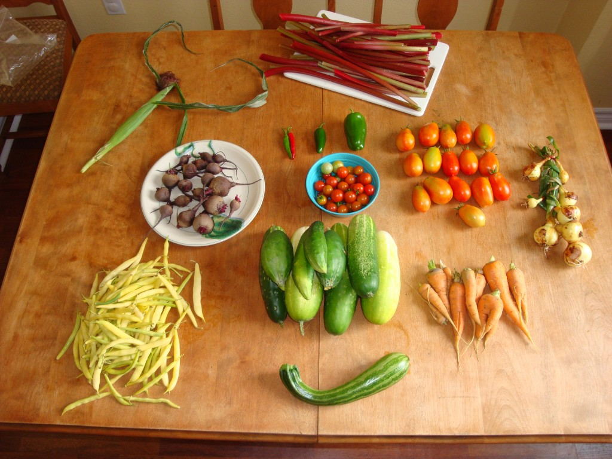

À tous les samedis matin, si on est à Toronto et qu'on n'a pas de visite, on passe une partie de la matinée dans le jardin de la famille Duodu, notre deuxième jardin.

Après avoir écouté les bonhommes le matin, on se rend à la bibliothèque pour essayer d'avoir des billets de musées ou d'attraction gratuites (MAP), et après c'est le temps du jardinage. Je trouve que c'est une super de belle façon de faire un jardin, c'est-à-dire d'en faire une activité familiale.

Ézékiel qui arose le jardin ...

... pendant que Maman et Caleb se reposent

Cette année, Ézékiel était très bon pour cueillir les framboises et les haricots. L'an prochain, j'espère qu'il pourra aussi m'aider à semer. Il aime aussi arroser le jardin et boire l'eau!

Lorsque j'ai commencé mon jardin l'an passée, j'ai vraiment eu la piqûre. C'est génial de voir pousser ce qu'on a semé, de participer un peu à la création. Mais surtout, de récolter et de manger des bons aliments frais. Voici notre récolte d'aujourd'hui, le 20 Août 2011.

Un épi de blé d'inde (tombé trop tôt), de la rhubarbe, des betteraves, des piments (3 sortes différentes), des tomates (cerises et romaines), des oignons, des haricots, des concombres, des carottes et un zucchini italien.

Vive le jardinage!!!
