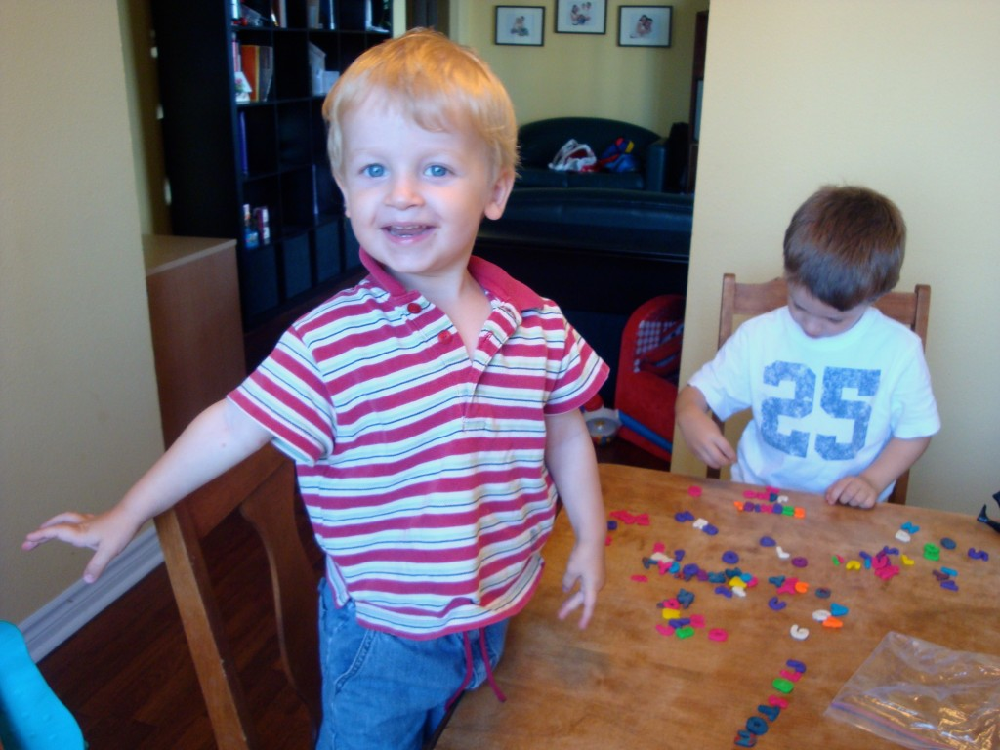
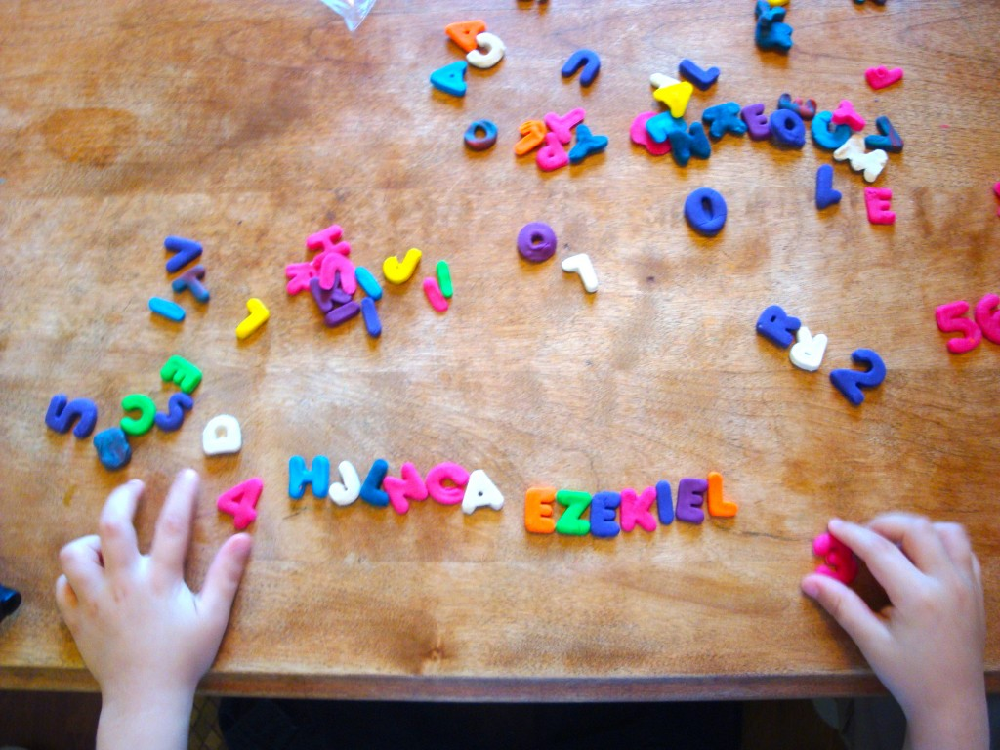
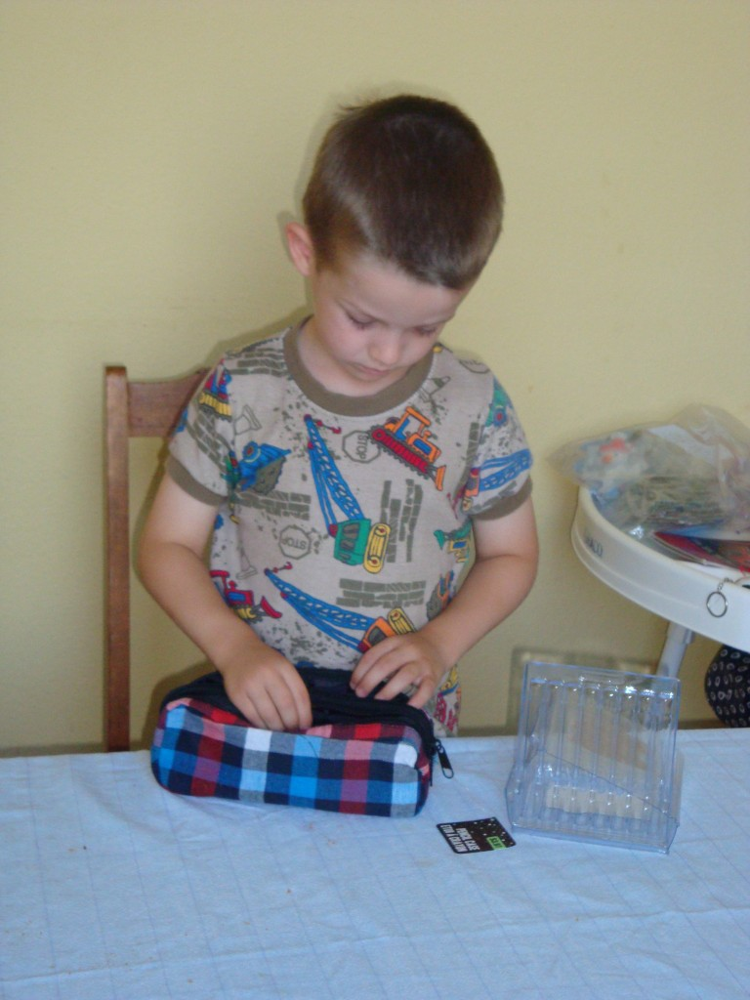
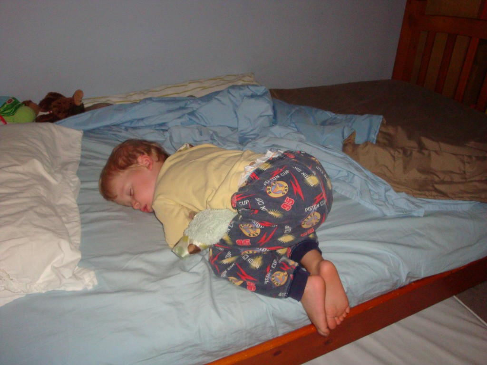
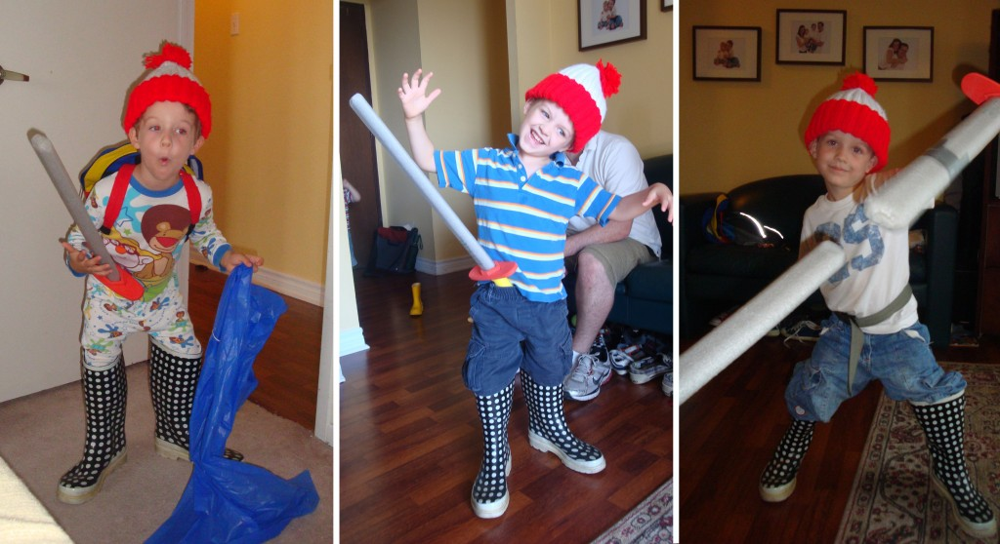
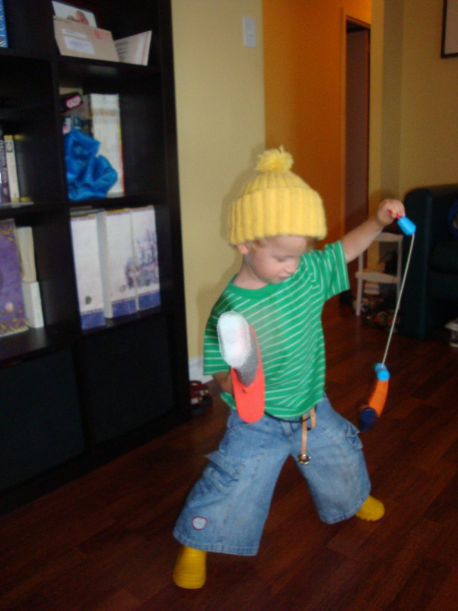
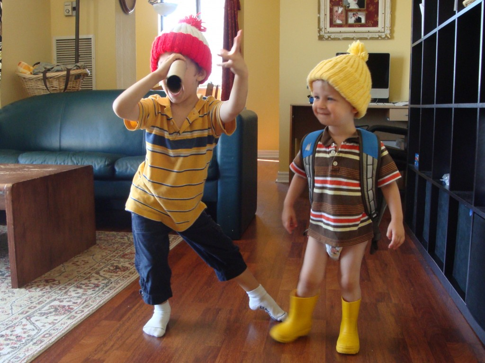

Que se passe t'il dans la vie de nos supers héros dernièrement? Et bien dans moins d'un mois Ézékiel va commencer l'école. Il va aller au Junior kindergarten, ce qui équivaut à la pré-maternelle au Québec. Sincèrement même s'il est toujours petit à mes yeux, je sens qu'il est près pour y aller. Il aime jouer avec les chiffres et les lettres. Il sait déjà écrire beaucoup de mots.

Sur ces deux photos les garçons jouent avec des lettres faites de pâtes à modeler séchée. C'est comme ça que je recycle la vieille pâte à modeler. Les garçons aiment beaucoup cette activité. On peut voir qu'Ézékiel a écrit son nom.

Un matin Ézékiel s'est levé et a décidé de préparer son sac pour aller à l'école. Il a lui-même mit ses nouveaux crayons dans son étui et a préparé une collation dans son sac à lunch. Il a très hâte d'aller à l'école.

De son côté, Caleb devient aussi un vrai petit bonhomme. Il ne tombe presque plus de son lit. Mais on le retrouve toujours dans de drôle de position et sur le bord de son matelas. Et à tous les jours on constate de plus en plus qu'il est aussi coquin que son grand frère.

Ézékiel est dans la phase «Chat botté». Il nous sort son fameux costume presque à tous les jours et cris: En garde! En lançant son épée dans tous les sens. Il a aussi découvert une ceinture pour lui dernièrement ce qui rend le rangement de son épée plus facile.

De toute évidence Caleb est un peu influencé par cette vague.

Et sur cette dernière photo Ézékiel à échangé son costume de chat botté pour celui d'un pirate. Mais détrompez-vous. Ce n'était l'histoire que d'une minute. Le temps que je mette le recyclage à la rue.

En résumer, malgré la formation intense de mes deux supers-héros, je suis convaincue de leur super pouvoir. La super rapidité de traverser l'appartement en deux secondes en sautant sur tous les meubles. Leur force supérieure de répéter cette même actions cent fois sans se fatiguer. Le pouvoir d'épuiser leur ennemie uniquement par des sons et des bruits. Mais le plus impressionnant de tous c'est le pouvoir d'hypnotiser par leur beauté et de tout se faire pardonner (ou presque).
