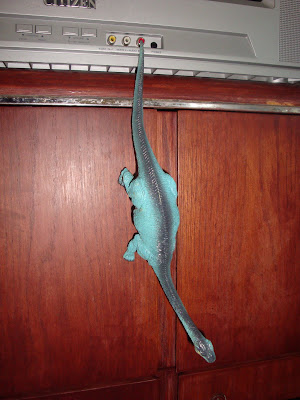
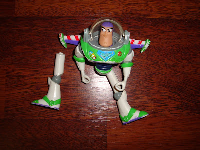
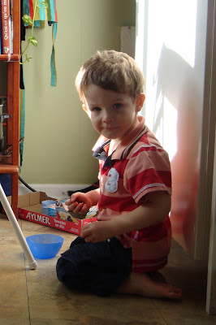

Pour ceux qui ne sont pas familier avec « Histoire de jouet » , dans la premier film il y a un garçon nommé Sid qui torture les jouets. Je n'irais pas à dire qu'Ézékiel torture ses jouets, car tous les petits garçons normaux en font voir beaucoup à tout ce qui se trouve près d'eux.

Par contre, au cour des derniers jours j'ai été témoins de quelques scènes plutôt terrifiantes pour un jouets. Hi, hi, hi!

  

Jean-Michel et moi avons trouvé un dinosaure suicidaire.

  

Buzz a vécu son pire cauchemar.  

Il a perdu une jambe et à été mi à la poubelle.

  

Demandez aussi à monsieur Patate qui ne trouve plus ses yeux et à Woudy qui a vu l'eau de la toilette de très près. À leur yeux la terreur c'est Zeke!

  
  

