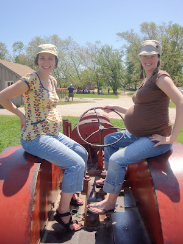
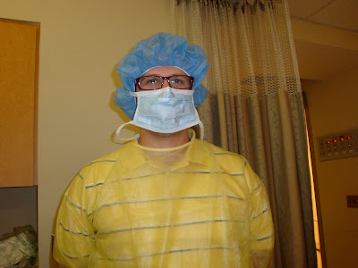
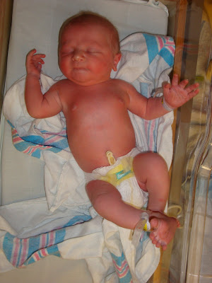
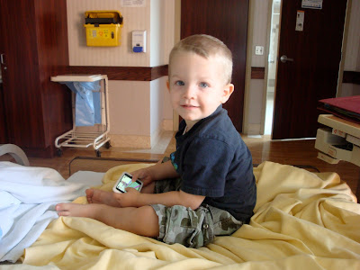
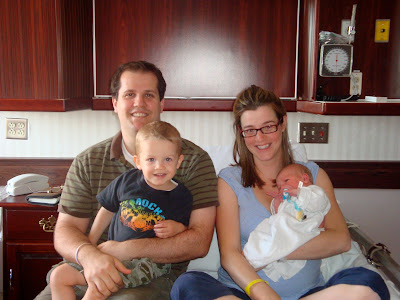

Oufff, c'est vraiment pas évident de trouver le temps de faire un post entre l'allaitement et un petit garçon de deux ans qui cherche l'attention de ses parents. Mais je ne peu pas passer à côté d'un aussi important événement que la naissance de notre fils Caleb.

Tout comme pour l'accouchement d'Ézékiel je me doutais bien que celui-là allait arriver en retard. Juste pour vous dire, pour ma 40ième semaine de grossesse, nous avons été passer la journée au parc provincial Bronte Creek avec des amis.

  

À 40 semaines de grossesse

Ce n'est que quatre jours plus tard que Caleb est arrivé. Je décrirais cette expérience en deux mots: Super rapide. Détrompez-vous ça ne veux pas dire sans douleurs et facile.

Voici en gros le déroulement de cette fameuse nuit:

1:30 a.m. Je me réveille en sursaut. Je constate que j'ai crevé mes eaux.

2:00 a.m. Il n'y a pas de doute sur l'arrivé de Caleb. Je suis en «méchantes» grosses contractions. Jean-Michel téléphone nos amis pour venir garder Ézékiel.

2:30 a.m. Nous partons pour l'hôpital.

3:00 a.m. Dans la salle de triage l'infirmière appel un docteur. J'aurais du me douter que quelque chose n'allait pas. Celui-ci fait une échographie et nous annonce que le petit se présente par le siège. Résultat je vais devoir avoir une césarienne. Génial!:(

3:45 a.m. Je rentre dans la salle d'opération. Épidurale et blablabla.

4:00 a.m. Jean-Michel et moi entendons le premiers cri de Caleb derrière le rideau. Il est bien là et nous étions très ému.

Une heure plus tard épuisé par cette longue nuit, nous sommes rentrez dans notre chambre d'hôpital et nous avons fait un bon dodo bien mérité.  

  

Le super costume de Jean-Michel avant d'entrer dans la salle d'opération.

  

Caleb: 8lbs et 1onz, 51 cm

  

Ézékiel qui aime venir à l'hôpital pour deux raison: voir Caleb et jouer avec le iPod de papa

  

La nouvelle famille

