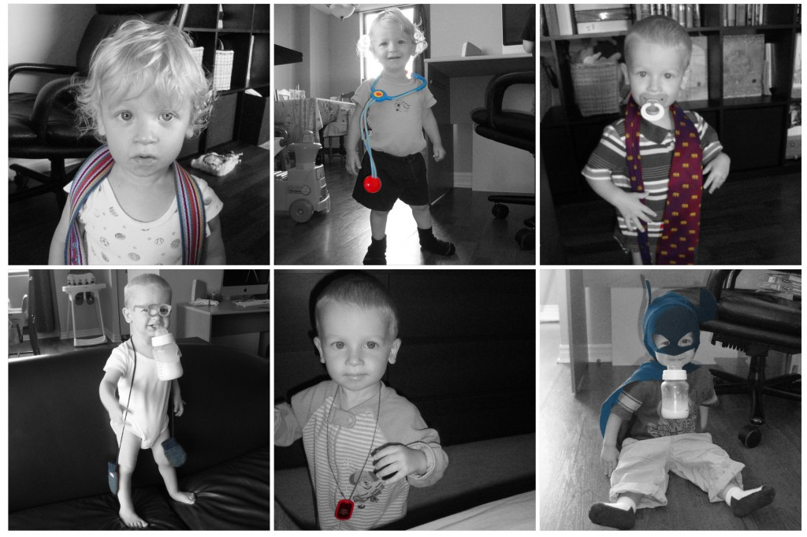

On sait tous que les enfants ont des phases. Et bien depuis deux trois mois Caleb a développé l'habitude de se mettre des objets autour du cou. Sur ces photos nous retrouvons les grands classiques de Caleb: la ceinture de maman, le stéthoscope, les cravates de papa, les mitaines, le dog tag et la cape de Batman.

Avec la supervision de maman ou papa, notre petit homme nous fait des parades de mode. Serait-il un petit excentrique ou bien aurait-il le sens de la mode?
