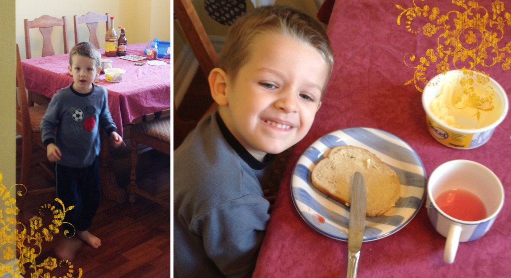

Samedi matin, avant même qu'on se lève, Ézékiel est venu dans notre chambre nous interdire de sortir de la pièce. Il voulait nous faire une surprise. À entendre le boucan dans la cuisine, j'avais une petite idée de ce qu'il trafiquait. J'ai pas pu résister d'aller le prendre en photo pendant qu'il préparait la table pour le déjeuner. Tout heureux, Ézékiel m'a montré mon assiette. Une tranche de pain à la margarine et un demi pouce de jus dans une tasse. Jean-Michel, lui, a eu droit à une tranche de pain dans un bol à soupe, un pouce de jus et un coin de nappe imbibée de jus. Tout ça semble bien banale, mais Jean-Michel et moi avons mangé avec fierté le déjeuner si gentiment offert. À nos yeux c'était du gros luxe.
