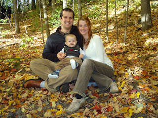
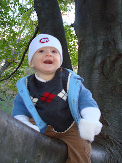
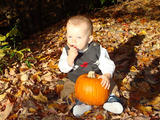

Couleur et lumière font de belles photos, c'est pourquoi nous voulions profiter d'une belle journée d'automne pour faire des protraits de famille. Avec les Meldrum's nous nous sommes rendu au parc où il y avait un beau décort rouge, jaune et orange.  
  
Malheureusement, on avait oublié de vérifier la baterie de notre caméra et comme de fait, elle était presque morte. Pam, pam, pam...  
  
On a quand même pu prendre quelques photos, mais ça aurait été une session bien différente si...  
  
En voici quand même quelques-unes. Nous vous présentons la famille Carter.  
  
  
Et la personne la plus photogénique de la famille: Ézékiel. Il tient absolument à vous écrire trois mots: fgsfgvxc cdzxæ za  
  
  
Et oui, Ézékiel a trouvé une citrouille comme par hasard dans le parc. J'imagine que ça pousse comme des champignons par ici!  
  
  
Faites comme nous, respirez à fond et souriez!
