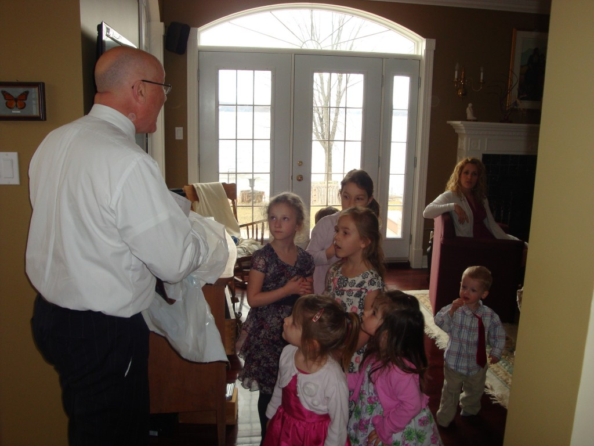
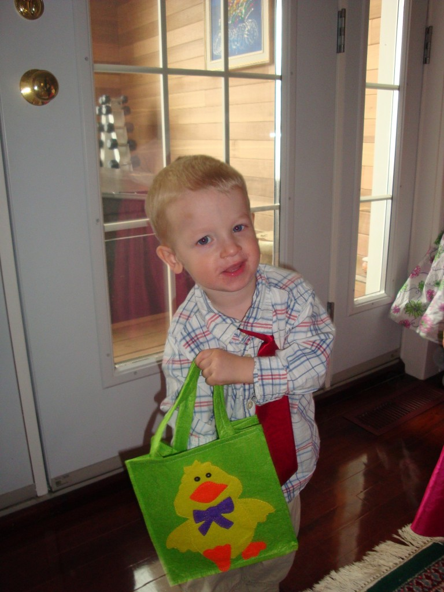
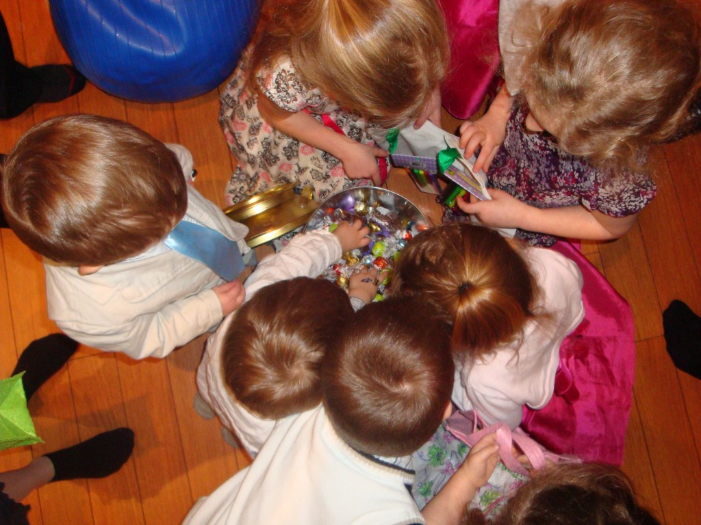
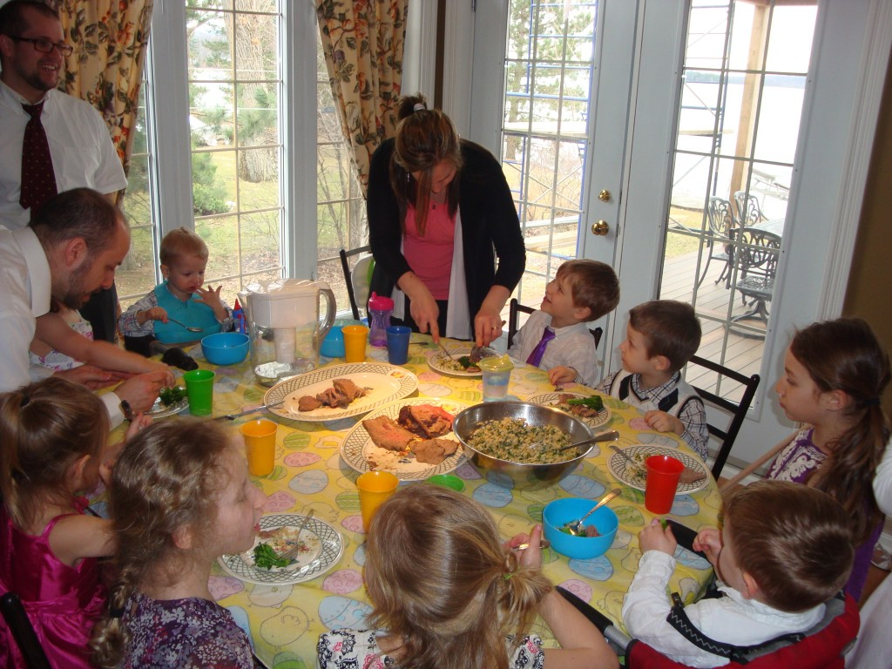

Pour Pâques les enfants on fait une chasse aux cocos chez les grands-parents. Papi avait très bien organisé le circuit pour que même les tout petits puissent contribuer à trouver le trésor.Dès que Caleb a trouvé son sac, il s'est arrêté de courir et n'a voulu que manger tout de suite ce qu'il avait dans celui-ci, ignorant tous les chocolats à la fin de la course.

Le dernier indice à mené tous les enfants à une boite rempli de chocolat.

Mais voici le vrai trésor de mamie et papi. Il est tout autour de cette table. Dix beaux enfants plein de vie et d'amour. Et qu'on les aimes!

