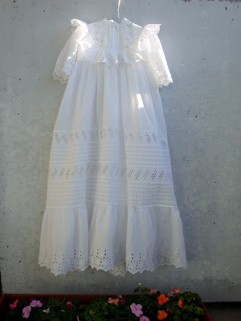
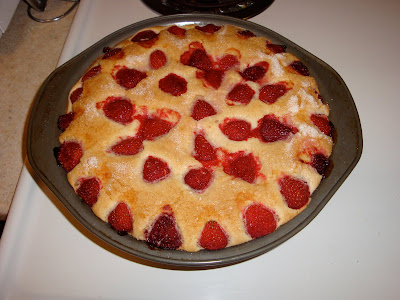
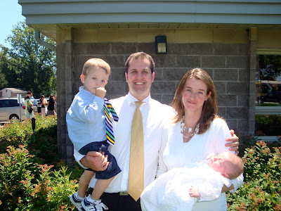

La veille du grand jour de la bénédiction de Caleb, Jean-Michel et moi avons fait des préparatifs. Alors que papa se préparait plus spirituellement en lisant ses écritures, maman elle préparait les choses physiques.

Premièrement, j'ai lavé la robe blanche que Caleb allait porter pour l'occasion. Je dois mentionner qu'elle a servi pour le baptême de Michel, le père de Jean-Michel. J'avais l'impression qu'il s'agissait d'un rituel. Je faisais très attention de ne pas abimer cette belle robe fait avec un tissu bien mince et joliment décoré d'oeillets. Il me semblait qu'elle était légère comme l'air.

Ça m'a prit au moins une bonne demi-heure pour la repasser tellement il y avait des petits détails.. Je savais que ça en valait la peine, mon petit coeur allait être tout beau.

  

  

Puis avec notre cueillette de fraise, j'ai fait un gâteau aux fraises. C'est ce que j'avais choisi d'apporter à la petite réception en l'honneur de la bénédiction de Hunter et Caleb.  

  

  

Bien nerveux, mais bien préparé, Jean-Michel a fait une très belle bénédiction. C'est juste dommage que la famille n'y était pas, mais ce sont les sacrifices qu'il faut faire quand on habite loin des notres.

Caleb dans toute sa splendeur.

  
  
  

