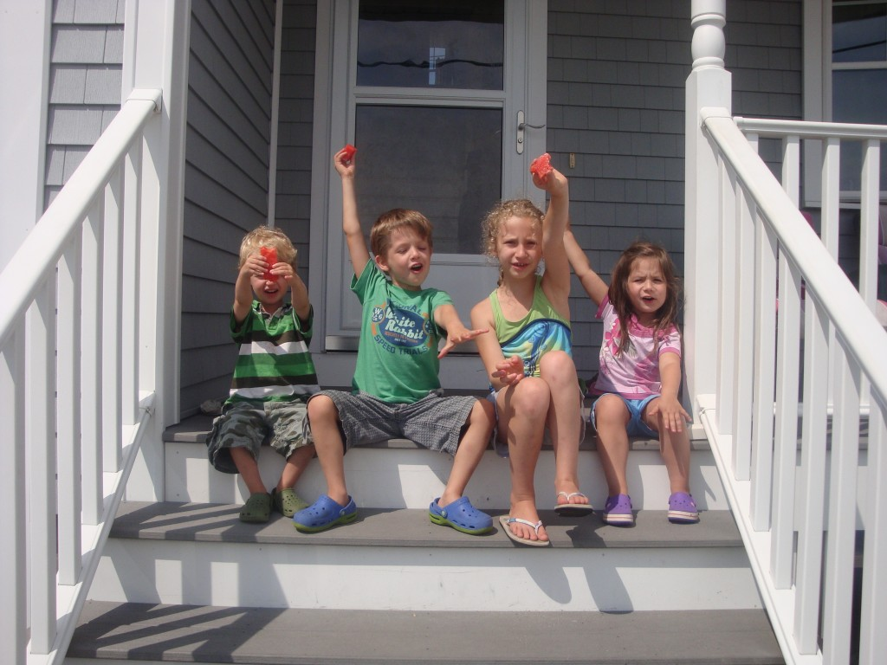
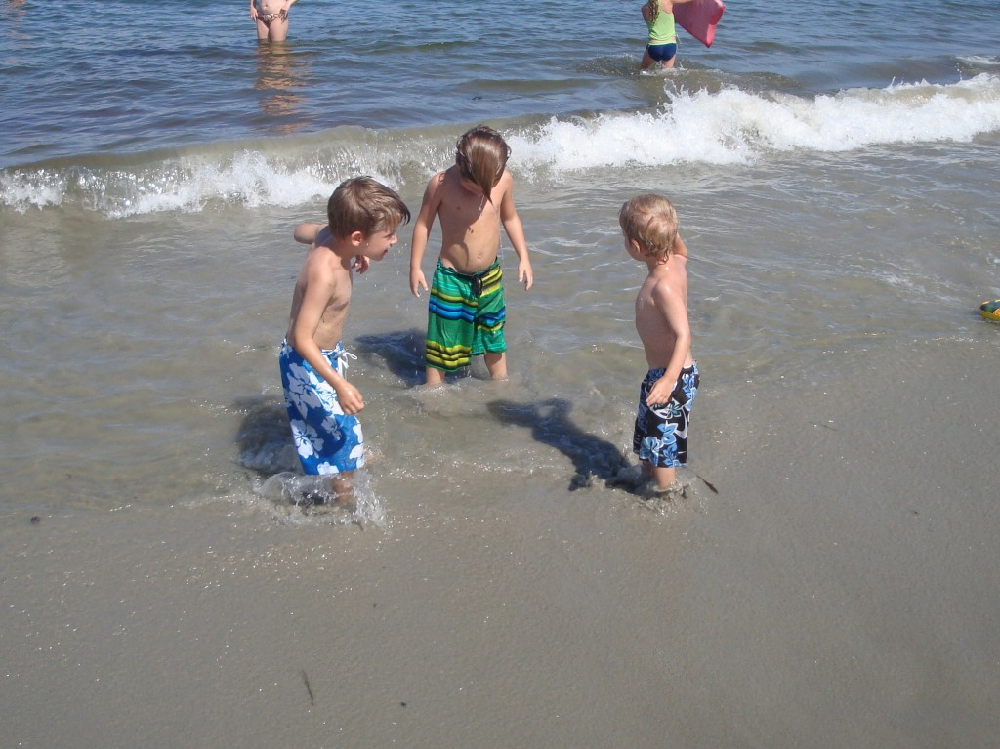

C’était toute une première pour notre famille d’aller en vacance au Maine. La famille Carter, presque au grand complet, s’est déplacée pour l’évènement. Nous avons loué trois chalets pour accommoder tout ce beau monde là. Voici nos enfants devant le logement que nous avons occupé durant la semaine.

Température géniale! À tous les jours nous avons été à la plage à l’exception du dimanche. Sur cette photo nos trois plus grandes qui ont bien profité de ce temps de rêve.

Nos gars aussi se sont bien amusés entre eux. C’est fou c’est comme si on a à peine vu nos enfants pendant la semaine tellement ils se sont bien occupé ensemble. C’est ça la joie d’avoir beaucoup de cousins et cousines de son âge.

Ici maman et papa heureux de se retrouver un peu.

À notre arrivé on a été un peu déçu de voir combien la plage était petite. Bien vite on s’est rendu compte que c’était la meilleur chose pour nous. Il n’y avait vraiment pas beaucoup de monde sur la plage, ce qui nous facilitait la surveillance des enfants et qu’on à profiter de tout l’espace libre pour faire d’innombrable jeux. Sur cette photo mes deux amour qui explore la plage le matin lors de la marée basse.

On s’est fait un grand terrain de pétanque et pendant trois jours, si je me souviens bien, on a tenu un tournois familiale. Les grands gagnants: Marie et Eli.

Voici tout ceux qui étaient présent. Ça en fait du beau monde et ça en fait du temps de qualité en famille.

Pour terminer la semaine en beauté nous avons célébré la fête de Danielle. En son honneur Michel a acheté du homard pour tout le monde. Super semaine, super cadeau d’être tous ensemble, super souvenirs. Encore un gros merci!

