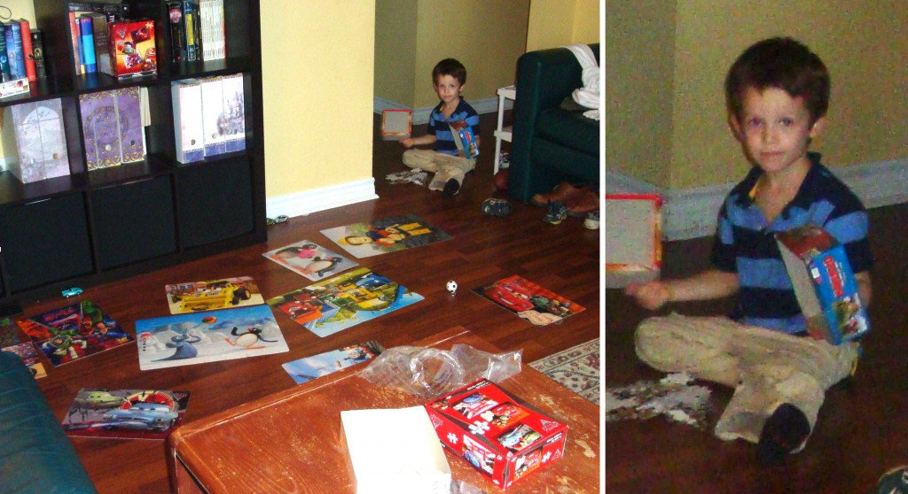
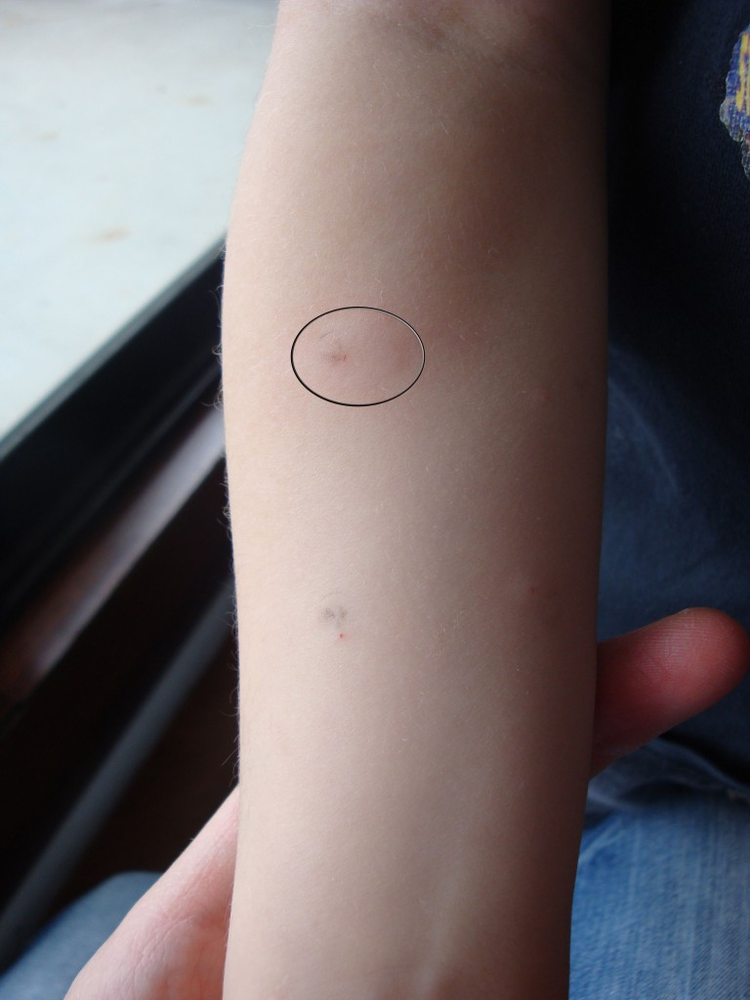
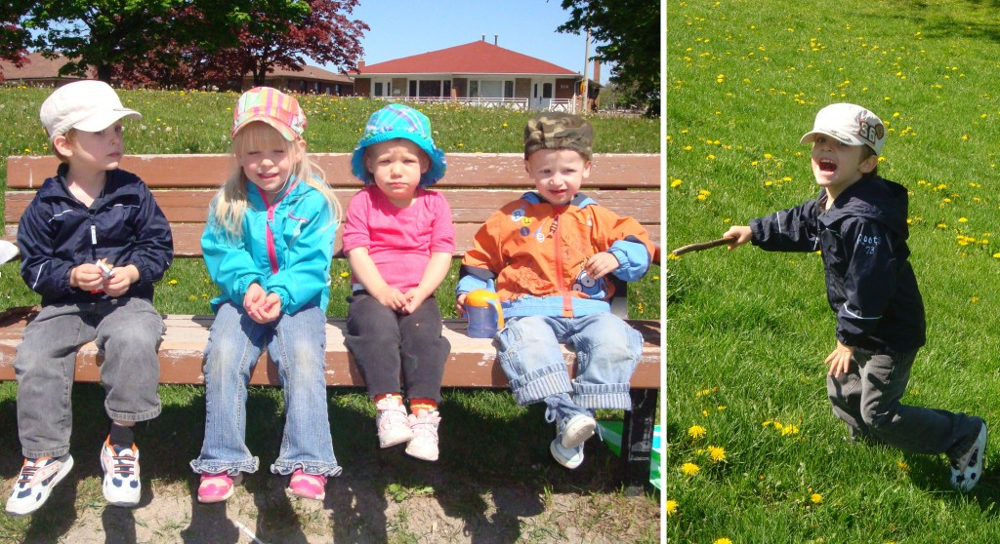
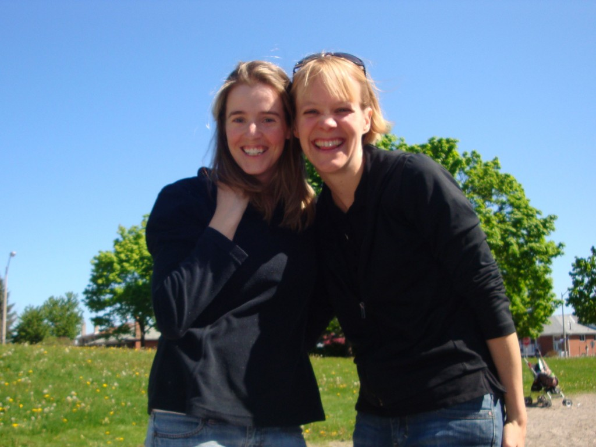
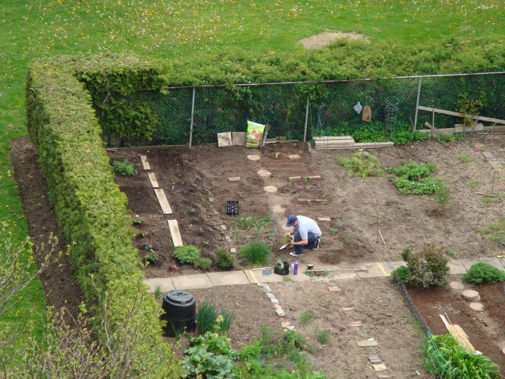

Notre retour du Québec à été très mémorable. Toute la famille est tombé malade pendant les deux semaines qui ont suivie. Ézékiel 6 fois, Caleb 3 fois, Marjorie 2 fois et Jean-Michel 1 fois. Ça en fait des dégâts tout ce monde là de malade!

À tous les jours le plancher de notre salon a été tapissé de 12 ou 13 casse-têtes. Pour un total maximum de 440 morceaux de casse-tête.

À gauche: le champ de mines. À droite: Ézékiel maigre, blanc et cerné par la gastro.En plus, durant la dernière semaine de maladie, nous avons vu trois différents docteurs. Un pour le tympan percé d'Ézékiel. Le second pour le rendez-vous annuel pour l'allergie d'Ézékiel. Et le dernier parce qu'Ézékiel ne semblait toujours pas guérir de la gastro.

Sur la photo on peu voir qu'Ézékiel est toujours aussi allergique aux arachides. L'ovale nous donne une idée de l'enflure causée pas une goute d'huile d'arachide sur son bras. Aucun changement en deux ans.

Avec un ventre bien sensible, mais la connaissance de ne plus être contagieux, j'ai finalement sorti mes deux petits vampires à la peau blanche. Nous avons été voir nos amies et avons joué au parc. C'était temps de les voir sourire et courir!

Puis le lendemain toute la famille est sortie pour faire le jardin. Nous étions finalement revenu à notre normal. Pour célébrer, Jean-Michel nous a sorti au restaurent. Que c'est merveilleux d'être en santé!

