C'est notre dernier été à Toronto (en théorie). Donc Mon mec est occupé par dessus la tête avec ses articles et bientôt sa thèse. Ce qui veux dire qu'on a pas vraiment de vacance en famille. Ce n'est quand même pas une raison pour ne pas profiter du beau temps. Voici quelques activités que notre famille à fait depuis le début de l'été.

**L'été c'est... La fin des classes.** Et pour Ézékiel, la fin de son cours « Creative play time ». Il va s'ennuyer de cette classe qu'il avait deux fois par semaine. Le voici devant son crochet, dans l'attente des parents.

[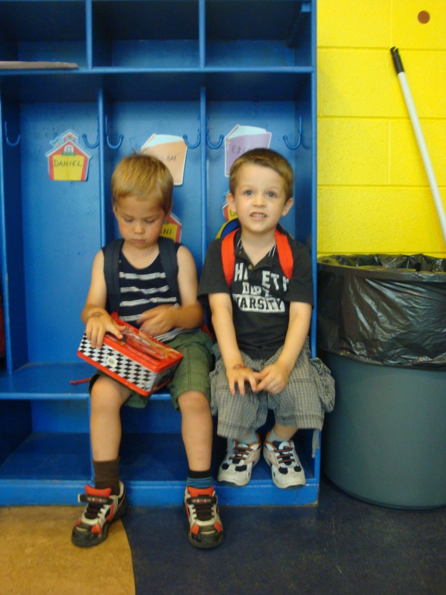](http://famillecarter.com/blog/wp-content/uploads/2012/07/DSC04429.jpg)Puis avec l'une des deux monitrices.

[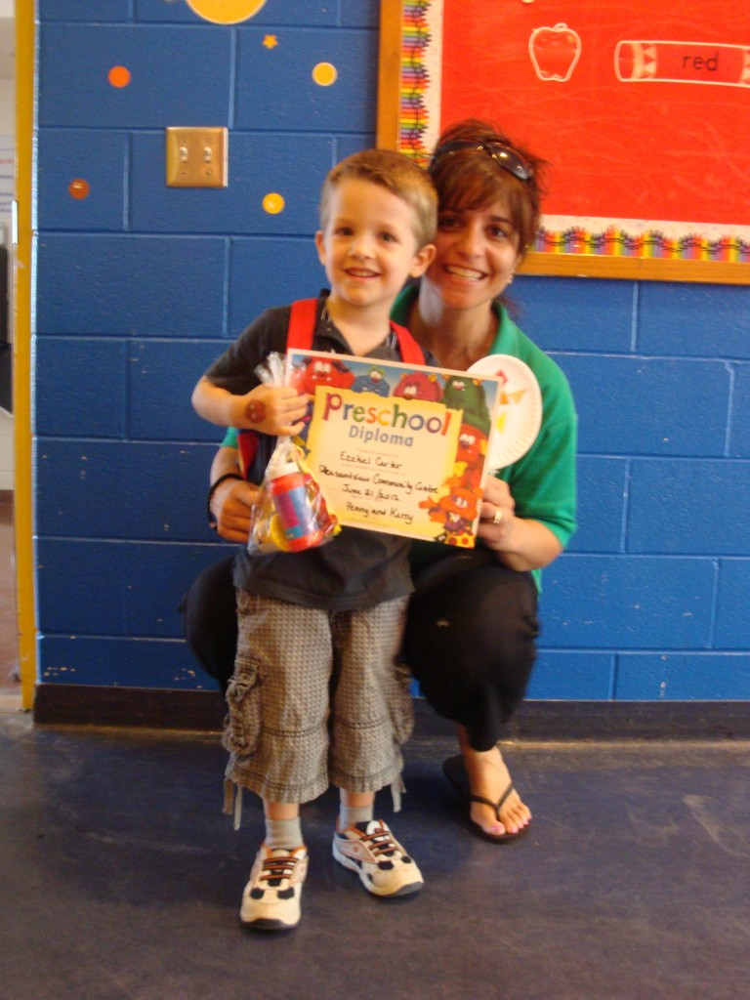](http://famillecarter.com/blog/wp-content/uploads/2012/07/DSC04431.jpg)

**L'été c'est... le temps d'aller cueillir des fraises.** Cette année j'ai choisi une très mauvaise journée pour aller aux fraises. À 9h du matin, il faisait déjà 30. La chaleur et le soleil nous écrasait. À ne plus refaire. Mais on a quand même réussi à avoir une belle récolte. Ici Ézékiel tenté par le contenu de sa petit chaudière.

[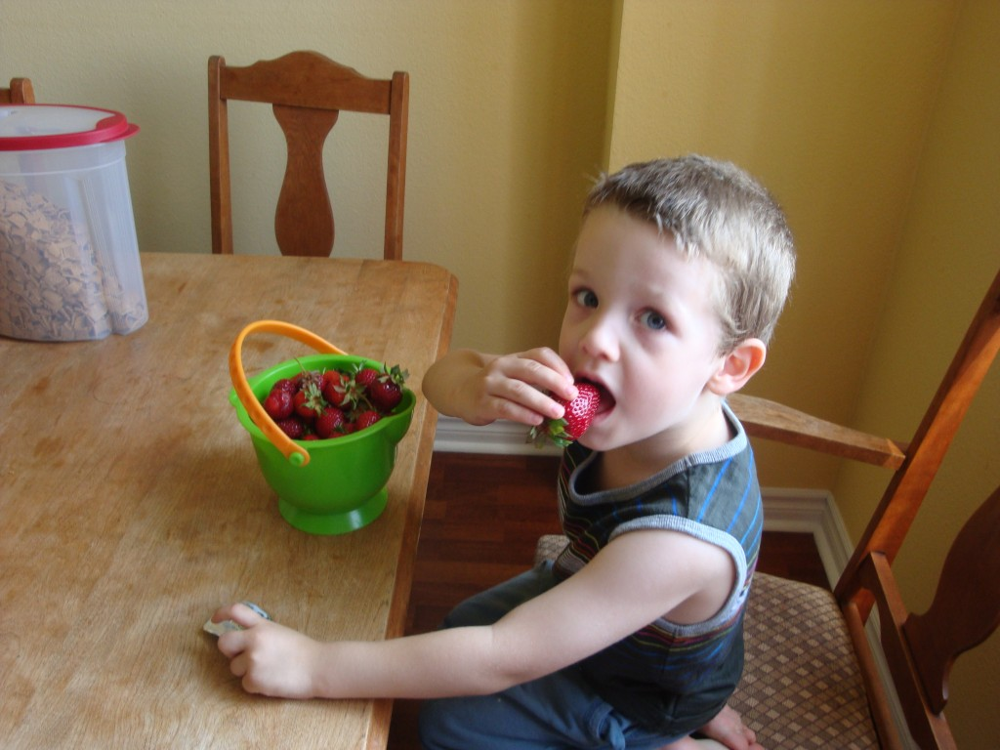Tandis qu'on voie bien sur cette photo que Caleb à eu très chaud.](http://famillecarter.com/blog/wp-content/uploads/2012/07/DSC04403.jpg)[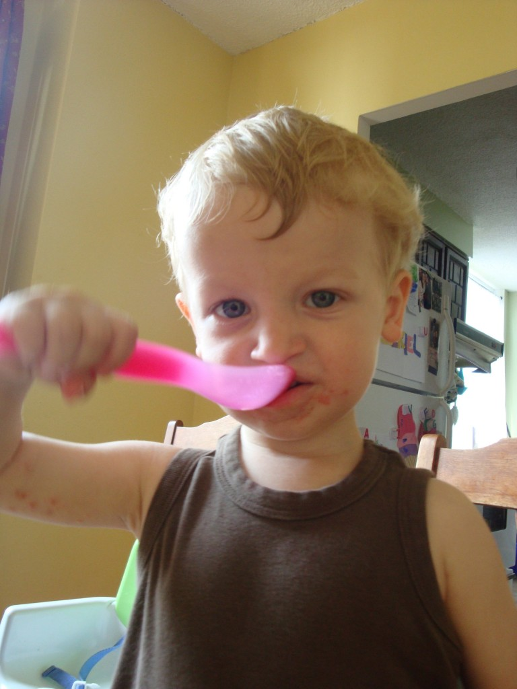](http://famillecarter.com/blog/wp-content/uploads/2012/07/DSC04406.jpg)**L'été c'est... les fêtes** (Victoria, St-Jean et du Canada). À chaque année la paroisse organise un BBQ pour la fête du Canada et c'est toujours une belle activité. Pour la première fois il y avait un « Bouncy castle ». Quelques enfants n'ont pas été capable d'y entrer tellement il faisait chaud là dedans. Mais ça n'a pas arrêté Zeke de s'y faire dorer la couenne. Il a trippé.

[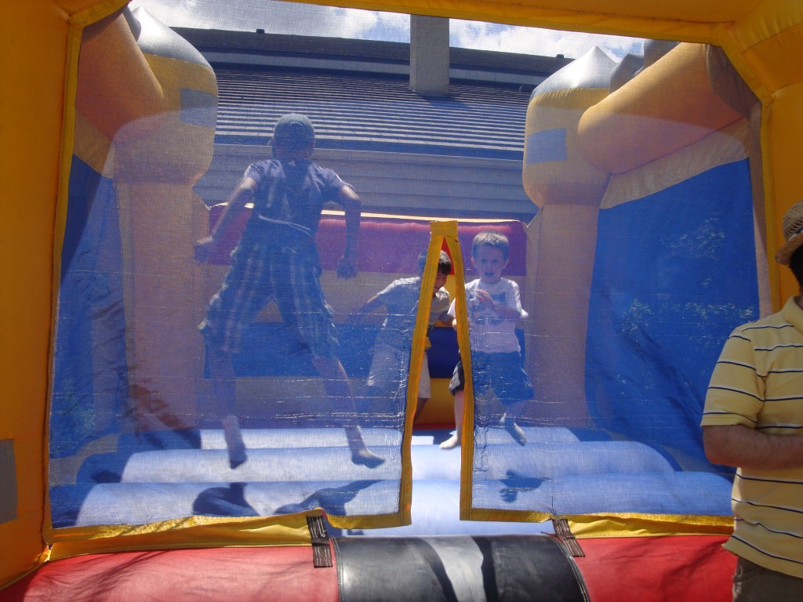](http://famillecarter.com/blog/wp-content/uploads/2012/07/DSC04475.jpg) [Pauvre Caleb, il aurait bien voulu sauter comme les autres, mais il avait mal à son pied... Aussi avez-vous déjà vu du melon d'eau jaune? Il goutait aussi bon que le melon d'eau rouge.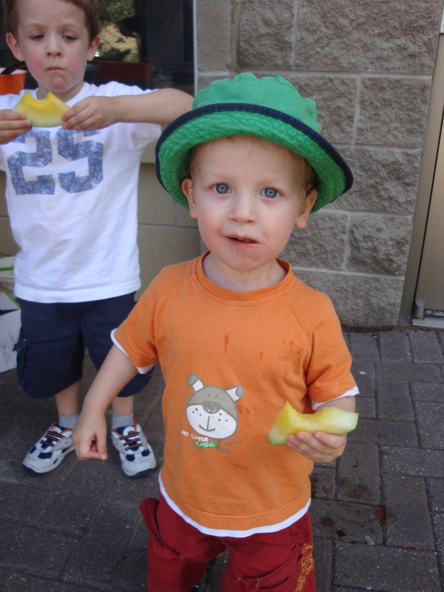](http://famillecarter.com/blog/wp-content/uploads/2012/07/DSC04481.jpg)**L'été c'est... jouer dans l'eau.** Presqu'à tous les deux jours on va jouer au parc d'eau ou à la plage. Ça veux dire qu'il fait beau et chaud cet été. On en profite aussi pour voir des amis. Les 4 amigos: Liviya, Cora, Caleb et Ézékiel.

[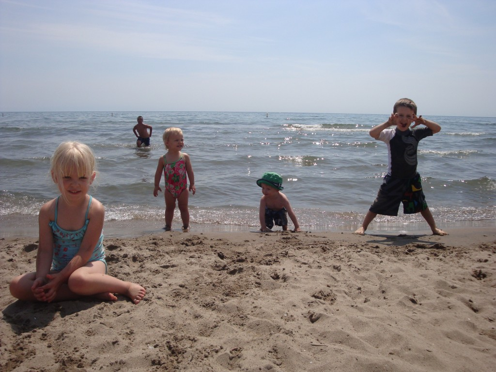](http://famillecarter.com/blog/wp-content/uploads/2012/07/DSC04499.jpg)[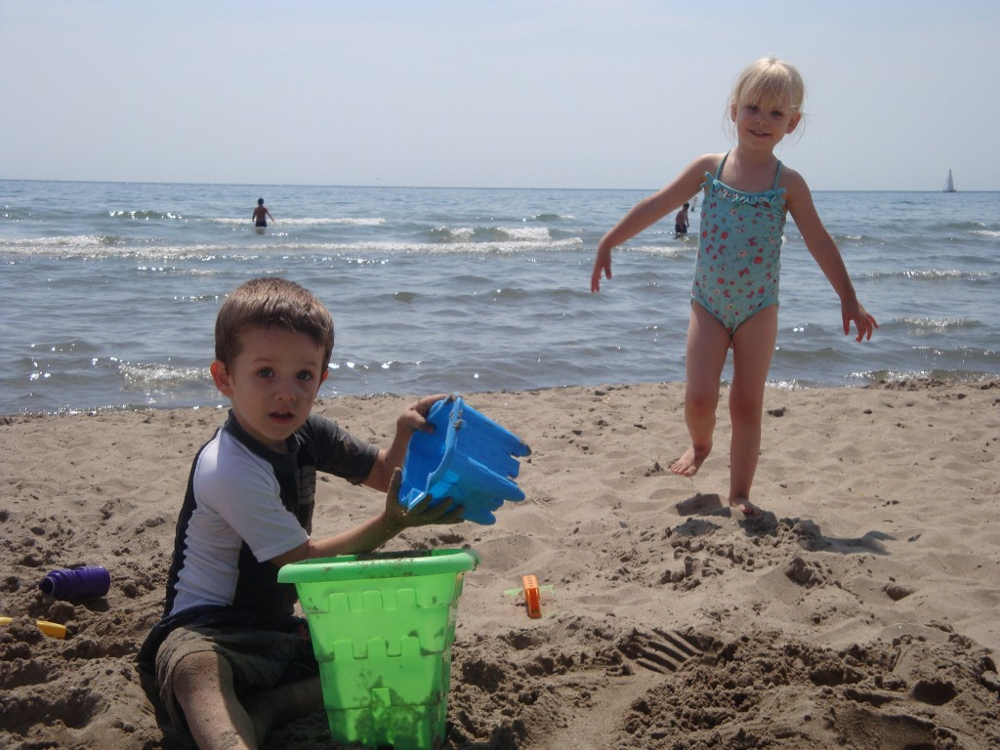](http://famillecarter.com/blog/wp-content/uploads/2012/07/DSC04490.jpg)[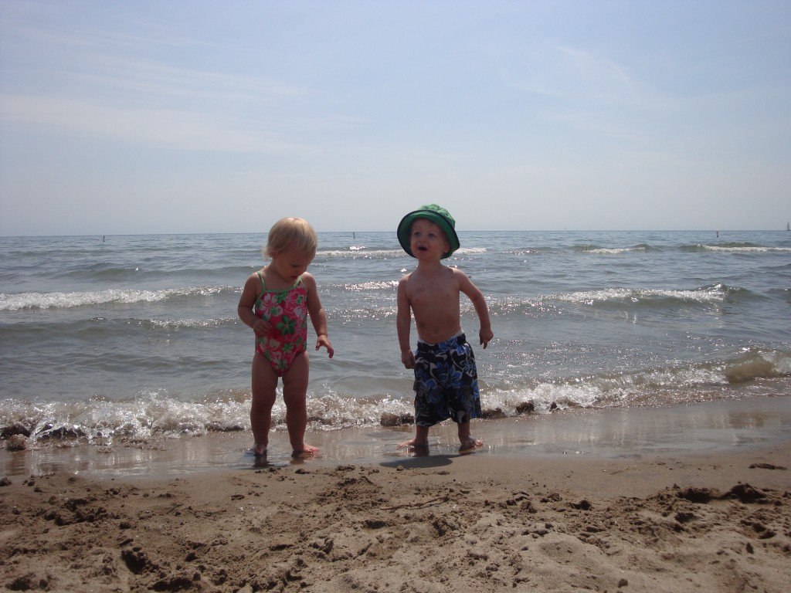](http://famillecarter.com/blog/wp-content/uploads/2012/07/DSC04501.jpg)**L'été c'est... être mort de fatigue.** Très rare sont les activités qui ne finissent pas comme ça. Et oui Caleb à du sable tout autour de la bouche. Que c'est beau des p'tits dormeurs comme ça.

[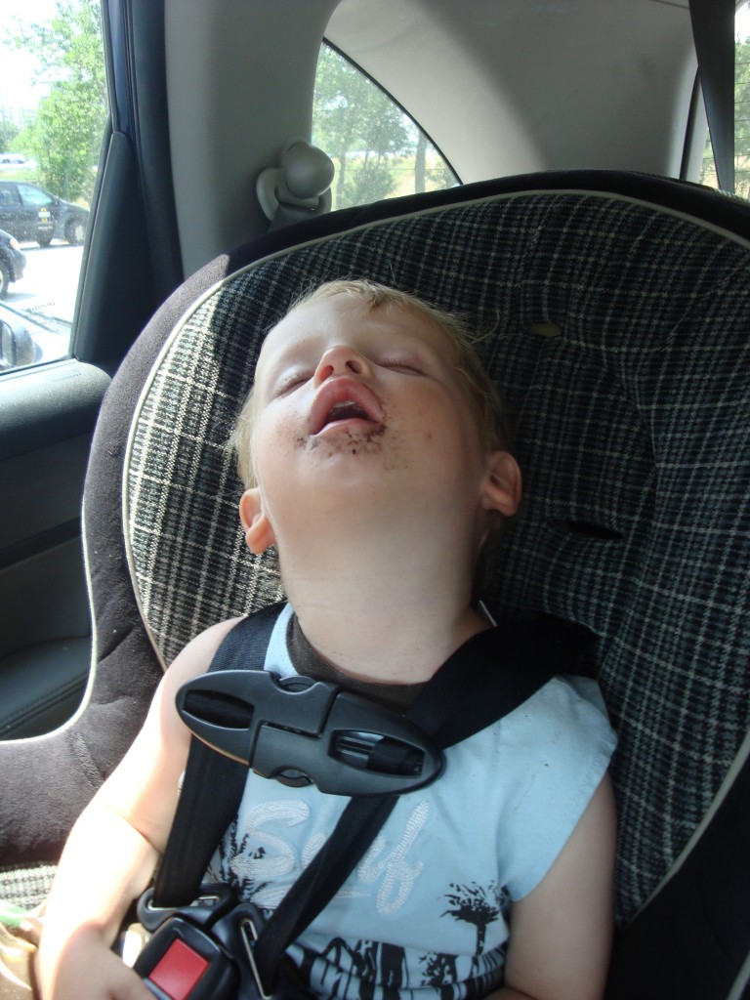](http://famillecarter.com/blog/wp-content/uploads/2012/07/DSC04507.jpg)[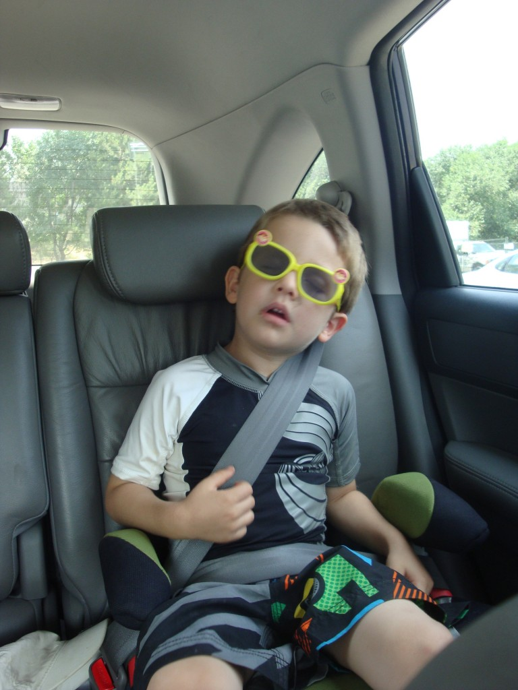](http://famillecarter.com/blog/wp-content/uploads/2012/07/DSC04509.jpg)
