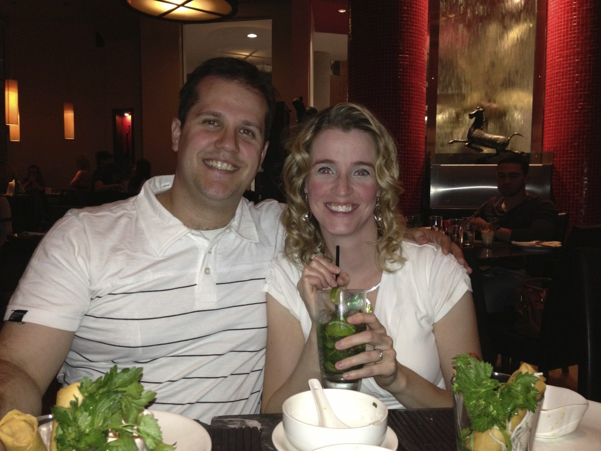
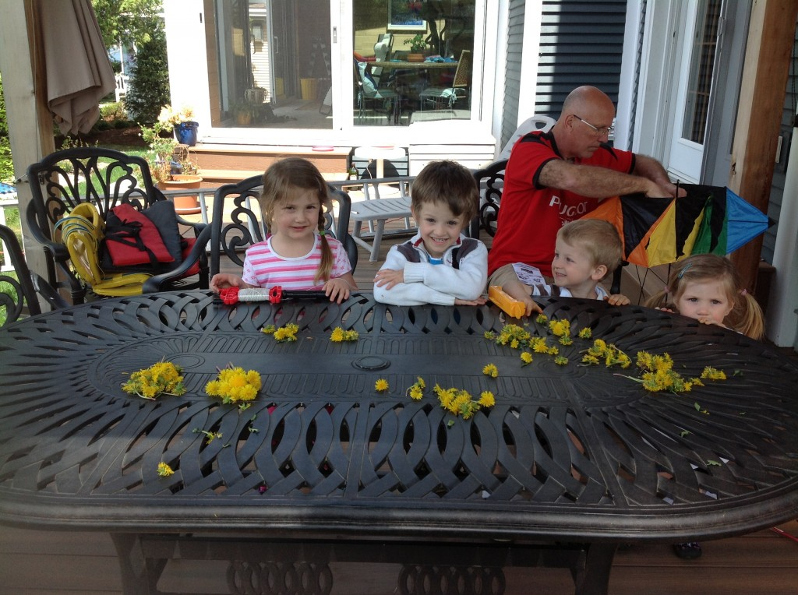
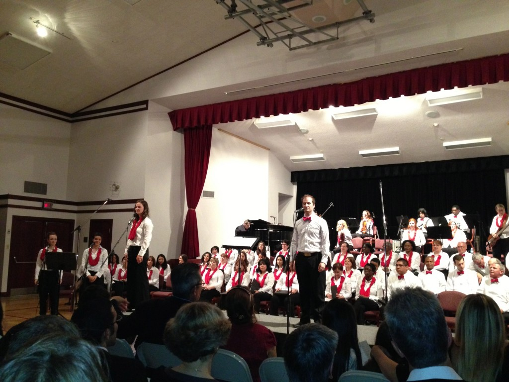
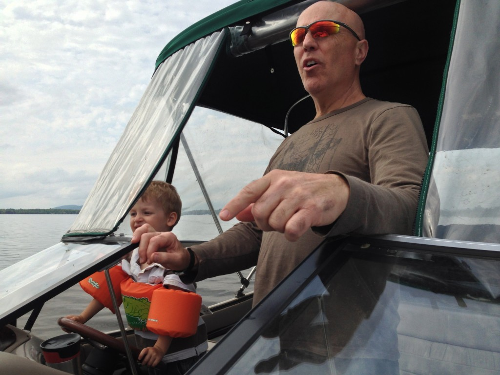
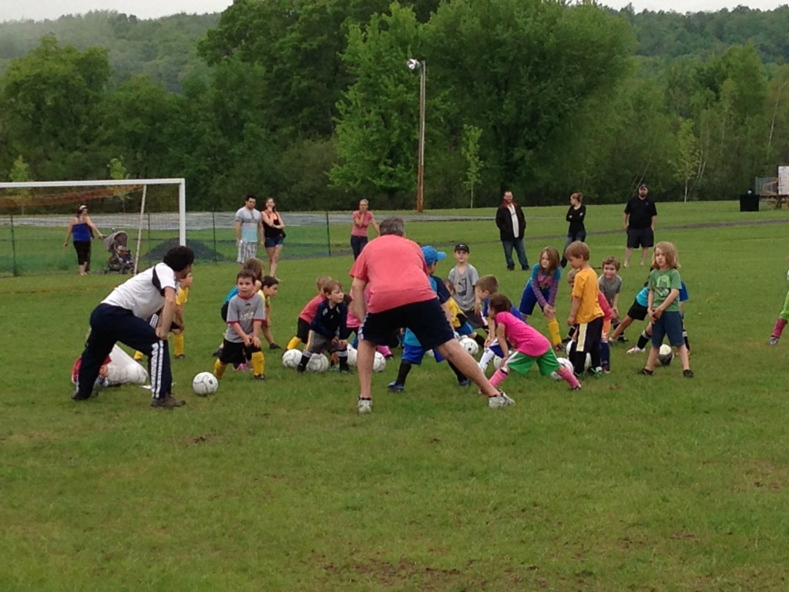
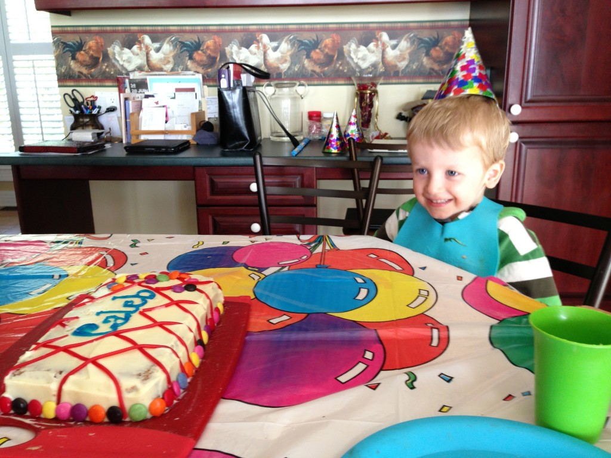
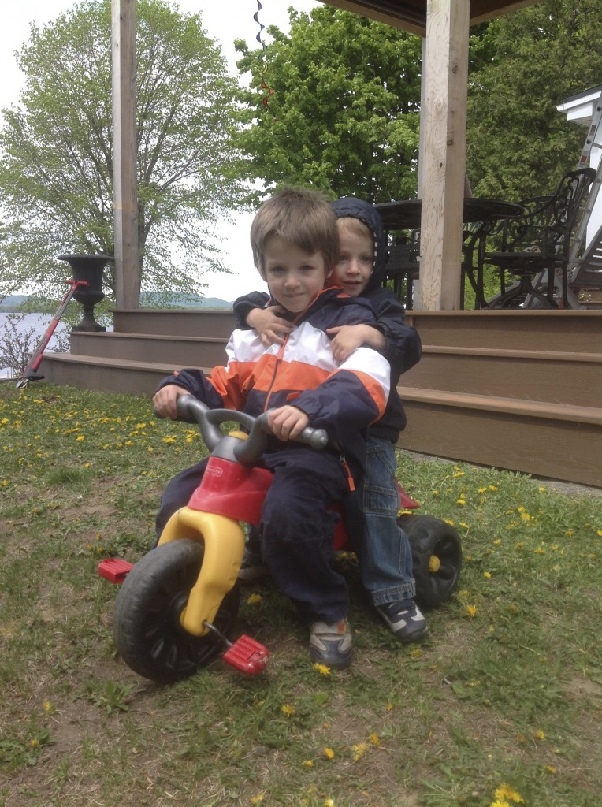

Le déménagement a été un grand stress pour nous, spécialement mon homme. Ça nous a fait un grand bien de se retrouver tranquille chez la famille. Ça nous donne le temps de faire toute la paperasse officielle pour notre retour dans la province de la poutine et le plus important de se trouver un travail. Malgré ces deux occupations primordiales, nous avons quand même pris le temps de relaxer. Pour la fête de Jean-Michel, nous avons renoué avec plusieurs de nos bons amis. Une soirée qui nous a fait réellement sentir aimé par ces derniers.Nous avons eux la visite de deux cousines pour une semaine. Sur cette photo les voici qui pratique pour la fête des mères. À moi toutes ses belles fleurs](http://famillecarter.com/blog/wp-content/uploads/2013/07/IMG_0921.jpg)Puis après autant de mois d'attente nous avons finalement assisté au super concert "Il Vit!" où nous avons été témoins de grands talents. J'en grade un très bon sentiment. Les "quelques beaux jours" que nous avons eux nous ont permis de profiter du bateau. Caleb aime le conduire sous la supervision de papi bien sûr! "C'est pas grave si je ne voie pas où je vais, en autant que j'ai le contrôle!"Puis on a inscrit Ézékiel au soccer à son grand bonheur. À tous les semaines il attend patiemment d'enfiler ses vêtements bleus de soccer pour aller jouer comme l'Impact de Montréal. Devinez de qui il prend ça?Notre coco Caleb a eu 3 ans... "Je suis grand maintenant!" Depuis plusieurs mois il nous demandait quand est-ce que c'était sa fête, car il savait qu'on allait célébrer au Bowling. Trop mignon, après notre sortie il est revenu à la maison avec à l'esprit que c'était la plus belle journée qu'il avait eu de toute sa vie. Avec tout ça, les enfants se sont familiarisés avec leur nouvelle vie chez mamie et papi.
