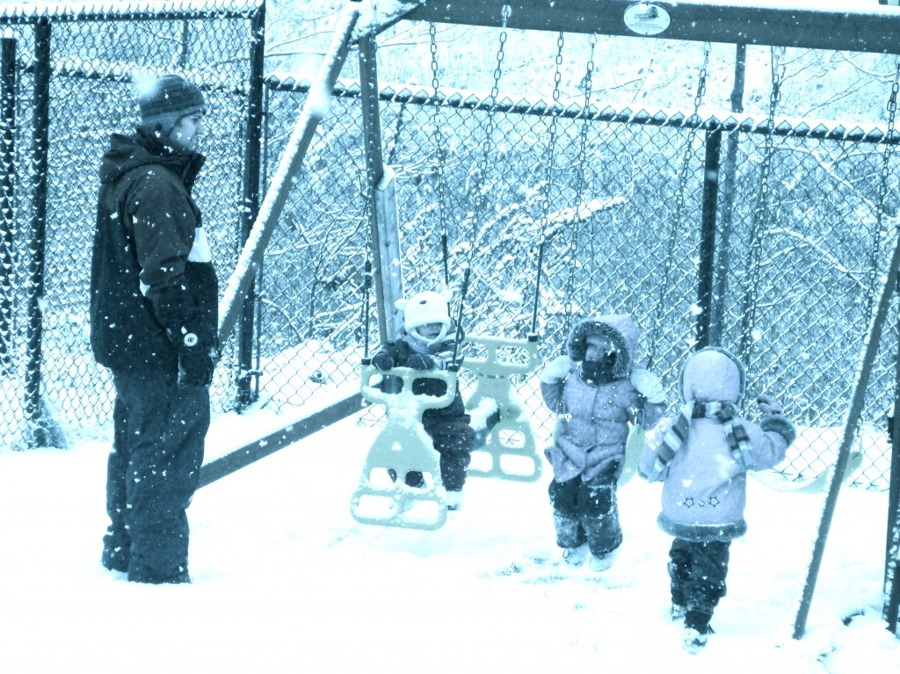
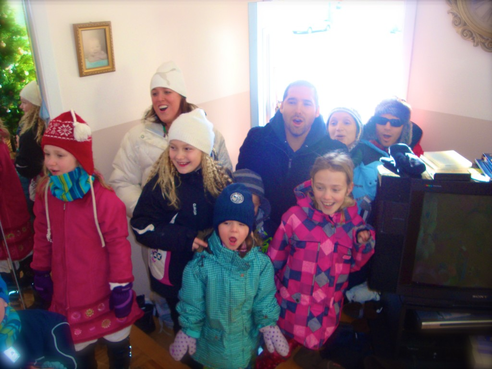
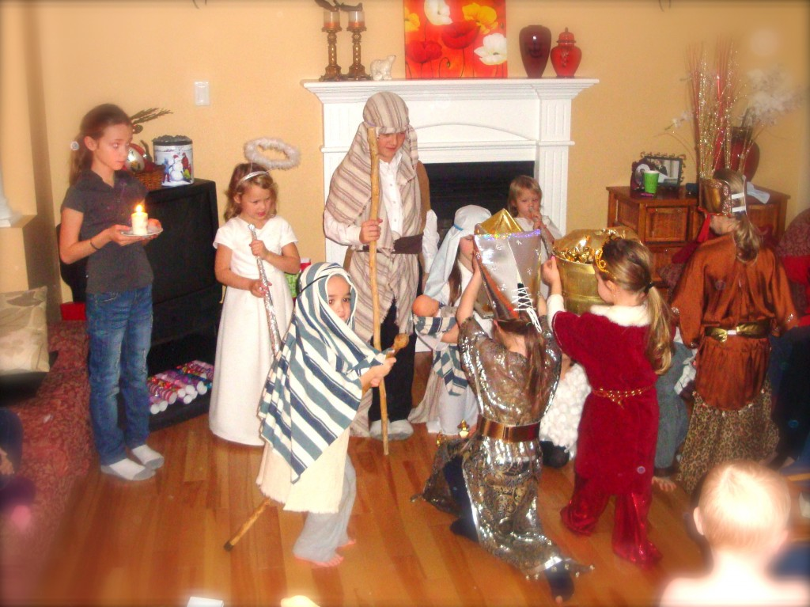
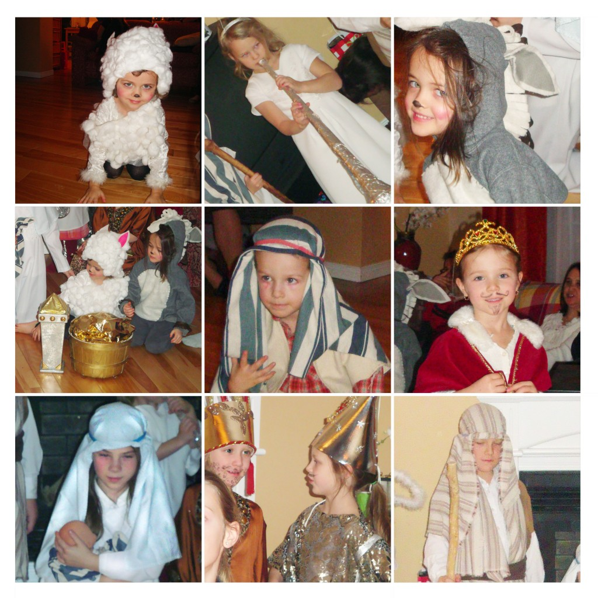
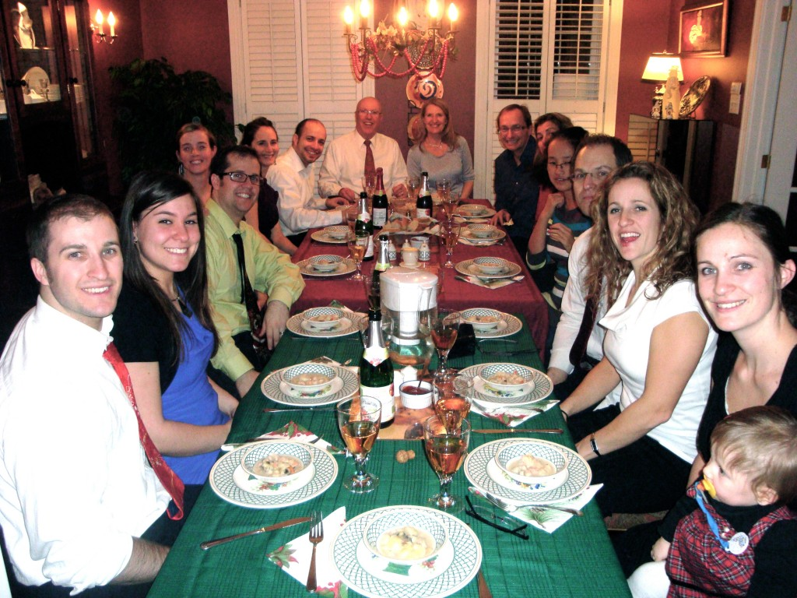
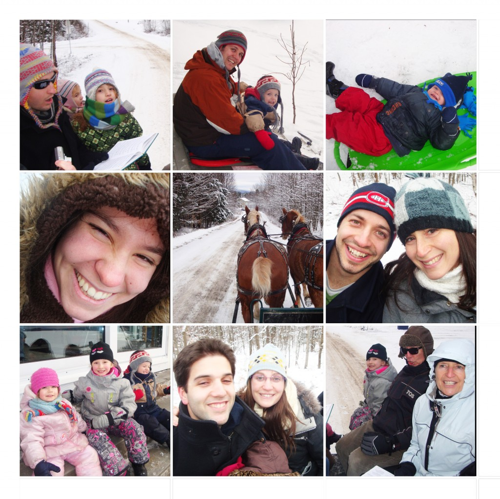
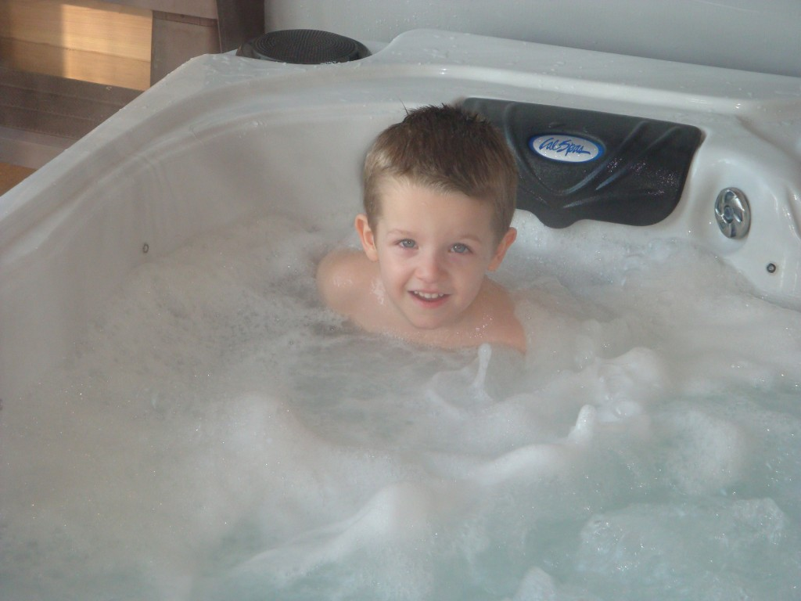
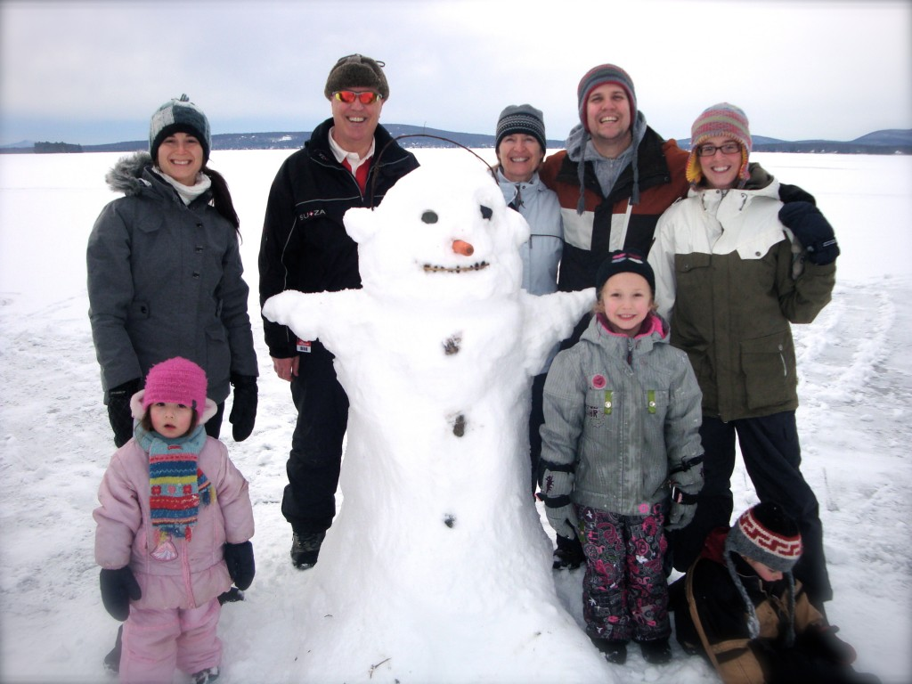
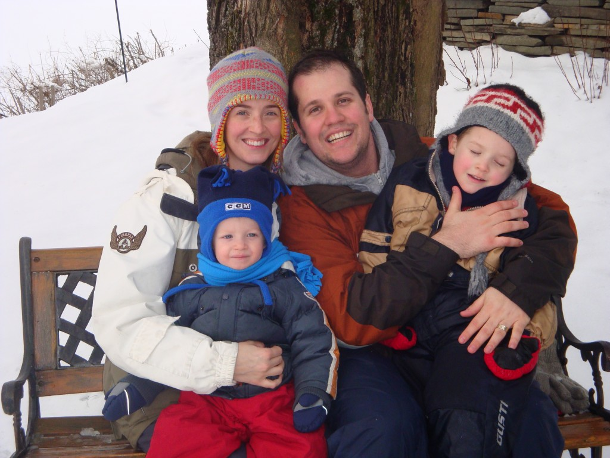

Le 23 décembre il y a eu une belle neige blanche qui s'est installée sur le Québec. Ouf, on était soulagé. On a passé proche de ne pas avoir un Noël blanc.

Pour commencé nos vacances, nous avons visité mon côté de famille. Le 24 c'était la grosse fête. Au matin, chez les Amyot, on a eu droit à du « caroling ».

Puis, en soirée la rencontre se faisait chez les Vallée. J'ai particulièrement aimé la crèche vivante. Les costumes étaient vraiment bien fait et les enfants ont bien joué leur rôle.

À partir du 25 la fête continuait du côté Carter. Enfin, c'était le premier noël que nous étions tous réuni ensemble en quatre ans. C'était temps! Les journées qui ont suivi ont été rempli d'activités hivernales. Une chance pour nous la neige était toujours au rendez-vous.

La première expérience d'Ézékiel dans un spa.

L'avant-midi du 27, température idéal pour jouer à l'extérieur.

Notre famille après avoir joué dehors.

