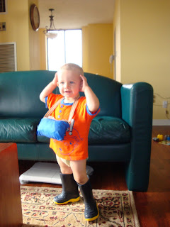
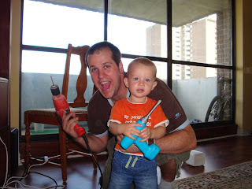
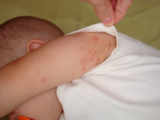

Cet été "Non, non, non..."est devenue la phrase préférée d'Ézékiel. Il secoue la tête et dit non à tout, même quand il veux dire oui. Dans quelques jours notre grand garçon va avoir 17 mois et il nous parle déjà un p'tit peu.  
  
Voici la liste des mots qu'il dit.  
  
\-maman  
\-papa/dady  
\-cor (encore)  
\-aide  
\-coucou  
\-gdi (J'ai dit!)  
\-non  
\-nez  
  
Aussi, Ézékiel comprend très bien quand on lui demande d'aller chercher ses souliers, qu'il est l'heure de manger, qu'on va faire la prière ou encore qu'on va lui donner son lait.  
  
Notre petit homme aime imiter ses parents, ce qui est très mignon. Ça fait déjà quelques mois qu'il a commencé à faire les mouvements des chansons que l'on fait en famille. Ses mouvements sont maladroits, mais de le voir s'essayer nous rend tellement fière de lui.  
  

"Tête, épaules, genoux, ..."  

  
  
  
  

L'homme à tout faire  
  
  

  
Côté santé d'Ézékiel, il a toujours ses verrues de bébé un peu partout sur le corp. Elles sont "sensées" partir entre 6 mois et 1 an et demi. Ça va faire plus d'un an qu'il les a et elles semblent se multiplier de plus en plus. Sur cette photo que j'ai prit alors qu'il dormait on peux en compter 19 incrustées dans son dessous de bras. Quelques conseils nous ont déjà été donné par des amis.  
  
  
  
  
C'est une histoire à suivre.
