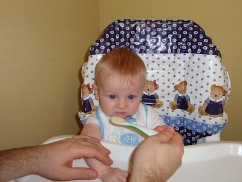
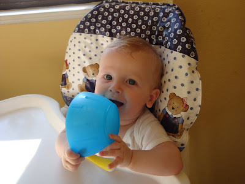
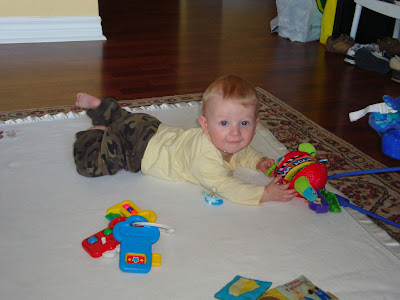
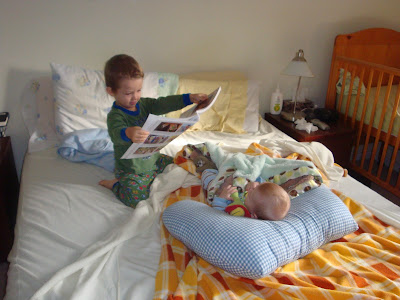

Caleb a célébré ses 6 mois la semaine passée. Pour l'occasion il a été voir son pédiatre. (Un luxe quand on compare à ce que j'ai entendu dire de la rive-nord.) Comme cadeau on lui a donné un vaccin et on a mesuré son poids et sa taille. D'après le docteur nous avons un grand-petit homme. Selon sa courbe de croissance il est plus grand (71 cm) et moins gros (14 lbs et 3 onz) que les garçons de son âge.

Disons qu'il détient de sa maman et n'est pas un grand gourmand. Le voici lors de son premier repas de nourriture solide. « Pas sûr que j'aime ça papa? En tout cas pas pour aujourd'hui. »

  

  

Ici lors d'une pratique à l'heure du midi.

  

Il se roule du ventre sur le dos facilement...  

jusqu'à disparaitre sous les meubles.

  

Au grand plaisir d'Ézékiel, Caleb passe de plus en plus de temps avec lui. Sur cette photo Zeke fait la lecture des écritures à Caleb.

  

Prochaine étape... la position assise.
