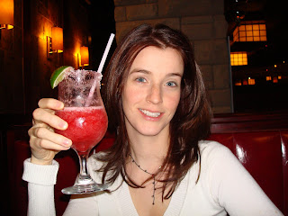
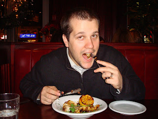
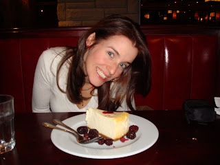
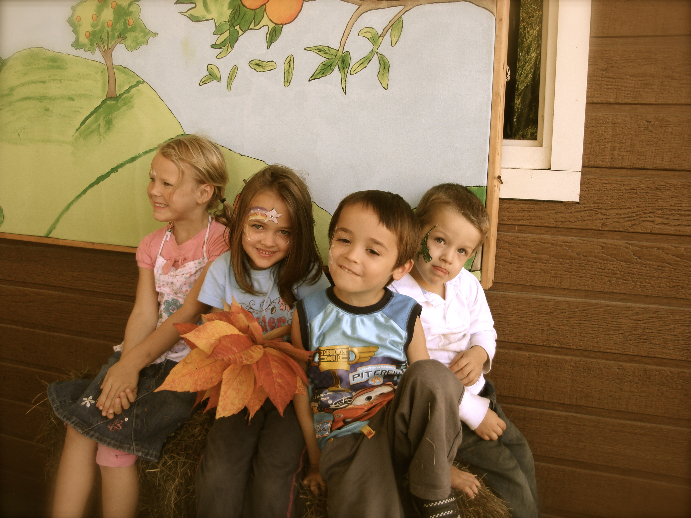
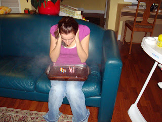
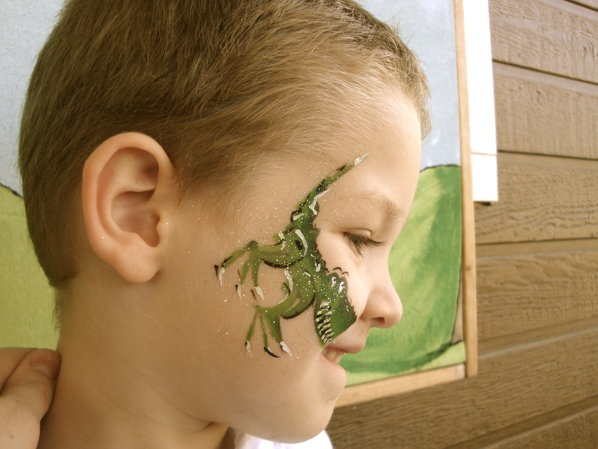

La semaine passé j'ai fêté mon 29e anniversaire. Déjà!!!  
  

Comme toujours, Jean-Michel a trouvé le moyen de me faire passer une très belle journée. Pour commencer, il m'a apporté le petit déjeuner au lit accompagné d'un présent. Puisqu'il devait aller à l'école Emily a prit la relève. Elle a gardé Zeke pour me permettre d'aller chez le coiffeur avoir une petite séance de beauté et de relaxation. Pour le dîner elle m'a même payé le sushi. Je me suis vraiment sentie gâté-poupou.  
  
En soirée les Devenney's devait garder Zeke. Un service rendu pour avoir garder leur petite lors de la fête à Niki.  
Je n'avais aucune idée de l'endroit où Jean-Michel voulait m'amener pour souper. Il faut dire que les bons restaurants sont râres dans le coin. En temps normal, si on veux bien manger il faut aller au centre-ville de Toronto. Par miracle James a trouvé un restaurant BATON ROUGE à 15-20 minutes de chez nous. J'étais bien heureuse de son choix parce que je n'y suis jamais allé auparavant.  
  
Ici je lève mon verre à une autre belle année de passé et une autre à venir.  

  
  
Jean-Michel lui se régale avec du calmars grillers.  
  
  
Même si j'étais pleine à craquer j'ai eu droit à une pointe de gâteau au fromage...que j'ai à peine touché!  
  
  

Lorsqu'on avait gardé pour les Devenney's on avait bien ri d'eu lorqu'ils sont revenus à la maison à 10h p.m. "Quand on va avoir notre bébé, ça sera pas notre cas!" qu'on s'était dit.  
Jean-Michel avait prévu d'aller au cinéma après avoir mangé et bien devinez quoi? On s' était tellement bourré qu'on a eu de la difficulté à se rendre à l'auto. Aussi pathétique que ça peut sembler, on était de retour à 9:30 p.m. et bien heureux d'être à la maison.  
  
En tout cas, le dimanche qui a suivi on a invité des amis à venir prendre une pointe de gâteau pour mon anniversaire. Jean-Michel s'est sincèrement forcé à faire 2 tartes au fromage . Tout le monde a aimé, une vraie réussite.  
  
Ici je pense profondément à mon voeux... à ne pas prendre à la légere!  
  
  
J'ai soufflé sur le gâteau en chocolat qu'Emily m'a fait. Après ça, il y avait un méchant nuage de boucan dans l'appart. Bon j'en met un peu...  
  
Pour terminer, je voulais vous montrer la belle plante que Jean-Michel m'a acheté. Un gros poinsettia. Malheureusement il est en train de mourir. Je pense avoir mi trop d'eau. Je vais être meilleure la prochaine fois... je l'espère.  
  

