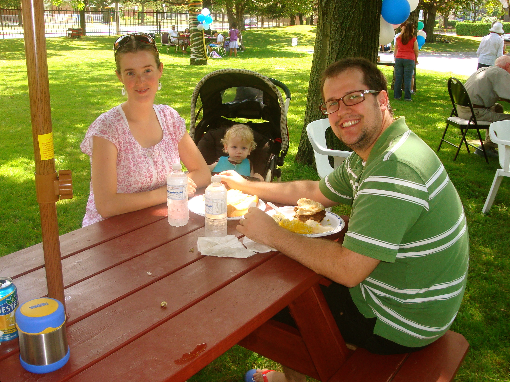
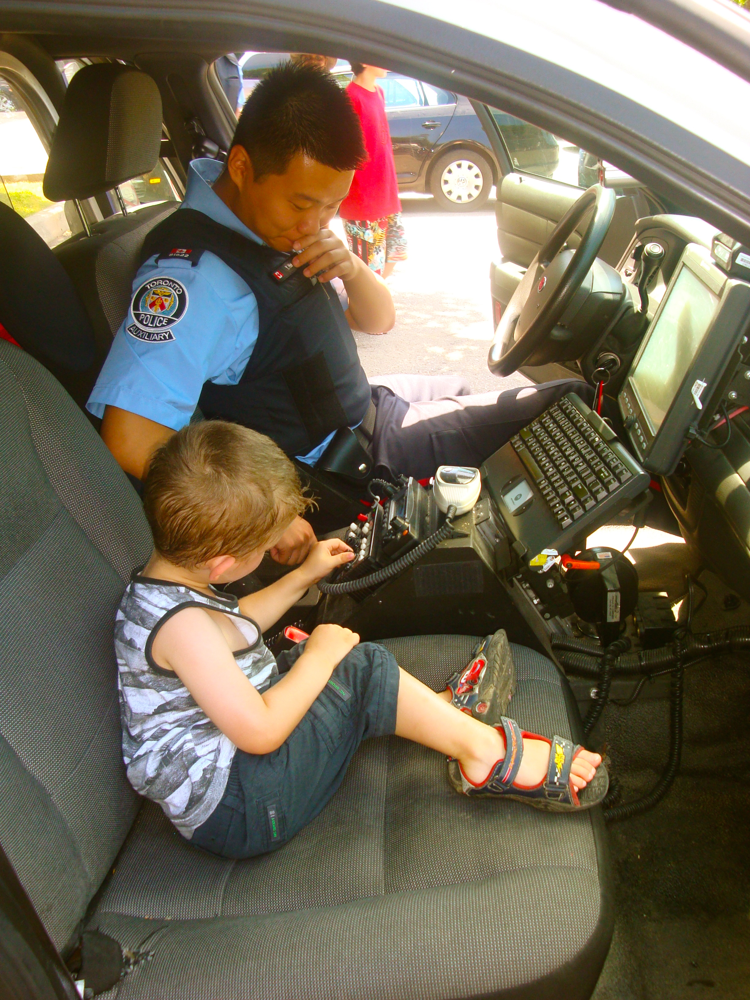

La température a battu des records de chaleur ici à Toronto dans la dernière semaine. Celle-ci est montée jusqu'à 49° avec le facteur humidex. Malgré cela, nous avons prouvé que nous n'étions pas fait en chocolat et nous sommes sortis braver la température.

Au début de la semaine nous avons eu le BBQ annuel de notre immeuble appartements. En 4 ans c'était la première fois que nous y assistions et nous avons été agréablement surprit de la qualité de l'organisation.

Il y avait beaucoup d'activités organisées pour les enfants dont la visite d'une voiture de police et d'un camion de pompier.

Ici Zeke qui combat sa peur et affronte une descente à-pic.

C'est le paradis de Monsieur boutons dans la voiture de police.

Puis mardi nous avons eu la visite des Amyots. Pas questions de rester 11 personnes dans un petit 5 ½ . Alors on est sortie. Au programme: la plage, le jardin botanique, le musée de Spadina, le parc, une partie de Baseball (pour les hommes), les cascades d'eau, magasinage (pour les femmes), soirée de jeux (pour les parents) et puis la piscine du condos. Il fallait avoir beaucoup d'activités dans l'eau pour bien apprécier ces belles journées ensoleillées.

Les petits mousses protégés du soleil.

Angie, la  petite beauté sauvage des Amyot.

Zeke n'a jamais autant joué dans l'eau qu'avec son cousin et ses cousines.

Avec la soeurette à la piscine.

Notre étoile de mer.

La mini saucette de Caleb.

Les enfants de leur côté ont beaucoup aimé passer du temps ensemble. Même Caleb s'est fondu dans le décor.

En gros les seuls qui voudraient bien se plaindre sont les pelouses toutes jaunies et brulées par le soleil. Et bien sûr ceux qui n'ont pas l'AC.
