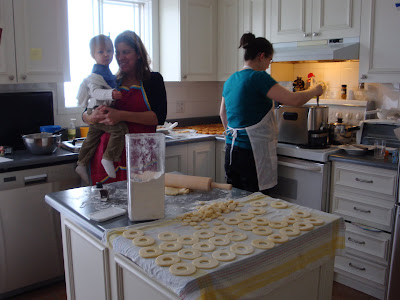
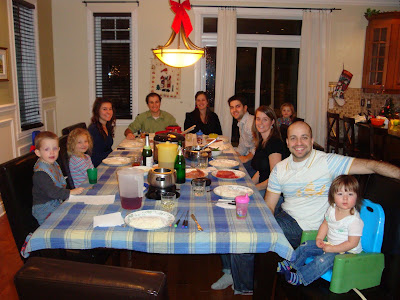
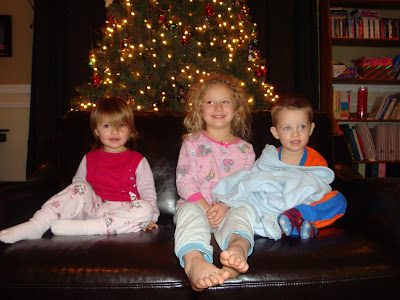
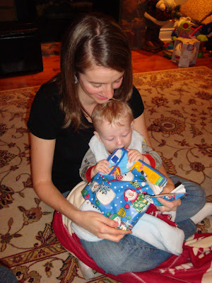
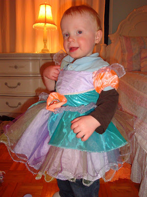
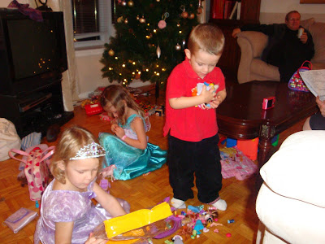

Il y a franchement trop à dire au sujet de nos vacances. Il va me falloir plus d'un article pour vous donner un bref aperçu de nos 12 jours au Québec.

Durant les journées qui ont précédé Noël, nous avons profité de la douce température et de la belle neige pour jouer dehors. Aussi, nous avons évidement visité nos proches, ri, joué et mangé avec eux. Que du bon temps!

J'ai particulièrement apprécié l'invitation de ma belle-soeur à venir faire des beignes à l'ancienne avec elle et Manon. C'est pas si sorcier à faire, mais ça prend du temps. Les 48 beignes qui m'ont été donné ont été mangé dans un temps record. Hummm. Trop bon!

  

  

Le 24 décembre nous avons fêté dans la famille Carter. Enfin, c'était la dernière sans les beaux-parents. Malgré l'absence de plusieurs membre de la famille nous avons passé une très belle soirée.

  

Les fêtards du 24

  

  

Plutôt bien réveillé les enfants pour minuit.  

Serait-ce l'idée de développer des cadeaux qui vous garde les yeux ouvert?

  

  

Caleb qui «Bouffe» son cadeau avant même qu'on ai fini de le développer.

  

  

Le lendemain au soir, le party était chez la famille Amyot. Deux choses m'ont fait rire durant la soirée. Comme il a 9 filles et 4 garçons on comprend que l'influence féminin est très fort quand les enfants se retrouvent tous ensembles. Joe a presque renié son fils quand il l'a vu faire parti de la parade de mode. Tandis que Jean-Michel m'a interdit d'un jour d'avoir des polly pocket chez nous. Ézékiel les voulais tous.

  

  

  

La deuxième chose que j'ai trouvé mignon c'est avant de commencer le Karaoke. François avait le micro dans les mains. Il a demandé: Ézékiel qu'est-ce que tu as reçu comme cadeau? Zeke qui se trouvait plus loin c'est retourné vers l'amplificateur. Il s'est penché dessus la grosse boite noir et s'est mi à lui répondre comme si c'était la boite qui lui avait parlé. Trop drôle le p'tit gars!

Sur cela je dois aller préparer mon souper... la suite une prochaine fois!
