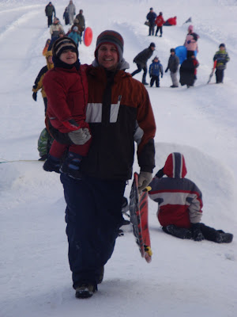
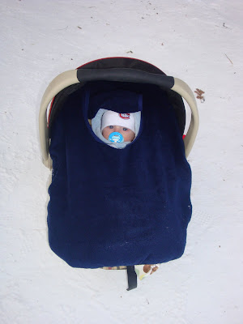
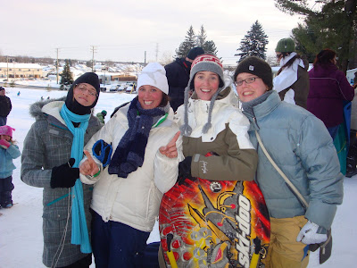
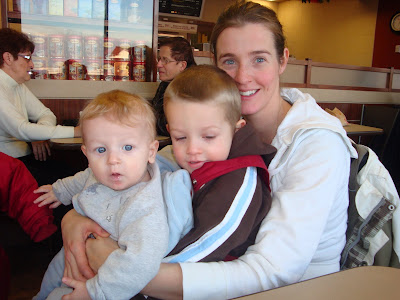
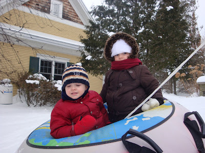
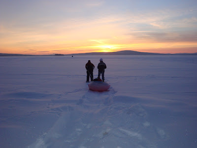

C'est tellement le fun de faire découvrir la vie à nos enfants. C'est le premier hiver qu'Ézékiel démontre du plaisir à jouer dans la neige.

Alors que nous étions au Québec nous sommes allé glisser trois fois, Jean-Michel et Zeke on été patiner une fois et nous avons tous été faire de la raquette au moins une fois. On ne pouvait pas s'en empêcher puisqu'il fessait si beau à l'extérieur. Vive les sport d'hiver!

Je tiens à mentionner qu'à la première descente en toboggan d'Ézékiel, il a clairement dit à Jean-Michel que c'était la première fois sur dix. Le petit voulait être sûre qu'on allait pas partir. À chaque fois qu'il arrivait au bas de la pente Zeke comptait combien de descente il lui restait à faire.  

  

Ici deux de mes hommes heureux comme tout.

  

  

Caleb aussi y était. C'était un p'tit peu froid pour lui, mais il n'a rien dit.  

  

  

Avec mes trois soeurettes, Audrey, Mélanie, moi et Martine.

  

  

Après une heure au froid nous sommes allé prendre un bon chocolat chaud. Juste à notre famille nous avons prit le 2/3 du restaurant.

Ici avec mes deux trésors d'amour.

  

  

Au chalet, Jean-Michel et Philippe se sont montré bien courageux. Ils ont entrepris de tirer Zeke et Zoé sur la belle neige blanche du lac. Tout cela en raquette. La destination: une petite cabane de pêcheur entre l'île et le chalet.  

  

  

C'est ti pas beau ça?

  

  

Qu'est-ce qu'on ne ferait pas pour nos petits amours?
