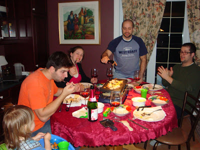
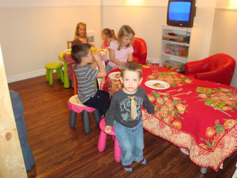
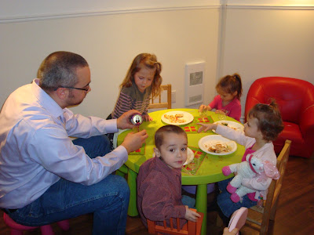
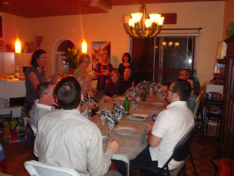
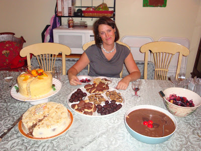

Voici la dernière partie de nos deux semaines au pays de l'hiver.

Dans la famille Carter nous avons souligné le jour de l'an avec la fameuse raclette traditionnelle. On a réussi a tout rentrer sur la petite table de la cuisine et on s'est fait un bon festin. C'était en même temps la conclusion de trois belles journées passées tous ensemble.  

  

  

Tandis que dans la famille Lemire ça grouillait comme toujours. Y'en avait du monde! À 7 p.m. on a fait mangé les enfants en premier. La nourriture était tellement alléchante que j'ai probablement mangé le 1/3 de l'assiette à Ézékiel. Jean-Michel m'a avoué par la suite avoir fait la même chose que moi. Puis quand notre tour est venu on s'est empiffré de plein de bonnes choses.

Les tables des enfants

  

  

Et oui, Mic est un enfant...  

  

  

La table des adultes. Pas si adultes que ça...hi hi hi!

  

  

L'hôtesse de la soirée.  

Ma belle soeurette Mémé, entourée d'une vision céleste...  

les desserts!

  

  

Maintenant que nous sommes de retour à la maison notre bonne résolution comme à chaque année: tout perdre le poids que l'on a prit durant les fêtes!
