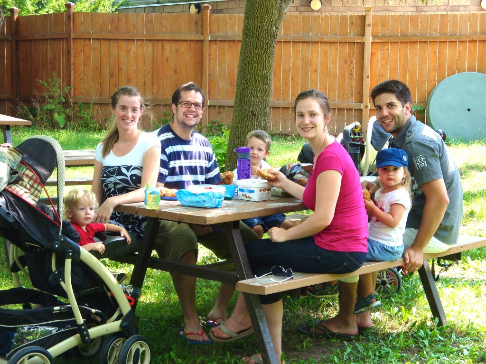
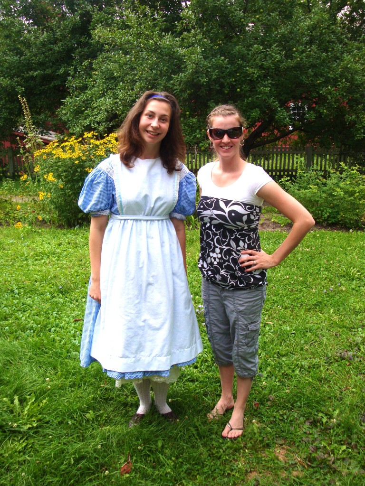
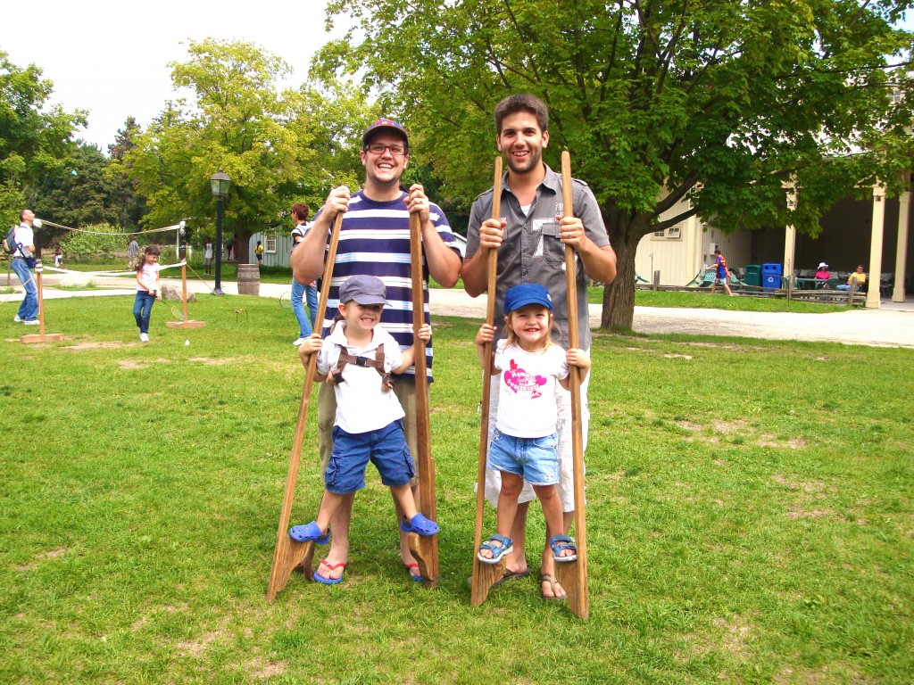
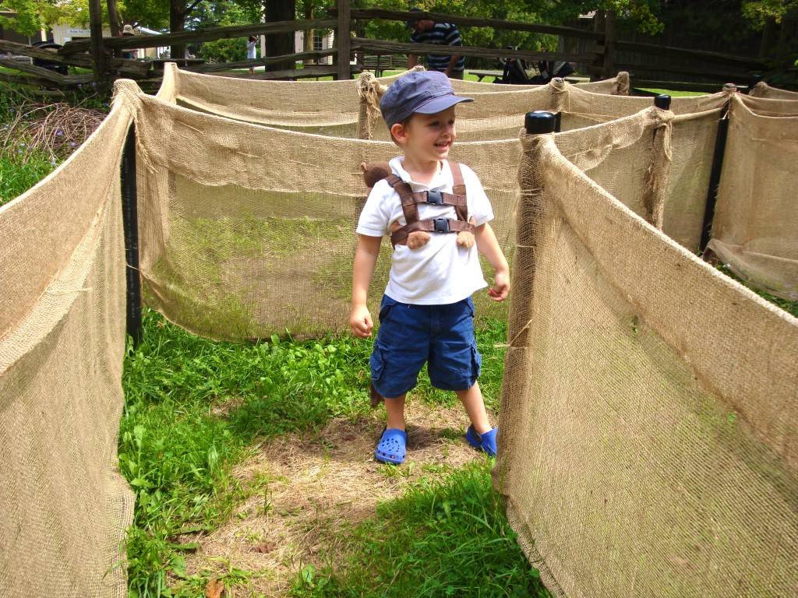
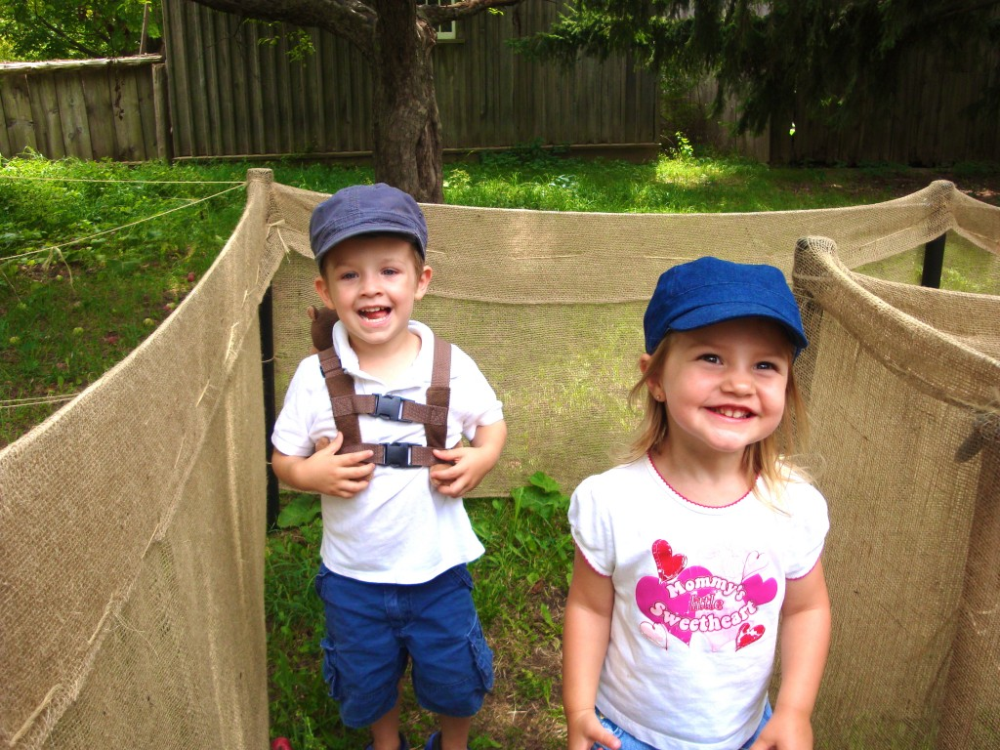
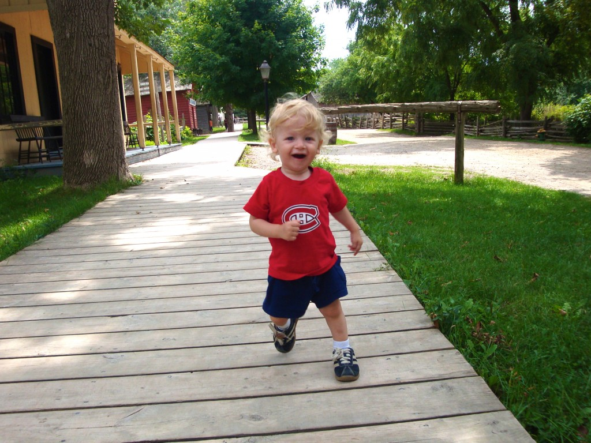

Une fois de plus nous avons eu de la belle visite du Québec. La famille de Dou et Phil est venue passer un peu plus de quatre jours avec nous. On a vraiment apprécié chaque activité passé avec eux.

On a profité de leur présence pour aller visiter pour la première fois un village d'antan : Black Creek Pioneer Village. On a fait un petit pique-nique juste avant de commencer notre tour.

 Ici je suis avec la « grande » Alice qui plus tard dans la journée s'est transformée en Cendrillon et nous a donné un cours de danse et d'étiquette.

On a aussi particité à l'activité: Old-fashioned races and games.

Ézékiel fier de porter le petit singe à Zoé.

Deux amours qui ont aimé partager jeux et rire.

Caleb lui aussi a profité de la belle journée. Il s'est bien dégourdi les jambes... et est revenu à la maison avec les genoux bien égratignés.

Merci d'être venu passer une partie de vos vacances avec nous. C'était plaisant comme toujours!
