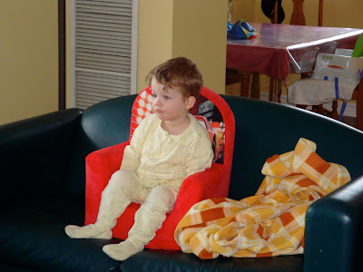
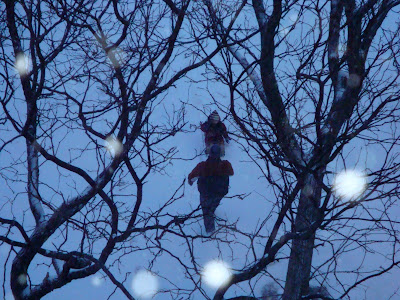
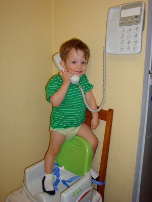
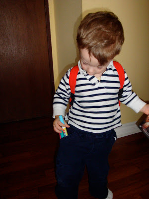
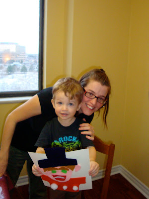

  

Depuis quelques semaines Jean-Michel et moi avons tendance à renommer Ézékiel avec le prénom Pierre. À tous les jours, notre petit homme change d'idée sans arrêt. On se doute bien que c'est de l'âge d'Ézékiel d'agir comme ça. On espère bientôt qu'il comprendra le principe de Pierre et le loup, parce que papa et maman se demande souvent quoi faire.

\-Quel film veux-tu écouter?

\-Inc! (Monsters Inc.)

Maman prépare le film, puis cinq minutes plus tard...

\-Non, fini Inc. Story 2, Story 2! (Toy story 2)

Maman hésite puis change le film.

\-Non, fini Story... Jack-Jack... (The incredibles)

\-Tu me niaises-tu???

  

Ici Ézékiel qui écoute son film préféré, Monsters inc.  

  

\-Dehors, dehors!!!

Pour une des rares fois il y a une belle petite neige à Toronto et Ézékiel veux sortir. Maman sort le traineau , et aide papa à habiller Ézékiel. Aussitôt le nez dehors:

\-Fini, fini. Maman, maman.

Papa compréhensif retourne dans l'entrée du condo.

\-Dehors!

Réclame une deuxième fois de sortir. Papa rebrousse entame une deuxième tentative.

\-Fini, fini,... Snif!

Rendu dans l'ascenseur, Pierre recommence de plus belle.

\-Dehors, dehors.

Papa n'a plus le coeur de ressortir pour moins de deux minutes. Aucune chance de croire son p'tit homme.

Résultat crise de 10 minutes pour rentrer dans l'appartement. Une autre de 5 min pour enlever les bottes, et puis encore des pleurs pour enlever la salopette de neige puis le gros chandail. Et on continu...

  

Papa est mi à l'épreuve par Zeke.

  

Malgré cette période d'apprentissage d'Ézékiel, on est en amour avec lui.

  

Il est trop adorable quand il téléphone tous ses amis.

  

Vive les poches!

  

Comme Jean-Michel a peur que son fils ne soit pas artistique comme lui, il a prit une photo pour prouver qu'Ézékiel a déjà fait un bricolage.

  

