[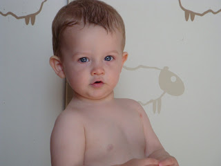](http://2.bp.blogspot.com/_ToTXtyv4mUo/ShMdj4-5R0I/AAAAAAAAAew/eZAeB2wuzX0/s1600-h/DSC04335.JPG)  

  
Observations de la semaine:  
Je savais déjà qu'Ézékiel aimait se cacher derrière sa chaise bersante. Et bien son plaisir d'aller là où les grandes personnes ne peuvent se faufiler s'est développé de plus en plus. Il a un fun fou à se cacher dans les armoires, derrière la chaise bersante, entre la bibliothèque et le mur de la cuisine, sous son lit ...  

  

[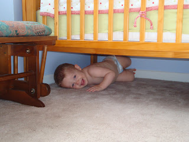](http://4.bp.blogspot.com/_ToTXtyv4mUo/ShMdkDwilCI/AAAAAAAAAe4/-viMdRTzw28/s1600-h/DSC04348.JPG)  

...et dans la bibliothèque du salon.  
  

[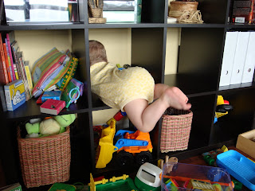](http://4.bp.blogspot.com/_ToTXtyv4mUo/ShMdkw532FI/AAAAAAAAAfA/9BdAAT1RTEE/s1600-h/DSC04374.JPG)  
Une petite drôle:  

Samedi soir nous sommes aller fêter l'anniversaire de Jean-Michel. Nos amis ont bien voulu garder Ézékiel. Après le souper, ils sont sorti jouer à l'extérieur. Comme la température était plus fraîche, Zeke a du mettre le manteau et les bottes de sa bonne amie Margo. Si vous vous demandez , il est avec le manteau à poids rose. "Ouin, pas mal beau Zeke!" Emily à du expliqué à ses voisins qu 'ils n'étaient pas jumelles. "Celui-là, c'est un garçon." Vous pouvez vous imaginer leur surprise.  

  
[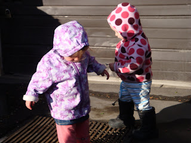](http://1.bp.blogspot.com/_ToTXtyv4mUo/ShMdky1Q5jI/AAAAAAAAAfI/qCz57lb5dKQ/s1600-h/DSC04392.JPG)

Bronte Creek:  

Lundi, journée fériée, nous sommes allé au parc provincial Bronte Creek. Il y avait des animaux de la ferme, des jeux et un petit village d'antan. C'était tellement beau de voir notre garçon avec un grand sourire aux lèvres.  
  

Ici Ézékiel nourri et flatte un bouc.  
  

[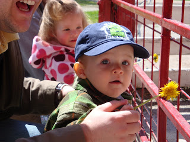](http://2.bp.blogspot.com/_ToTXtyv4mUo/ShMxnIjc0HI/AAAAAAAAAgQ/wQoFVuzA4To/s1600-h/DSC04402.JPG)  
[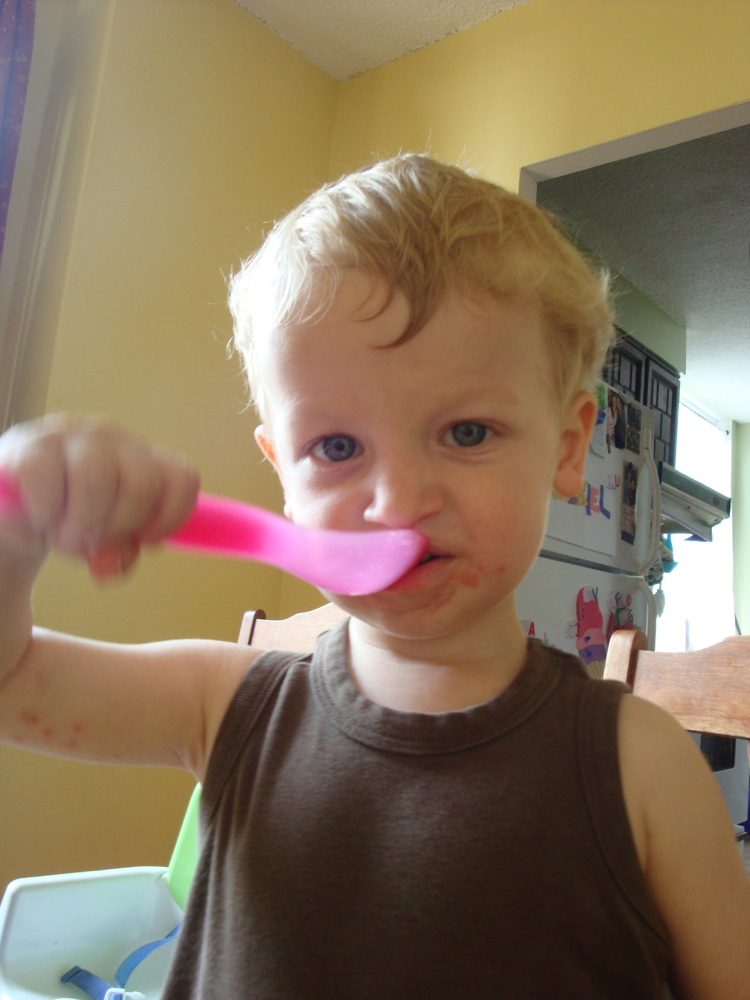](http://2.bp.blogspot.com/_ToTXtyv4mUo/ShMuLDdQHWI/AAAAAAAAAfQ/_lgIltnNpH8/s1600-h/DSC04406.JPG)  

Ézékiel et Jean-Michel observent les cochons.  

  
[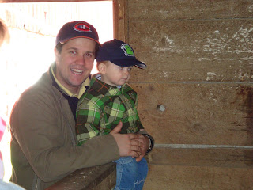](http://2.bp.blogspot.com/_ToTXtyv4mUo/ShMuLUsDPqI/AAAAAAAAAfY/-6LYAY34rVM/s1600-h/DSC04417.JPG)  
  

Il y avait une grange aménagé en parc d'amusement.  
Autant parents, qu'enfants ont du plaisir.  

  
[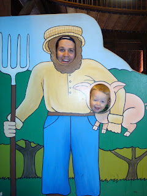](http://1.bp.blogspot.com/_ToTXtyv4mUo/ShMuMA4zEnI/AAAAAAAAAfw/sbi_Wt8sCzc/s1600-h/DSC04473.JPG)  
  

Ézékiel aimait se lancer  
ou se faire lancer par son papa  
sur ce gros matelas.  

  
[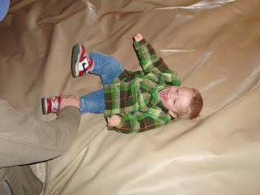](http://2.bp.blogspot.com/_ToTXtyv4mUo/ShMuLskiOUI/AAAAAAAAAfg/ApwqDYlsldc/s1600-h/DSC04466.JPG)  
  

Le beau grand sourire de notre petit homme.  

  
[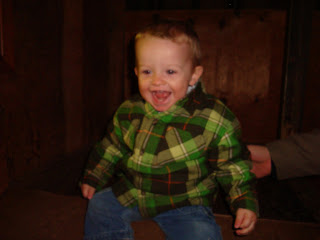](http://2.bp.blogspot.com/_ToTXtyv4mUo/ShMuL9bR6eI/AAAAAAAAAfo/i_enUMuLmC8/s1600-h/DSC04468.JPG)  

Nous sommes vraiment choyé d'avoir de bons amis avec qui on s'entend bien. Nous avions prévu pique-niquer tous ensemble. Alors qu'on digérait notre dinner Jean-Michel à dit quelque chose de bien vrai: "Ça c'est la vraie vie!" Puis après nous avons continué notre tour du parc. C'est définitivement une place à retourner dans les années qui nous reste à vivre à Toronto.  
  

[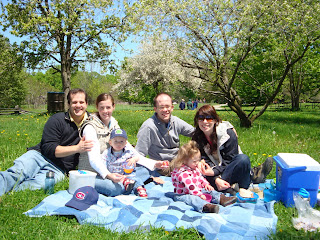](http://4.bp.blogspot.com/_ToTXtyv4mUo/ShMv5GtyetI/AAAAAAAAAf4/S6dV6juDu68/s1600-h/DSC04483.JPG)
