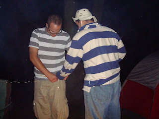
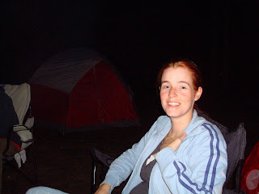
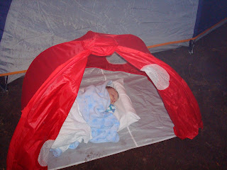
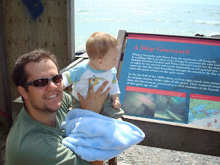
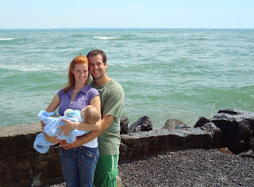
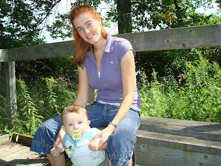
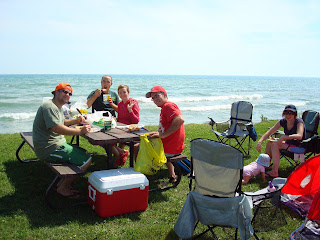
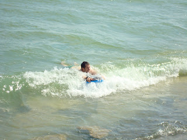
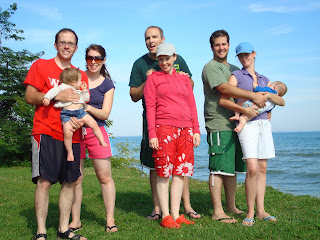

Après avoir entendu parler à plusieurs reprise du parc régional Presqu'ile, nous y sommes finalement allé le 22 et 23 août dernier. Nous étions trois couples: les Meldrum, les Murdoc et bien sûr les Carter. Le seule "hic" c'était la plage, mais malgré tous ses défauts, sa profondeur était idéal pour des petits poissons comme Zeke et Margo. 10 cm de profondeur pour une très très longue distance de la berge. Aussi on a bien aimé assister à un show "life" de danse lascive par Doug et Emily.  
  
  
  
Le soir venu on a eu bien du fun autour du feu, feu, joli feu. Tristes d'avoir perdu au jeu de Big Booty, Jean-Michel et Aaron ont voulu se consoler en se mesurant le booty. Ici on peux les voir ainsi que moi la grande perdante #5. 
  
  
  
  
  
  
  
  
  
  
  
  
  
Zeke a rien voulu manquer de la soirée. Il faut comprendre que c'était son 1er feu de camp.  
  
  
  
Un peu d'histoire...  
Les eaux qui entourent Presqu'ile sont reconnues pour être dangereuses, spécialement en automne. Malgré son phare, 8 navires y ont sombrés et de la pointe ou nous étions nous aurions pu en être témoin.  
  
  
  
  
  

Ici notre petit paradis du samedi.  

  
  
  

Et voici notre super star Jean-Michel en plein action  
sur son boogie board. "Ct'ait l'fun!" a-t'il déclaré.  

  
  
  

Dernière photo avant de nous séparer.  
Snif, snif, les vacances sont finis!  

  

