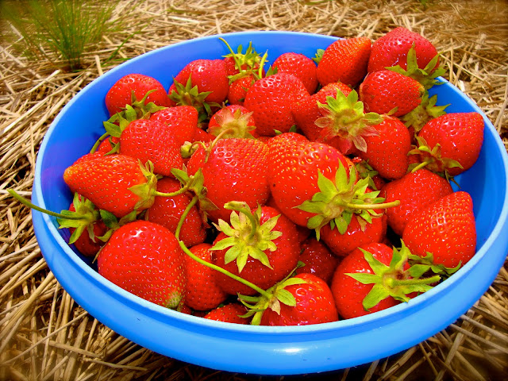
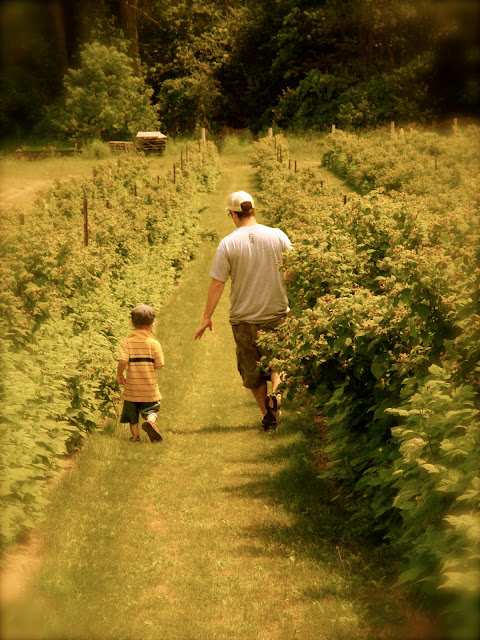
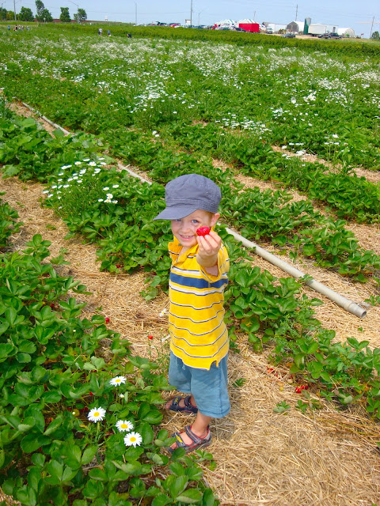
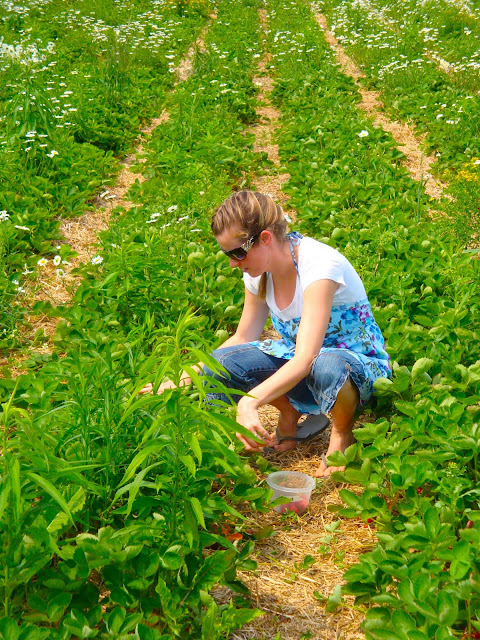
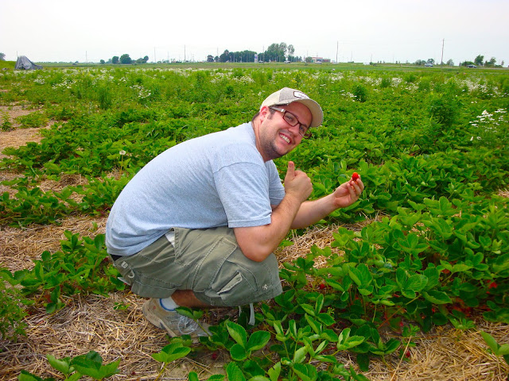
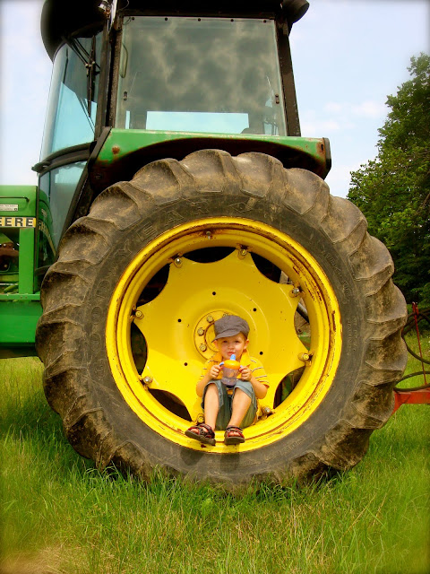
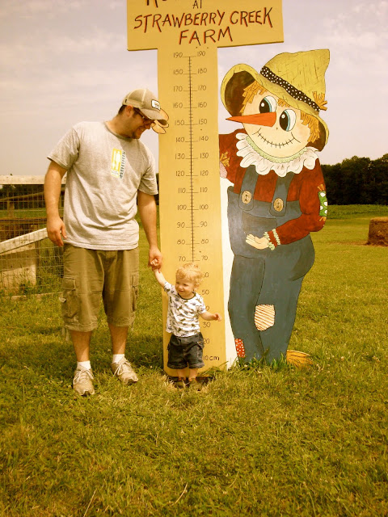
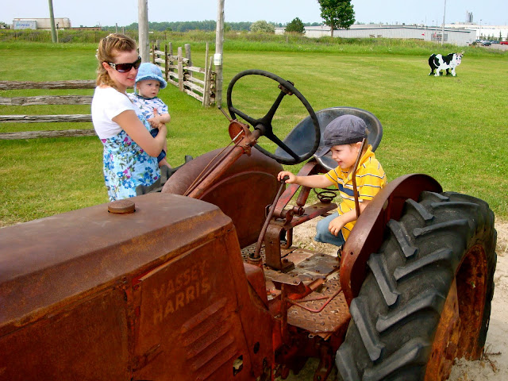

 

Pour une deuxième année consécutives, nous avons été cueillir des belles fraises rouges. C'est toujours une belle sortie à faire en famille.

  

En direction d'un bout de champ où les fraises sont grosses, rouges et bien juteuses!

  

Contrairement à l'année passée, Ézékiel à beaucoup aimé ramasser des petits fruits. Pour chaque fraise qu'il cueillait il demandait: Papa, celle-là? Puis avec l'approbation rapide de papa ou maman il la déposait dans sa chaudière. Bien sûr, avant d'aller payer nous avons refait le tri de sa récolte... le pauvre à été un peu déçu de voir qu'une bonne partie de ce qu'il avait amassé, n'était pas digne d'être ramené à la maison.

  

  

 Maman et papa au travail.

  

  

 Une petite pause bien mérité.

  

 Caleb qui pousse, lui aussi.

  

 Et puis il y avait une aire de jeux pour bien récompenser nos petits braves.

  

Quand nous sommes rentrée à la maison tout un travail m'attendait puisqu'on avait aussi une récolte de rhubarbe et de radis du jardin. En gros le résultat de la semaine: Muffins à la rhubarbe, pouding aux fraises, tarte à la rhubarbe, 2 coulis aux fraises et 2 salsa maison. C'est tellement plaisent de manger aussi frais en été!
